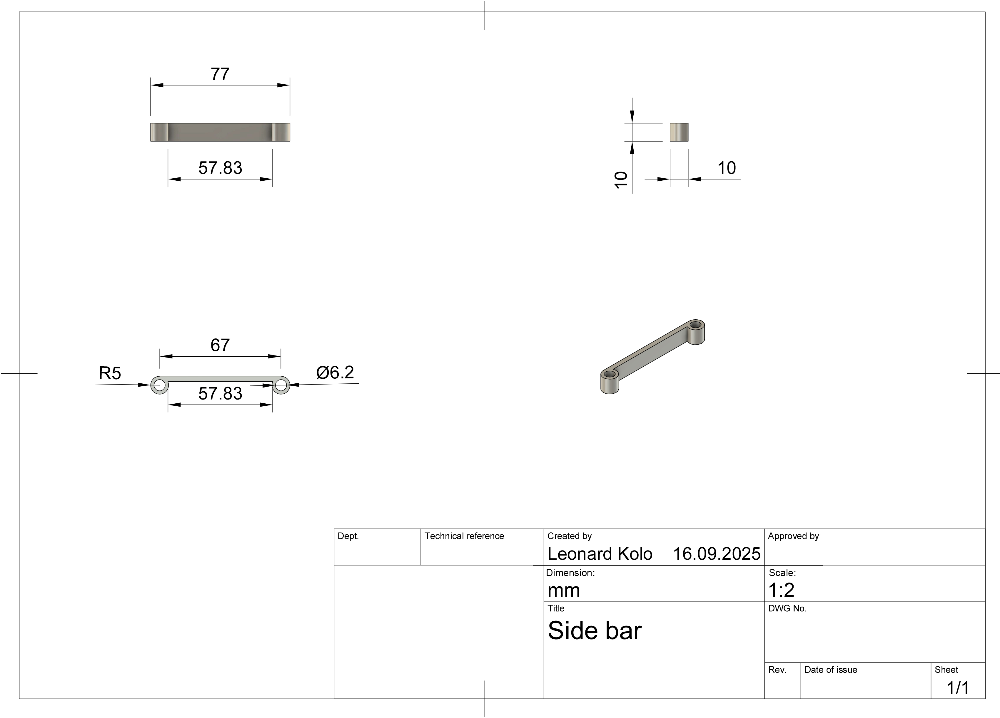

# Inhaltsverzeichnis

<ul dir="auto">
<li><a href="#the-team">The Team</a>
<ul dir="auto">
<li><a href="#nils-stauff">Nils Stauff</a></li>
<li><a href="#olivia-greilich">Olivia Greilich</a></li>
<li><a href="#leonard-kolo">Leonard Kolo</a></li>
<li><a href="#team-photo">Team Photo</a></li>
</ul>
</li>
<li><a href="#the-robot">The Robot</a></li>
<li><a href="#mobility-management">Mobility Management</a>
<ul dir="auto">
<li><a href="#chassis">Chassis</a></li>
<li><a href="#umbau-des-modellautos">Umbau des Modellautos</a>
<ul dir="auto">
<li><a href="#bodenplatte">Bodenplatte</a></li>
<li><a href="#mitteldeck">Mitteldeck</a></li>
<li><a href="#oberdeck">Oberdeck</a></li>
</ul>
</li>
<li><a href="#potential-improvements---chassis">Potential improvements - Chassis</a></li>
<li><a href="#powertrain">Powertrain</a>
<ul dir="auto">
<li><a href="#drivetrain">Drivetrain</a></li>
<li><a href="#motor">Motor</a></li>
<li><a href="#motor-driver--fahrtenregler">Motor Driver (= Fahrtenregler)</a></li>
<li><a href="#funktionsweise-antrieb">Funktionsweise Antrieb</a></li>
</ul>
</li>
<li><a href="#potential-improvements---powertrain">Potential improvements - Powertrain</a></li>
<li><a href="#steering">Steering</a>
<ul dir="auto">
<li><a href="#servo-saver">Servo Saver</a></li>
<li><a href="#servo-motor-anders-einsortieren---ungünstig-als-eigener-unterpunkt">Servo Motor</a></li>
</ul>
</li>
<li><a href="#potential-improvements---steering">Potential improvements - Steering</a></li>
</ul>
</li>
<li><a href="#power-and-sense-management">Power and Sense Management</a>
<ul dir="auto">
<li><a href="#sensoren">Sensoren</a>
<ul dir="auto">
<li><a href="#lidar">LiDAR</a></li>
<li><a href="#potential-improvements---lidar">Potential improvements - LiDAR</a></li>
<li><a href="#kamera">Kamera</a></li>
<li><a href="#potential-improvements---kamera">Potential improvements - Kamera</a></li>
<li><a href="#odometrie-sensor">Odometrie Sensor</a></li>
<li><a href="#potential-improvements---odometriesensor">Potential improvements - Odometriesensor</a></li>
<li><a href="#status-display">Status-Display</a></li>
</ul>
</li>
<li><a href="#energieversorgung-des-fahrzeugs">Energieversorgung des Fahrzeugs</a>
<ul dir="auto">
<li><a href="#li-po-battery">Li-Po Battery</a></li>
<li><a href="#energieverbrauch-der-komponenten">Energieverbrauch der Komponenten</a></li>
<li><a href="#gesamtleistungsbedarf">Gesamtleistungsbedarf</a></li>
<li><a href="#spannungsversorgung">Spannungsversorgung</a></li>
<li><a href="#sicherheit-und-verdrahtung">Sicherheit und Verdrahtung</a></li>
</ul>
</li>
<li><a href="#potential-improvements---energieversorgung">Potential improvements - Energieversorgung</a></li>
<li><a href="#schaltplan-der-bauteile">Schaltplan der Bauteile</a></li>
</ul>
</li>
<li><a href="#code-für-alle-komponenten">Code für alle Komponenten</a>
<ul dir="auto">
<li><a href="#servo">Servo</a>
<ul dir="auto">
<li><a href="#software-implementation">Software Implementation</a></li>
<li><a href="#steering-range-and-calibration">Steering Range and Calibration</a></li>
</ul>
</li>
<li><a href="#drive-motor">Drive Motor</a>
<ul dir="auto">
<li><a href="#components">Components</a></li>
<li><a href="#hardware-interface">Hardware Interface</a></li>
<li><a href="#software-implementation-1">Software Implementation</a></li>
<li><a href="#pid-controller-implementation">PID Controller Implementation</a></li>
<li><a href="#advanced-control-features">Advanced Control Features</a></li>
</ul>
</li>
<li><a href="#optical-tracking-odometry-sensors">Optical Tracking Odometry Sensors</a>
<ul dir="auto">
<li><a href="#position-and-speed-tracking">Position and Speed Tracking</a></li>
<li><a href="#sensor-health-monitoring-and-redundancy">Sensor Health Monitoring and Redundancy</a></li>
<li><a href="#data-fusion-and-final-position-calculation">Data Fusion and Final Position Calculation</a></li>
<li><a href="#position-reset-and-calibration">Position Reset and Calibration</a></li>
<li><a href="#key-features-of-our-implementation">Key Features of Our Implementation</a></li>
</ul>
</li>
<li><a href="#lidar-1">LiDAR</a>
<ul dir="auto">
<li><a href="#real-time-scanning-and-data-acquisition">Real-time Scanning and Data Acquisition</a></li>
<li><a href="#position-detection-and-localization">Position Detection and Localization</a></li>
<li><a href="#dynamic-position-correction-during-driving">Dynamic Position Correction During Driving</a></li>
<li><a href="#obstacle-detection-and-recognition">Obstacle Detection and Recognition</a></li>
<li><a href="#key-features-of-our-lidar-implementation">Key Features of Our LiDAR Implementation</a></li>
<li><a href="#data-structure-and-access-patterns">Data Structure and Access Patterns</a></li>
</ul>
</li>
<li><a href="#potential-improvements---code-for-all-components">Potential improvements - Code for all components</a></li>
</ul>
</li>
<li><a href="#obstacle-management">Obstacle Management</a>
<ul dir="auto">
<li><a href="#initial-location-acquisition">Initial Location Acquisition</a></li>
<li><a href="#position-updates-during-driving">Position updates during driving</a>
<ul dir="auto">
<li><a href="#optical-tracking-sensor-function">Optical tracking sensor function</a></li>
<li><a href="#sensor-failure-detection--health-status">Sensor failure detection / health status</a></li>
</ul>
</li>
<li><a href="#position-corrections">Position corrections</a></li>
<li><a href="#obstacle-recognition">Obstacle Recognition</a>
<ul dir="auto">
<li><a href="#determining-the-position-of-an-obstacle-within-a-course-section">Determining the position of an obstacle within a course section</a></li>
<li><a href="#determining-the-color-of-the-obstacle">Determining the color of the obstacle</a></li>
</ul>
</li>
<li><a href="#software-structure">Software Structure</a>
<ul dir="auto">
<li><a href="#multi-threading-architecture">Multi-Threading Architecture</a></li>
<li><a href="#why-three-threads">Why Three Threads?</a></li>
<li><a href="#thread-1-control-loop">Thread 1: Control Loop</a></li>
<li><a href="#thread-2-command-loop-high-level-navigation-thread">Thread 2: Command Loop (High-Level Navigation Thread)</a></li>
<li><a href="#thread-3-display-loop-user-interface-thread">Thread 3: Display Loop (User Interface Thread)</a></li>
<li><a href="#thread-synchronization-and-communication">Thread Synchronization and Communication</a></li>
</ul>
</li>
</ul>
</li>
<li><a href="#construction-guide---bauanleitung">Construction Guide - Bauanleitung</a>
<ul dir="auto">
<li><a href="#übersicht-der-baugruppen">Übersicht der Baugruppen</a></li>
<li><a href="#schritt-1-vorbereitung-der-3d-gedruckten-teile">Schritt 1: Vorbereitung der 3D-gedruckten Teile</a></li>
<li><a href="#schritt-2-aufbau-der-bodenplatte">Schritt 2: Aufbau der Bodenplatte</a>
<ul dir="auto">
<li><a href="#21-latrax-rally-chassis-vorbereiten">2.1 LaTrax Rally Chassis vorbereiten</a></li>
<li><a href="#22-motor-und-getriebe-montieren">2.2 Motor und Getriebe montieren</a></li>
<li><a href="#23-servo-für-lenkung-einbauen">2.3 Servo für Lenkung einbauen</a></li>
<li><a href="#24-fahrtenregler-montieren">2.4 Fahrtenregler montieren</a></li>
<li><a href="#25-odometriesensoren-einbauen">2.5 Odometriesensoren einbauen</a></li>
</ul>
</li>
<li><a href="#schritt-3-neue-vorderachse-konstruieren">Schritt 3: Neue Vorderachse konstruieren</a>
<ul dir="auto">
<li><a href="#31-ackermann-lenkung-aufbauen">3.1 Ackermann-Lenkung aufbauen</a></li>
<li><a href="#32-montage-der-vorderachse">3.2 Montage der Vorderachse</a></li>
</ul>
</li>
<li><a href="#schritt-4-mitteldeck-aufbauen">Schritt 4: Mitteldeck aufbauen</a>
<ul dir="auto">
<li><a href="#41-raspberry-pi-5-montieren">4.1 Raspberry Pi 5 montieren</a></li>
<li><a href="#42-kamera-integrieren">4.2 Kamera integrieren</a></li>
<li><a href="#43-servo-controller-montieren">4.3 Servo-Controller montieren</a></li>
<li><a href="#44-batterie-und-spannungsversorgung">4.4 Batterie und Spannungsversorgung</a></li>
</ul>
</li>
<li><a href="#schritt-5-oberdeck-mit-lidar">Schritt 5: Oberdeck mit LiDAR</a>
<ul dir="auto">
<li><a href="#51-lidar-montieren">5.1 LiDAR montieren</a></li>
<li><a href="#52-status-display-installieren">5.2 Status-Display installieren</a></li>
</ul>
</li>
<li><a href="#schritt-6-verkabelung-und-inbetriebnahme">Schritt 6: Verkabelung und Inbetriebnahme</a>
<ul dir="auto">
<li><a href="#61-i²c-bus-verkabeln">6.1 I²C-Bus verkabeln</a></li>
<li><a href="#62-stromverkabelung-prüfen">6.2 Stromverkabelung prüfen</a></li>
<li><a href="#63-erste-tests">6.3 Erste Tests</a></li>
</ul>
</li>
<li><a href="#schritt-7-software-installation">Schritt 7: Software-Installation</a>
<ul dir="auto">
<li><a href="#71-raspberry-pi-os-vorbereiten">7.1 Raspberry Pi OS vorbereiten</a></li>
<li><a href="#72-python-bibliotheken-installieren">7.2 Python-Bibliotheken installieren</a></li>
<li><a href="#73-kalibrierung">7.3 Kalibrierung</a></li>
</ul>
</li>
<li><a href="#troubleshooting---häufige-probleme">Troubleshooting - Häufige Probleme</a></li>
<li><a href="#wartung-und-pflege">Wartung und Pflege</a></li>
</ul>
</li>
</ul>
</li>
</ul>


# THE TEAM 
<div align="center">
    <a href="img/teamname.jpg" target="_blank">
        
    </a>
</div>
In this repository, you’ll find the documentation for the robot created by the "Battlepillars" for the 2025 World Robot Olympiad Future Engineers competition. The robot was the result of a collaborative effort by three students.

## Nils Stauff

<div align="center">
    <a href="img/nils.jpg" target="_blank">
        
    </a>
</div>

Hi! Ich bin Nils und bin 16 Jahre alt. Ich bin der Programmierer in unserem Team und beschäftige mich gerne mit Code und dem Lösen technischer Probleme. In meiner Freizeit gehe ich tauchen und genieße die Unterwasserwelt. Im Winter fahre ich regelmäßig Ski und mag auch Katzen sehr gerne.

Bei unserem WRO-Projekt bin ich für die Programmierung des Roboters zuständig und entwickle die Software, die ihn steuert. Das kann manchmal herausfordernd sein, aber es ist sehr befriedigend wenn alles wie geplant funktioniert!

## Olivia Greilich

Hello everyone! My name is Olivia Greilich and I'm 16, currently attending the Lise-Meitner Gymnasium in Anrath. Languages, communicating and connecting with people is my passion, same with painting, sculpting and crocheting!
One interesting fact about me is that I am simply enamored with jellyfish of all types, colours, shapes and sizes. I have two jellyfish lamps, tons of stickers, books and of course a phone charm.
In my free time, I usually occupy myself with writing fanfiction on Archive Of Our Own (AO3).

My part of the team effort is the documentation and images you'll see below.

## Leonard Kolo

<div align="center">
    <a href="img/leonard.jpg" target="_blank">
        
    </a>
</div>

Hi! I'm Leonard from Germany and I'm 15 years old, currently attending the Max Steenbeck Gymnasium in Cottbus. This is not my first WRO season. Last year I participated in the Robo Mission category and this year me and my team wanted to try something new so we are participating now in the category Future Engineers. My hobby’s are go karting, playing games, building LEGO and flying drone.

Ich bringe meine technische Expertise in den Bereichen Roboterbau, Komponentenrecherche und -auswahl sowie in der Entwicklung und Fertigung von 3D-gedruckten Bauteilen ein, die für die mechanische Realisierung unseres Projekts von entscheidender Bedeutung sind.

## Team photo

<div align="center">
    <a href="img/team.jpg" target="_blank">
        
    </a>
</div>

## Funny Team photo

<div align="center">
    <a href="img/team.jpg" target="_blank">
        
    </a>
</div>
<br><br><br>

# The Robot
## Photos of the Robot
The pictures of the robot must cover all sides of the robot, must be clear, in focus and show aspects of the mobility, power and sense, and obstacle management. Reference in the discussion sections 1, 2 and 3 can be made to these pictures.
<br><br><br>

# Mobility Management

Das Mobility Management System umfasst das Chassis, die Lenkung sowie den Antriebsstrang des Roboters, die für eine präzise und effiziente Fortbewegung erforderlich sind. In den folgenden Kapiteln werden diese einzelnen Elemente näher erläutert.
<br>
## Chassis
Anfangs entstand die Idee, ein Fahrzeug mit einer Gesamtlänge von unter 20 cm zu konstruieren, um am Ende des dreirundigen Hindernisrennens einfach geradeaus in die Parklücke einfahren zu können, was Teil der regionalen Aufgabe war. Diese Strategie war im Rahmen des deutschen Regelwerks zulässig.

Da handelsübliche Modellautos in der Regel nicht den erforderlichen Maßen entsprechen, war schnell klar, dass ein Umbau eines Modellautos notwendig sein würde. Die meisten verfügbaren Modelle weisen eine Länge von etwa 30 cm auf – eine Reduktion auf unter 20 cm erschien in diesen Fällen technisch zu aufwendig. Kleinere Modelle mit einer Länge von rund 10 cm boten hingegen nicht genügend Raum für sämtliche erforderlichen Komponenten.

Schließlich wurde ein Modell mit einer Länge von 22 cm gefunden, das als geeignet erschien, auf die gewünschte Länge von 20 cm angepasst zu werden. Dieses Modell – der LaTrax Rally – wurde daher als Basis für das selbtfahrende Fahrzeug ausgewählt.

Where to buy the car: <a href="https://traxxas.com/75054-5-118-latrax-rally">https://traxxas.com/75054-5-118-latrax-rally</a>
<br>

## Umbau des Modellautos

### Bodenplatte

Zur Optimierung der Fahrzeugarchitektur wurde eine neue Bodenplatte in Fusion 360 konstruiert, wodurch die Gesamtlänge des Fahrzeugs auf etwa 19 cm reduziert wurde. Die Konstruktion erfolgte unter Berücksichtigung einer kompakten Bauweise zur Verbesserung der Manövrierfähigkeit. Zur Positionsbestimmung mittels Odometrie-Sensoren wurden zwei Öffnungen in der Bodenplatte integriert, um eine direkte optische Erfassung der Bodenstruktur zu ermöglichen. Die Fertigung der Platte erfolgte mittels 3D-Druck. Die Bodenplatte wurde zunächst in einfachem PLA gedruckt. Allerdings hat sich ergeben, dass schon ein leichtes Durchbiegen der Bodenplatte zu einer kritischen Veränderung des Kamerawinkels geführt hat. Deswegen wurde nach Wegen gesucht, die Bodenplatte steifer zu machen. Neben Verstärkungen der Geometrie wurde zusätzlich entschieden, ein anderes Material beim Druck zu verwenden. Im Vergleich aller Materialien, die das Team selber drucken kann, hat PPA-CF sich als das Material mit der höchsten Steifigkeit herausgestellt. Dieses Filament hat das Problem des Durchbiegens der Bodenplatte komplett eliminiert.


<table align="center">
  <tr>
     <td width=320>
       <a href="img/Bodenplatte1.jpeg" target="_blank">
         
       </a>
     </td>
     <td width=500>
       <a href="img/Bodenplatte2.jpeg" target="_blank">
         
       </a>
     </td>
  </tr>
</table>

Bemaßung der Bodenplatte:


<div align="center">
    <a href="img/Masse/Lowerdeck.jpg" target="_blank">
        
    </a>
</div>


Auf der Bodeplatte befinden sich das Differential, das Getriebe, der Motor, das Servo, der Fahrtenregler und die Odometriesensoren. Wie diese Komponenten genau befestigt werden, kann im <a href="#construction-guide---bauanleitung">Construction Guide</a> nachgelesen werden.

<div align="center">
    <a href="img/Bodenplatte3.jpg" target="_blank">
        
    </a>
</div>

Das Servo wird in die Bodenplatte in einer vorhergesehenen Halterung eingesetzt und mittels des Servobrackets befestigt.

Bemaßung des Servobrackets:
<div align="center">
    <a href="img/Masse/Servobracket.jpg" target="_blank">
        
    </a>
</div>


Damit der Fahrtenregler nicht von der Bodenplatte fällt, sind zwischen den Distanzbolzen zwei 3D-gedruckte Sidebars eingebaut.

Bemaßung der Sidebars:
<div align="center">
    <a href="img/Masse/Sidebar.jpg" target="_blank">
        
    </a>
</div>

Um die Vorderräden vor Kollision zu schützen und damit auch indirekt das Lenkgestänge und den Servo, haben wir einen "Bumper" designt und mit dem 3D-Drucker gedruckt.

Bemaßung des Bumpers:
<div align="center">
    <a href="img/Masse/Bumper.jpg" target="_blank">
        
    </a>
</div>

### Mitteldeck

Anschließend wurde noch ein Mitteldeck mit Fusion 360 designt. Die Maße orientieren sich an der Bodenplatte.

<table align="center">
  <tr>
     <td width=320>
       <a href="img/Mitteldeck2.jpeg" target="_blank">
         
       </a>
     </td>
     <td width=500>
       <a href="img/Mitteldeck1.jpeg" target="_blank">
         
       </a>
     </td>
  </tr>
</table>

Bemaßung der Mittelplatte:

<div align="center">
    <a href="img/Masse/Middledeck.jpg" target="_blank">
        
    </a>
</div>

Dort verbaut wurde der Servo-Controller, die Batterie, der Raspberry und der Spannungsregler. Außerdem haben wir hier eine Kamera integriert. Wie diese Komponenten genau befestigt werden, kann im <a href="#construction-guide---bauanleitung">Construction Guide</a> nachgelesen werden. 


<div align="center">
    <a href="img/Mitteldeck3.jpg" target="_blank">
        
    </a>
</div>

Um die Kamera am Roboter befestigen zu könne, haben wir eine Halterung entworfen und mit dem 3d-Drucker gedruckt.

Bemaßung der Halterung:
<div align="center">
    <a href="img/Masse/Cameraholder.jpg" target="_blank">
        
    </a>
</div>

### Oberdeck

Um den LiDAR zu befestigen, wurde noch ein Oberdeck designt. An diesem wurde der LiDAR auf dem Kopf stehend befestigt.

<table align="center">
  <tr>
     <td width=280>
       <a href="img/Oberdeck2.jpeg" target="_blank">
         
       </a>
     </td>
     <td width=500>
       <a href="img/Oberdeck1.jpeg" target="_blank">
         
       </a>
     </td>
  </tr>
</table>
Bemaßung des Oberdecks:

<div align="center">
    <a href="img/Masse/Lidar.jpg" target="_blank">
        
    </a>
</div>

Dort verbaut wurde der LiDar und das Status-Display. Wie diese genau befestigt werden, kann im <a href="#construction-guide---bauanleitung">Construction Guide</a> nachgelesen werden.

<div align="center">
    <a href="img/Oberdeck3.jpg" target="_blank">
        
    </a>
</div>

## Potential improvements - Chassis
- Construct an outer hull to improve the outer appearance of the vehicle and prevent potential dust or debris from reaching the inner works.
- Furthermore, we could free up some space for a third odometry sensor.

- We could lower the chassis height in order to allow the LiDAR to be mounted lower, thus removing the need for support beams, which currently block LiDAR vision.

<br>

## Powertrain

### Drivetrain
Bei Automobilen lassen sich grundsätzlich drei Antriebsarten unterscheiden:

- Allradantrieb: Sämtliche Räder werden mit Antriebskraft versorgt.
- Frontantrieb: Die Antriebskraft wirkt ausschließlich auf die Vorderräder.
- Heckantrieb: Nur die Hinterräder werden angetrieben.

Das vorhandene Chassis war serienmäßig mit einem Allradantrieb ausgestattet, der den Wettbewerbsanforderungen grundsätzlich genügt hätte. Die vorhandene Lenkung ließ jedoch keinen ausreichenden Radeinschlag zu, was beispielsweise ein Ausparken in einem Zug bei der Parkchallenge unmöglich machte. Zur Verbesserung des Lenkeinschlags wurde daher eine alternative Lösung erarbeitet. Diese bestand in der Konstruktion einer vollständig neuen Vorderachse (<a href="#steering">vgl. Kapitel "Steering"</a>). Im Zuge des Umbaus konnte der Antrieb der Vorderräder nicht beibehalten werden, da die vorhandenen Kardangelenke den erhöhten Lenkeinschlag mechanisch nicht zuließen. Aus diesem Grund wurde auf einen reinen Hinterradantrieb umgestellt.

So?
Aus diesem Grund wurde der ursprüngliche Allradantrieb deaktiviert und stattdessen auf Heckantrieb umgestellt. Diese Konfiguration bietet im Kontext niedriger Geschwindigkeit und präziser Steuerung eine ausreichende Kraftübertragung, wobei gleichzeitig die Lenkung von Antriebseinflüssen entkoppelt wird – ein Vorteil, insbesondere bei feinfühligem Navigieren durch den Hindernisparcours.


### Motor
Der bereits vorhandene Brushed-Motor wurde im Rahmen einer vergleichenden Analyse verschiedenen Motorarten gegenübergestellt. Zur Bewertung der jeweiligen Vor- und Nachteile wurde eine internetgestützte Recherche durchgeführt. Dabei konnten neben dem Brushed-Motor insbesondere der Brushless-Motor sowie der Schrittmotor als relevante Alternativen identifiziert werden.

- Brushless-Motor:<br>
Diese Bauart bietet grundsätzlich eine höhere Leistungsabgabe im Vergleich zum im Modellfahrzeug verbauten Brushed-Motor. Da im Rahmen des Wettbewerbs jedoch keine hohe Endgeschwindigkeit erforderlich ist, wurde dieser Vorteil als nicht entscheidungsrelevant eingestuft. Zudem weisen Brushless-Motoren insbesondere bei niedrigen Drehzahlen eine eingeschränkte Steuerbarkeit auf, was eine präzise Navigation im Hindernisparcours erschwert.

- Schrittmotor:<br>
Schrittmotoren zeichnen sich durch eine hohe Steuerpräzision aus. Allerdings ist ihre Ansteuerung vergleichsweise komplex. Zusätzlich gehen ein hoher Stromverbrauch, größere Bauformen und eine geringe maximale Drehzahl mit dieser Motorart einher, was sie für den vorgesehenen Einsatzbereich als ungeeignet erscheinen lässt.

Auf Grundlage dieser Analyse wurde entschieden, den bereits im Modellauto integrierten Brushed-Motor weiterzuverwenden, da dieser unter den gegebenen Rahmenbedingungen die funktional und technisch sinnvollste Lösung darstellt.

<table align="center">
  <tr>
    <th bgcolor=#CCFFCC width=300>Motor</th>
    <th bgcolor=#9ae4fd width=600>Specifications</th>
  </tr>
  <tr>
    <td>
      <a href="img/motor.jpg" target="_blank">
        
      </a>
    </td>
    <td bgcolor=#c8f0fd>23-turn brushed 370-size LaTrax® motor with bullet connectors
</td>
   </tr>
    <tr><TD bgcolor=#e9c8fd colspan=2>Where to buy the motor: <a href="https://traxxas.com/7575r-23-turn-brushed-370-size-motor">https://traxxas.com/7575r-23-turn-brushed-370-size-motor</a></TD></tr>
</table>


### Motor Driver (= Fahrtenregler)
Der Fahrtenregler ist zwischen der Energiequelle und dem Antriebsmotor positioniert und übernimmt die Regelung der Motordrehzahl. Im Rahmen experimenteller Untersuchungen konnte festgestellt werden, dass der ursprünglich verbaute Fahrtenregler primär auf den Hochgeschwindigkeitsbetrieb ausgelegt ist. Im unteren Drehzahlbereich ließ sich keine ausreichende Feinsteuerung realisieren.

Im Zuge weiterführender Recherchen wurde festgestellt, dass bestimmte Modellfahrzeuge, sogenannte Crawler, speziell für den Einsatz auf unebenem und steilem Gelände konzipiert sind. Die in diesen Fahrzeugen eingesetzten Fahrtenregler zeichnen sich durch eine besonders feinfühlige Steuerbarkeit im Niedriggeschwindigkeitsbereich aus und erfüllen somit die für das Projekt relevanten Anforderungen an präzises Fahrverhalten bei geringer Geschwindigkeit.

Auf Grundlage dieser Erkenntnisse wurde die Entscheidung getroffen, den ursprünglich verbauten Regler durch ein geeigneteres Modell zu ersetzen. Die Wahl fiel auf den Quicrun WP 1080–G2, dessen technische Eigenschaften den spezifizierten Anforderungen in vollem Umfang entsprechen.

<table align="center">
  <tr>
    <th bgcolor=#CCFFCC width=300>Motor Driver Quicrun WP 1080–G2</th>
    <th bgcolor=#9ae4fd width=600>Specifications</th>
  </tr>
  <tr>
    <td width=300>
      <a href="img/fahrtenregler.jpg" target="_blank">
        
      </a>
    </td>
    <td bgcolor=#c8f0fd ><li>Application: 1/10th Rock Crawler</li>
<li>Motor Type: Brushed Motor (540 / 555 size motors)</li>
<li>Cont./Peak Current: 80A/400A</li>
<li>Input Voltage: 2-3S LiPo/5-9S Cell NiMH</li>
<li>BEC Output: 6V / 7.4V / 8.4V @ 4A (Switch-mode)</li>
<li>Wires & Connectors: Black-14AWG-200mm / Red-14AWG-200mm</li>
<li>Programming device: LED program box</li>
</td>
   </tr>
    <tr><TD bgcolor=#e9c8fd colspan=2>Where to buy the motor driver: <a href="https://www.modellbau-berlinski.de/rc-elektronik-und-akkus/regler/auto-brushed/quicrun-wp1080-g2-crawler-brushed-regler-80a-bec-4a">https://www.modellbau-berlinski.de/rc-elektronik-und-akkus/regler/auto-brushed/quicrun-wp1080-g2-crawler-brushed-regler-80a-bec-4a</a></TD></tr>
</table>
<tr> 


### Funktionsweise Antrieb

Das Getriebe besteht aus einem Motorritzel mit 14 Zähnen und einem größeren Hauptzahnrad
mit 61 Zähnen. Das Motorritzel wird vom Motor gedreht. Das Ritzel wiederum dreht das größere
Hauptzahnrad. Das Hauptzahnrad ist mit dem Differential verbunden, welches die Kraft auf die
beiden Hinterräder verteilt. Um feinfühlig steuern zu können und weil wir keine hohe Endge-
schwindigkeit brauchen, haben wir die größtmögliche Übersetzung gewählt, die sich in unser
Chassis einbauen ließ. Die Übersetzung wird vom Hauptzahnrad und dem Motorritzel bestimmt
und ist bei uns 61:14 = 1:4,35.
<br><br>
Durch die gewählte Übersetzung von 61:14 ergibt sich eine signifikante Verstärkung des Drehmoments am Antriebsstrang. Diese Konfiguration wurde gezielt gewählt, um eine zuverlässige Kraftübertragung auch bei niedrigen Geschwindigkeiten sicherzustellen. Während der Testläufe zeigte sich, dass die Wettbewerbsfläche oft kleinere Unebenheiten und Wellen aufweist. Diese können dazu führen, dass Fahrzeuge mit unzureichendem Drehmoment hängen bleiben oder an Traktion verlieren. In unseren Versuchen bewährte sich die getroffene Antriebswahl: Der Roboter konnte auch über wellige Mattenbereiche hinweg gleichmäßig beschleunigen und blieb dabei jederzeit kontrollierbar. Somit trägt die kraftbetonte Getriebeübersetzung wesentlich zur Zuverlässigkeit des Fahrzeugs im realen Einsatz bei.

## Potential improvements - Powertrain:
- Use the same wheels for the back wheels as the front axis, as the front wheels have better traction and are easier to clean and maintain.

- Encoders on rear wheels or on the motor for precise wheel slip detection, better traction control, more accurate speed control and for detecting the wheels spinning on uneven surfaces, e.g. bumps.

- Maintain high steering angles while providing front wheel drive. That would prevent the front weels from sliding at high steering angles.


## Steering

Wie bereits erläutert, ließ die vorhandene Lenkung des gekauften Chassis keinen ausreichenden Radeinschlag zu, was beispielsweise ein Ausparken in einem Zug bei der Parkchallenge unmöglich machte. Zur Verbesserung des Lenkeinschlags wurde daher eine alternative Lösung erarbeitet. Diese bestand in der Konstruktion einer vollständig neuen Vorderachse. 

In diesem Zug testeten wir auch different steering concepts, including parallelogram and bell-crank mechanisms, we carefully evaluated their pros and cons. In the end, we decided to implement an Ackermann steering system. This choice was made because Ackermann geometry optimizes wheel angles during turns, reducing tire slip and improving maneuverability—especially important for precise movements in our small, lightweight robot. Compared to simpler systems, Ackermann steering provides more accurate cornering and better control, which was crucial for our performance goals.

The steering assembly consists of two symmetrical wheel mounts connected by a steering linkage, which is actuated by a servo motor. Steel rods form the joints between the wheel mounts and the steering linkage, ensuring precise and reliable movement.


### Die neue Vorderachse

Ein Teil der neuen Vorderachse wurde mit dem Programm Fusion 360 selbst erstellt und mit dem 3D-Drucker gedruckt. 

<div align="center">
    <a href="https://github.com/user-attachments/assets/82217cac-1acd-4b5e-9e69-d0e1849cdb06" target="_blank">
        
    </a>
</div>

Bemaßung of the front axle:
<div align="center">
    <a href="img/Masse/Frontaxle.jpg" target="_blank">
        
    </a>
</div>
<br>
Für den Bau der neuen Vorderachse wurde ein Lenkgestänge und Achsschenkel benötigt:
<br><br>
<table align="center">
  <tr>
    <th bgcolor=#CCFFCC width=300>Lenkgestänge und Achsschenkel</th>
    <th bgcolor=#9ae4fd width=500>Specifications</th>
  </tr>
  <tr>
    <td>
      <a href="img/lenkstange.jpg" target="_blank">
        
      </a>
    </td>
    <td bgcolor=#c8f0fd>RC Metall Vorderachse Hinterachse Für WPL HengLong 1/16 Militär LKW RC LKW DE-
</td>
   </tr>
  <tr><TD bgcolor=#e9c8fd colspan=2>Where to buy the set: <a href="https://www.ebay.de/itm/176692013502">https://www.ebay.de/itm/176692013502</a></TD></tr>
</table>
<tr> 
<tr> 

<br>
Die Räder der neuen Vorderachse sind von Lego:
<br><br>
<table align="center">
  <tr>
    <th bgcolor=#CCFFCC width=300>Wheels</th>
    <th bgcolor=#9ae4fd width=500>Specifications</th>
  </tr>
  <tr>
    <td>
      <a href="img/legorad.jpg" target="_blank">
        
      </a>
    </td>
    <td bgcolor=#c8f0fd>Size: 5,6cm x 1,5cm x 5,6cm
</td>
   </tr>
  <tr><TD bgcolor=#e9c8fd colspan=2>Where to buy the wheels: <a href="https://www.brickowl.com/de/catalog/lego-wheel-56-with-medium-azure-tire-39367">https://www.brickowl.com/de/catalog/lego-wheel-56-with-medium-azure-tire-39367</a></TD></tr>
</table>
<br>
Die neue Vorderachse in einer Detailaufnahme:
<br><br>
<div align="center">
    <a href="https://github.com/user-attachments/assets/29e9e002-67d4-4cfb-aa75-9a4d085aa4be" target="_blank">
        
    </a>
</div>


### Servo Saver
The Servo Saver is installed on the Servo and connects to the steering linkage. The Servo Saver, when the front wheels collide against an obstacle, uses a spring to prevent an overload on the Servo.

### Servo Motor ANDERS einsortieren - ungünstig als eigener Unterpunkt - ist neu einsortiert, gut hier?
Der Servo ist für die Lenkung der Vorderräder verantwortlich. Die Stellgeschwindigkeit sowie das Drehmoment dieses Servos wurden im Rahmen einer technischen Bewertung als vollumfänglich ausreichend für die Wettbewerbsanforderungen eingestuft.

Konkret handelt es sich um den Traxxas Waterproof Sub-Micro Servo (Modellnummer 2065A). Dieser erzeugt bei einer Betriebsspannung von 6,0 V ein Drehmoment von 2,3 kg·cm (≈ 32 oz-in) und erreicht eine Stellzeit von 0,20 s pro 60°.

Da diese Kenndaten eine präzise sowie wirkungsvolle Lenkung gewährleisten, wurde beschlossen, den bereits im Modell vorhandenen Servo weiterhin zu verwenden.

<table align="center">
  <tr>
    <th bgcolor=#CCFFCC width=300>Waterproof Sub-Micro Servo</th>
    <th bgcolor=#9ae4fd width=600>Specifications</th>
  </tr>
  <tr>
    <td>
      <a href="img/motordriver.jpg" target="_blank">
        
      </a>
    </td>
    <td bgcolor=#c8f0fd><li>Fully waterproof</li>
<li>Fits steering in LaTrax models</li>
<li>Power: 2.3kg/cm</li>
<li>Operating voltage: 6.0V</li>
<li>Speed: 0.20 sec/60°</li>
<li>Dimensions: 22.6×12.6×22.5 mm</li>
</td>
   </tr>
    <tr><TD bgcolor=#e9c8fd colspan=2>Where to buy the motor: <a href="https://traxxas.com/2065a-waterproof-sub-micro-servo">https://traxxas.com/2065a-waterproof-sub-micro-servo</a></TD></tr>
</table>
<tr> 

## Potential improvements - Steering:
- The servo saver occasionally fails and triggers a false alarm during sharp or high-speed turns. A potential improvement would be to tighten the servo saver to prevent this issue.

- Additionally, the wheels could be improved in terms of grip to reduce slipping.
<br><br><br>

# Power and Sense Management
Das Power and Sense Management System umfasst die Sensorik zur Umgebungswahrnehmung sowie die Energieversorgung des Roboters, die für eine zuverlässige und autonome Navigation erforderlich sind. In den folgenden Kapiteln werden die einzelnen Sensoren, die Energieversorgung und die elektrische Schaltung detailliert erläutert.
<br>
## Sensoren

### LiDAR

Im Rahmen unserer Untersuchungen zum Thema autonomes Fahren wurde festgestellt, dass in der Regel LiDAR-Systeme (Light Detection and Ranging) zur Umgebungserfassung eingesetzt werden. Dabei handelt es sich um ein zentrales Sensorsystem in autonomen Fahrzeugen, das mithilfe von Laserstrahlen die Umgebung präzise erfasst und ein zweidimensionales Abbild generiert.

Durch die Messung der Laufzeit der reflektierten Laserstrahlen kann die Entfernung zu Objekten bestimmt werden. Diese Informationen ermöglichen eine zuverlässige Erkennung von Hindernissen sowie anderen Verkehrsteilnehmern und tragen wesentlich zur sicheren Navigation des Fahrzeugs bei.

Eine erhöhte Umgebungswahrnehmung wird erzielt, wenn die LiDAR-Daten mit weiteren Sensordaten, beispielsweise von Kameras oder Radarsystemen, kombiniert werden. Dies erlaubt eine fundierte Entscheidungsfindung zur sicheren Fahrzeugsteuerung. Aufgrund der überzeugenden Leistungsmerkmale wurde entschieden, ein LiDAR-System in das eigene autonome Fahrzeug zu integrieren.

In der nachfolgenden Tabelle wurden die für die Auswahl relevanten technischen Kriterien verschiedener LiDAR-Systeme zusammengestellt und entsprechend unserer Anforderungen farblich bewertet. Im Ergebnis stellte sich heraus, dass der RpLidar S2 die geeignetste Option für unsere Anwendung darstellt.

<table align="center" border="1" style="border-collapse: collapse; border: 2px solid black;">
  <tr>
    <th bgcolor=#E8E8E8 width=200 style="border: 1px solid black; border-bottom: 3px solid black; padding: 8px;">Kriterium</th>
    <th bgcolor=#E8E8E8 width=150 style="border: 1px solid black; border-bottom: 3px solid black; padding: 8px;">RpLidar-S2</th>
    <th bgcolor=#E8E8E8 width=150 style="border: 1px solid black; border-bottom: 3px solid black; padding: 8px;">RpLidar A2</th>
    <th bgcolor=#E8E8E8 width=150 style="border: 1px solid black; border-bottom: 3px solid black; padding: 8px;">RpLidar A1</th>
    <th bgcolor=#E8E8E8 width=150 style="border: 1px solid black; border-bottom: 3px solid black; padding: 8px;">YDLidar TG30</th>
  </tr>
  <tr>
    <td bgcolor=#F0F0F0 style="border: 1px solid black; padding: 8px;"><b>Reichweite</b></td>
    <td bgcolor=#90EE90 style="border: 1px solid black; padding: 8px;">0,05-18 m</td>
    <td bgcolor=#FFB6C1 style="border: 1px solid black; padding: 8px;">0,2-16 m</td>
    <td bgcolor=#FFB6C1 style="border: 1px solid black; padding: 8px;">0,15-12 m</td>
    <td bgcolor=#90EE90 style="border: 1px solid black; padding: 8px;">0,05-30 m</td>
  </tr>
  <tr>
    <td bgcolor=#F0F0F0 style="border: 1px solid black; padding: 8px;"><b>Genauigkeit der Abstandmessung</b></td>
    <td bgcolor=#90EE90 style="border: 1px solid black; padding: 8px;">+/- 50 mm</td>
    <td bgcolor=#FFB6C1 style="border: 1px solid black; padding: 8px;">< 1%</td>
    <td bgcolor=#FFB6C1 style="border: 1px solid black; padding: 8px;">< 1%</td>
    <td bgcolor=#FFD700 style="border: 1px solid black; padding: 8px;">+/- 60mm</td>
  </tr>
  <tr>
    <td bgcolor=#F0F0F0 style="border: 1px solid black; padding: 8px;"><b>Auflösung der Abstandsmessung</b></td>
    <td bgcolor=#90EE90 style="border: 1px solid black; padding: 8px;">13 mm</td>
    <td bgcolor=#FFB6C1 style="border: 1px solid black; padding: 8px;">1 %</td>
    <td bgcolor=#FFB6C1 style="border: 1px solid black; padding: 8px;">1 %</td>
    <td bgcolor=#FFB6C1 style="border: 1px solid black; padding: 8px;">-</td>
  </tr>
  <tr>
    <td bgcolor=#F0F0F0 style="border: 1px solid black; padding: 8px;"><b>Geschlossenes Gehäuse</b></td>
    <td bgcolor=#90EE90 style="border: 1px solid black; padding: 8px;">yes</td>
    <td bgcolor=#90EE90 style="border: 1px solid black; padding: 8px;">yes</td>
    <td bgcolor=#FFB6C1 style="border: 1px solid black; padding: 8px;">no</td>
    <td bgcolor=#90EE90 style="border: 1px solid black; padding: 8px;">yes</td>
  </tr>
  <tr>
    <td bgcolor=#F0F0F0 style="border: 1px solid black; padding: 8px;"><b>Winkelauflösung</b></td>
    <td bgcolor=#90EE90 style="border: 1px solid black; padding: 8px;">0,1125°</td>
    <td bgcolor=#FFB6C1 style="border: 1px solid black; padding: 8px;">0,225°</td>
    <td bgcolor=#FFB6C1 style="border: 1px solid black; padding: 8px;">1°</td>
    <td bgcolor=#FFD700 style="border: 1px solid black; padding: 8px;">0,13°</td>
  </tr>
    <tr>
    <td bgcolor=#F0F0F0 style="border: 1px solid black; padding: 8px;"><b>Aktualisierungsgeschwindigkeit</b></td>
    <td bgcolor=#90EE90 style="border: 1px solid black; padding: 8px;">2-10 Hz</td>
    <td bgcolor=#FFB6C1 style="border: 1px solid black; padding: 8px;">5-15 Hz</td>
    <td bgcolor=#FFB6C1 style="border: 1px solid black; padding: 8px;">5,5 Hz</td>
    <td bgcolor=#FFB6C1 style="border: 1px solid black; padding: 8px;">5-12 hz</td>
  </tr>
  <tr>
    <td bgcolor=#F0F0F0 style="border: 1px solid black; padding: 8px;"><b>Preis</b></td>
    <td bgcolor=#FFD700 style="border: 1px solid black; padding: 8px;">~ 220€</td>
    <td bgcolor=#FFD700 style="border: 1px solid black; padding: 8px;">~ 260€</td>
    <td bgcolor=#90EE90 style="border: 1px solid black; padding: 8px;">~ 90€</td>
    <td bgcolor=#FFB6C1 style="border: 1px solid black; padding: 8px;">~ 450€</td>
  </tr>
  <tr>
    <td bgcolor=#F0F0F0 style="border: 1px solid black; border-top: 3px solid black; padding: 8px;"><b>Bewertung</b></td>
    <td bgcolor=#90EE90 style="border: 1px solid black; border-top: 3px solid black; padding: 8px;">Sehr gut</td>
    <td bgcolor=#FFB6C1 style="border: 1px solid black; border-top: 3px solid black; padding: 8px;">Mäßig</td>
    <td bgcolor=#FFB6C1 style="border: 1px solid black; border-top: 3px solid black; padding: 8px;">Mäßig</td>
    <td bgcolor=#FFD700 style="border: 1px solid black; border-top: 3px solid black; padding: 8px;">Gut</td>
  </tr>
</table>


Nach der Integration des LiDAR-Systems in den Roboter wurde festgestellt, dass die Spielfeldbegrenzung nicht zuverlässig erkannt wurde. Ursache hierfür war, dass die vom Sensor ausgesendeten Laserstrahlen über die Begrenzung hinweg projiziert wurden.

In mehreren Iterationen wurde der Sensor schrittweise tiefer im Gehäuse des Roboters verbaut, jedoch konnte auch dadurch keine zufriedenstellende Erfassung der Begrenzungslinien erreicht werden. Eine anschließende Analyse des Datenblatts ergab, dass die Laserstrahlen des verwendeten LiDARs in einem leicht nach oben gerichteten Winkel emittiert werden. Dies erklärte, weshalb auch bei einer tieferliegenden Positionierung die relevanten Objekte nicht im Scanbereich erfasst wurden.

Daraufhin wurde beim Hersteller angefragt, ob eine Montage des LiDARs in umgekehrter (invertierter) Ausrichtung technisch zulässig sei. Die Rückmeldung fiel positiv aus, sodass der Sensor nun in umgekehrter Position im Roboter verbaut ist. Durch diese Anordnung wird erreicht, dass die Scanebene die Spielfeldbegrenzung zuverlässig detektiert.

### Potential improvements - LiDAR:
- Ein LiDAR finden, der parallel / nach unten scannt, statt nach oben.

- Recherche nach einem LiDAR mit einer höheren Aktualisiergeschwindigkeit, genaueren Abstandsmessung und eine höhere Winkelauflösung.


### Kamera
Während zur Positionsbestimmung eines Hindernisses der LiDar verwendet wird, wird zusätzlich eine Kamera benötigt, um die Farbe des Hindernisses zu erkennen. Zunächst wurde die Raspberry Pi Global Shutter Camera bestellt, da deren technische Eigenschaften als besonders geeignet für den Einsatz in einem mobilen Robotersystem eingeschätzt wurden. Die Kamera ermöglicht die verzerrungsfreie Erfassung schneller Bewegungen, da sie – im Gegensatz zu Rolling-Shutter-Systemen – typische Bewegungsartefakte vermeidet. Zudem erlaubt die Unterstützung von Wechselobjektiven eine flexible Anpassung an unterschiedliche Anwendungsszenarien. Nach dem Eintreffen der Kamera stellte sich jedoch heraus, dass deren physische Abmessungen deutlich größer ausfielen als ursprünglich angenommen. Aufgrund der begrenzten Platzverhältnisse im Fahrzeugchassis konnte sie nicht integriert werden.

Infolgedessen wurde auf eine kompaktere Alternative zurückgegriffen: das Raspberry Pi Camera Module 3 Wide (12 MP). Obwohl ursprünglich eine Global-Shutter-Kamera angedacht war, wurde festgestellt, dass die im System auftretenden Geschwindigkeiten keine kritischen Rolling-Shutter-Artefakte verursachen. Die gewählte Kamera erfüllt die Anforderungen in Bezug auf Sichtfeld, Auflösung (12 MP), Integration und Rechenkompatibilität und stellt somit eine praktikable Lösung für die Bildverarbeitung im gegebenen Kontext dar.

### Potential improvements - Kamera:
- Eine bessere Kamera mit einem höheren Blickwinkel finden und einbauen.

### Odometrie Sensor
In den letzten zwei Jahren wurde im Rahmen der Teilnahme an der Kategorie RoboMission die Bedeutung einer kontinuierlichen Positionsbestimmung deutlich. Dort wurde die Position durch Auswertung der Radumdrehungen und ergänzend durch ein Gyroskop bestimmt. Das aktuelle Modellbau-Chassis bietet jedoch keine Möglichkeit, die Radbewegung direkt zu messen.

Bei der Suche nach Alternativen wurde festgestellt, dass die Bewegung auch optisch – ähnlich wie bei einer Computermaus – erfasst werden kann. Auf dieser Grundlage wurde der „Optical Tracking Odometry Sensor“ von SparkFun ausgewählt. Dieser integriert einen optischen Bewegungssensor, ein Gyroskop sowie einen Mikrocontroller, der die Odometrieberechnungen eigenständig durchführt.

Zur Erhöhung der Genauigkeit und Redundanz wurden zwei dieser Sensoren verbaut.

Funktionsweise
Die Bewegungserkennung erfolgt durch eine nach unten gerichtete Kamera, die mit bis zu 20.000 Bildern pro Sekunde Veränderungen der Bodenstruktur analysiert. Aus den Bilddifferenzen wird die Verschiebung des Fahrzeugs über den Untergrund ermittelt. Diese Methode ist unempfindlich gegenüber Rutsch- oder Schlupfeffekten, wie sie bei Encoder-basierten Verfahren auftreten können.

### Potential improvements - Odometriesensor:

- Einen dritten Sensor einbauen, um eine echte Mehrheitsentscheidung bei der Bestimmung des korrekten Messwerts zu ermöglichen. Mit drei Sensoren könnte das System bei widersprüchlichen Messungen automatisch den einen abweichenden Sensor als fehlerhaft identifizieren und die beiden übereinstimmenden Sensoren verwenden. Dies würde die Robustheit des Systems erheblich verbessern, da aktuell bei einem Ausfall eines der beiden Sensoren nur noch ein einzelner Sensor zur Verfügung steht, dessen Genauigkeit nicht mehr durch Vergleich verifiziert werden kann.

### Status-Display
Zusätzlich wurde ein Status-Display integriert, über das verschiedene Systemparameter visualisiert werden. Die aktuelle Geschwindigkeit sowie die Zielgeschwindigkeit werden dabei durch Balkenanzeigen in Metern pro Sekunde dargestellt.

Der Betriebszustand der beiden Odometrie-Sensoren wird durch ein Farbsystem signalisiert:

- Grünes Licht zeigt an, dass der betreffende Maussensor aktiviert ist und ordnungsgemäß arbeitet.
- Rotes Licht wird angezeigt, wenn ein Sensor eine mehr als 0,2 m/s geringere Geschwindigkeit im Vergleich zum zweiten Sensor misst; in diesem Fall wird der Sensor als fehlerhaft klassifiziert.
- Blaues Licht weist darauf hin, dass der Sensor eine Geschwindigkeit über 2 m/s registriert, was physikalisch nicht plausibel ist; der Sensor wird daraufhin automatisch deaktiviert.

Dieses Display ist eine optionale Komponente und für die Funktionalität des Roboters nicht unbedingt erforderlich.

### Potential improvements - Status-Display:
- Mehr Informationen während der Fahrt anzeigen, z.B. welche Farben die Hindernisse haben.
<br>

## Energieversorgung des Fahrzeugs

Die Energieversorgung des autonomen Fahrzeugs wurde so ausgelegt, dass sie sämtliche Sensoren, Steuerungseinheiten und Aktuatoren zuverlässig mit Energie versorgen kann. Als zentrale Stromquelle kommt ein 7,4 V Lithium-Polymer-Akku (LiPo, 2S, 2200 mAh) zum Einsatz, der direkt mit dem Fahrtenregler verbunden ist und über einen 5V Spannungswandler auch den Raspberry mit Strom versorgt.

### Li-Po Battery
- Bild + Spezifikationen

### Energieverbrauch der Komponenten

Im Folgenden sind die wesentlichen verbauten Komponenten sowie deren typischer Energieverbrauch aufgeführt:

<table align="center" border="1" style="border-collapse: collapse; border: 2px solid black;">
  <tr>
    <th bgcolor=#E8E8E8 width=300 style="border: 1px solid black; border-bottom: 3px solid black; padding: 8px;">Komponente</th>
    <th bgcolor=#E8E8E8 width=200 style="border: 1px solid black; border-bottom: 3px solid black; padding: 8px;">Betriebsspannung</th>
    <th bgcolor=#E8E8E8 width=200 style="border: 1px solid black; border-bottom: 3px solid black; padding: 8px;">Leistungsaufnahme (typisch)</th>
    <th bgcolor=#E8E8E8 width=400 style="border: 1px solid black; border-bottom: 3px solid black; padding: 8px;">Bemerkung</th>
  </tr>
  <tr>
    <td style="border: 1px solid black; padding: 8px;">Raspberry Pi 5</td>
    <td style="border: 1px solid black; padding: 8px;">5 V</td>
    <td style="border: 1px solid black; padding: 8px;">3–8 W</td>
    <td style="border: 1px solid black; padding: 8px;">Hauptsteuerung, hohe CPU-Leistung</td>
  </tr>
  <tr>
    <td style="border: 1px solid black; padding: 8px;">Raspberry Pi Camera Module 3 Wide (12 MP)</td>
    <td style="border: 1px solid black; padding: 8px;">5 V</td>
    <td style="border: 1px solid black; padding: 8px;">1–2 W</td>
    <td style="border: 1px solid black; padding: 8px;">Direkt am CSI-Port des RPi angeschlossen</td>
  </tr>
  <tr>
    <td style="border: 1px solid black; padding: 8px;">2× SparkFun Optical Tracking Odometry Sensor</td>
    <td style="border: 1px solid black; padding: 8px;">3,3 V</td>
    <td style="border: 1px solid black; padding: 8px;">je ca. 0,1 W</td>
    <td style="border: 1px solid black; padding: 8px;">Geringer Stromverbrauch, über I²C kommunizierend</td>
  </tr>
  <tr>
    <td style="border: 1px solid black; padding: 8px;">RpLidar S2</td>
    <td style="border: 1px solid black; padding: 8px;">5 V</td>
    <td style="border: 1px solid black; padding: 8px;">2 W</td>
    <td style="border: 1px solid black; padding: 8px;">Kontinuierlicher Betrieb zur Umfelderfassung</td>
  </tr>
  <tr>
    <td style="border: 1px solid black; padding: 8px;">LaTrax 370 brushed DC-Motor (23-turn)</td>
    <td style="border: 1px solid black; padding: 8px;">7,4 V</td>
    <td style="border: 1px solid black; padding: 8px;">1-10 W (je nach Last)</td>
    <td style="border: 1px solid black; padding: 8px;">Hauptantrieb, stark lastabhängig</td>
  </tr>
  <tr>
    <td style="border: 1px solid black; padding: 8px;">Quicrun WP 1080–G2 Motor Driver</td>
    <td style="border: 1px solid black; padding: 8px;">7,4 V</td>
    <td style="border: 1px solid black; padding: 8px;">geringer Eigenverbrauch</td>
    <td style="border: 1px solid black; padding: 8px;">Steuerung des Antriebsmotors</td>
  </tr>
  <tr>
    <td style="border: 1px solid black; padding: 8px;">Traxxas Sub-Micro Servo 2065A (Lenkung)</td>
    <td style="border: 1px solid black; padding: 8px;">6 V</td>
    <td style="border: 1px solid black; padding: 8px;">1–2 W kurzzeitig</td>
    <td style="border: 1px solid black; padding: 8px;">Stromspitzen bei Bewegung, Versorgung über BEC</td>
  </tr>
  <tr>
    <td style="border: 1px solid black; padding: 8px;">Led Anzeigefeld (Status-Display)</td>
    <td style="border: 1px solid black; padding: 8px;">3,3 V</td>
    <td style="border: 1px solid black; padding: 8px;">0-0,5 W</td>
    <td style="border: 1px solid black; padding: 8px;">Der Stromverbrauch ist abhängig davon, wie viele Pixel leuchten</td>
  </tr>
  <tr>
    <td style="border: 1px solid black; padding: 8px;">Servo-Controller</td>
    <td style="border: 1px solid black; padding: 8px;">5 V</td>
    <td style="border: 1px solid black; padding: 8px;">0,1 W</td>
    <td style="border: 1px solid black; padding: 8px;">Geringer Stromverbrauch, über I²C kommunizierend</td>
  </tr>
</table>


### Gesamtleistungsbedarf

Der gesamte Energiebedarf des Systems liegt abhängig vom bei geschätzten 8–20 W im Betrieb. Dabei entfallen die größten Verbraucher auf:

- Den Raspberry Pi 5
- Den DC-Motor (hoher Strom bei Beschleunigung)
- Das LiDAR-Modul, das dauerhaft aktiv ist

Bei einer Akkukapazität von 2200 mAh (7,4 V) ergibt sich eine verfügbare Energie von 16,28 Wh. Damit kann eine Betriebsdauer von ca. 45 bis 120 Minuten erreicht werden, abhängig von Fahrverhalten, Streckenprofil und Rechenlast.
Basierend auf Erfahrungswerten wurde festgestellt, dass eine sichere Betriebszeit von ca. 90 Minuten zuverlässig erreicht wird. Im Anschluss wird der Akku routinemäßig gewechselt, um einer Tiefentladung vorzubeugen, da keine Spannungsüberwachung im System integriert wurde.

### Spannungsversorgung

Die Spannungsversorgung der einzelnen Komponenten wird wie folgt realisiert:
- 7,4 V direkt: DC-Motor über den Fahrtenregker
- 5 V über Step-Down-Regler (DC-DC-Wandler): Raspberry Pi 5, LiDAR, Kamera, Servo, Servocontroller
- 3,3 V über in den Raspberry integrierten Regler : Odometry-Sensoren, Led Anzeigefeld

### Sicherheit und Verdrahtung
- Der Akkustecker ist verpolungssicher
- Ein Hauptschalter trennt die Versorgung komplett


## Potential improvements - Energieversorgung:
- Akkuspannung messen, um den Akku rechtzeitig zu tauschen.
- Ein Baseboard(PCB) designen, welches alle Komponenten verbindet und den Verkabelungsaufwand reduziert.


## Schaltplan der Bauteile

[](https://github.com/user-attachments/assets/e5cade62-716a-46cd-814c-f3818447c41c)

<br><br><br>

# Code für alle Komponenten


## Servo 

The steering is controlled through an Adafruit 16 Channel Servo Driver connected to the Raspberry Pi via I²C communication. The servo driver board manages the PWM signal generation required for the servo positioning. For the communication with the board we use the Adafruit servokit library.

### Software Implementation

The servo control is implemented in the `motorController.py` file through the `setServoAngle()` function:

```python
def setServoAngle(kit, angle, slam=None):
    servoMitte = 80  # Center position (straight ahead)
    
    # Convert desired steering angle to servo position
    target = angle - 90 + servoMitte
    
    # Limit servo travel to prevent damage
    if target > 180:
        target = 180
    if target < 0:
        target = 0
    
    # Send command to servo on channel 0
    kit.servo[0].angle = target

```

### Steering Range and Calibration

- **Center Position**: 80° (servo angle) = straight ahead. This value needs to be set up by hand according to the exact servo arm mounting
- **Maximum Left**: 0° (servo angle) = full left lock
- **Maximum Right**: 180° (servo angle) = full right lock
- **Steering Input Range**: The function accepts angles where 90° represents straight ahead, with deviations from 90° controlling the steering direction


## Drive Motor

### Components

The drive motor control system consists of three main components:

1. **Adafruit ServoKit PWM Driver**: Generates the PWM control signals for the motor driver
2. **Motor Driver (ESC)**: Converts PWM signals to appropriate power levels for the brushed DC motor  
3. **PID Control Algorithm**: Provides closed-loop speed control using feedback from odometry sensors

### Hardware Interface

The motor is controlled via PWM signals sent to the motor driver through the Adafruit ServoKit library:

- **Control Channel**: Servo channel 3 on the ServoKit
- **PWM Range**: 90° to 180° (forward), 90° to 0° (reverse), 90° = neutral/brake
- **Communication**: I²C between Raspberry Pi and ServoKit
- **Update Rate**: 70 Hz depending on control loop timing

### Software Implementation

The motor control is implemented in the `DriveBase` class within `motorController.py`. Here is a sample code that implements driving to a specific x/y coordinate. We have other functions that do different maneuvers in this class.

```python
class DriveBase:
    
    def driveTo(self, x, y, speed, brake):
        """
        Drive the robot to a specific coordinate (x, y) with controlled speed and optional braking.
        
        Args:
            x (float): Target x-coordinate in millimeters
            y (float): Target y-coordinate in millimeters  
            speed (float): Desired speed in m/s (positive for forward, negative for reverse)
            brake (int): Braking mode (1 = enable progressive braking near target, 0 = no braking)
            
        Returns:
            bool: True when target is reached (within 30mm), False while still driving
        """
        # Set the target speed for the PID controller
        self.pidController.setpoint = speed
        
        # Calculate straight-line distance from current position to target
        distance = math.sqrt(math.pow((self.slam.xpos - x),2) + math.pow((self.slam.ypos - y),2))
        
        # Calculate the required heading angle to reach the target
        # atan2 gives angle from current position to target, negated to match robot coordinate system
        zielwinkel = -(math.atan2(self.slam.ypos - y, self.slam.xpos - x) / math.pi * 180)
        
        # Calculate heading error (difference between current and required heading)
        fehlerwinkel = -zielwinkel + self.slam.angle
        
        # Normalize heading error to [-180, +180] degree range
        # This ensures we always take the shortest angular path to the target
        while fehlerwinkel > 180:
            fehlerwinkel -= 360
        while fehlerwinkel < -180:
            fehlerwinkel += 360
        
        # Initialize target angle on first call (5000 is sentinel value for "not set")
        if self.zielWinkel == 5000:
            self.zielWinkel = zielwinkel
        
        # Calculate distance along the original target line (corrected for any heading drift)
        # This gives us the "useful" distance - how much progress we've made toward the target
        distanceLine = distance * math.cos((self.zielWinkel - zielwinkel) / 180 * math.pi)
        
        # Progressive braking: reduce speed as we approach the target
        # When within 200mm and braking enabled, scale speed proportionally to remaining distance
        if (abs(distanceLine) < 200) and (brake == 1):
            self.pidController.setpoint = speed * distanceLine / 200
        
        # Calculate steering correction using PID controller
        # fehlerwinkel is the input, outputSteer is the steering angle correction
        outputSteer = self.pidSteer.compute(fehlerwinkel,1)
        
        # Calculate motor speed correction using PID controller
        # Compares actual speed (slam.speed) with target speed (setpoint)
        output = self.pidController.compute(self.slam.speed,0.5,self.slam)
        
        # Limit steering output to prevent excessive steering angles
        # ±55 degrees is the maximum safe steering for faster driving
        if (outputSteer>55):
            outputSteer = 55
        if (outputSteer<-55):
            outputSteer = -55
            
        # Apply steering: 90° is straight ahead, add correction for turning
        setServoAngle(self.kit,90 + outputSteer,self.slam)
        
        # Apply motor control: 99° is forward base speed, add PID correction
        self.kit.servo[3].angle = 99 + output
        
        # Check if we've reached the target (within 30mm tolerance)
        if distanceLine < 30:
            # Reset target angle for next movement command
            self.zielWinkel = 5000
            # Stop the motor (90° = neutral position)
            self.kit.servo[3].angle = 90
            return True  # Target reached
        else:
            return False  # Still driving to target
```

### PID Controller Implementation

Our robot uses two separate PID controllers for motion control: one for speed regulation and another for steering control. The PID (Proportional-Integral-Derivative) controllers provide smooth and stable control by continuously adjusting outputs based on error feedback.

#### <ins>PID Controller Class Structure</ins>

```python
class PIDController:
    def __init__(self, Kp, Ki, Kd, setpoint, min, max, drive=0):
        self.Kp = Kp              # Proportional gain
        self.Ki = Ki              # Integral gain  
        self.Kd = Kd              # Derivative gain
        self.setpoint = setpoint  # Target value
        self.previous_error = 0   # Previous error for derivative calculation
        self.integral = 0         # Accumulated error for integral term
        self.min = min           # Minimum output limit
        self.max = max           # Maximum output limit
        self.drive = drive       # Flag for drive motor (used for diagnostics)
    
    def reset(self):
        """Reset integral and derivative terms - used when changing direction"""
        self.previous_error = 0
        self.integral = 0
```

#### <ins>PID Computation Algorithm</ins>

```python
def compute(self, process_variable, dt, slam=None):
    """
    Calculate PID output based on current measurement and target setpoint
    
    Args:
        process_variable: Current measured value (speed, angle, etc.)
        dt: Time delta since last computation 
        slam: Optional SLAM object for diagnostics
        
    Returns:
        Control output value (within min/max bounds)
    """
    # Calculate error between target and actual value
    error = self.setpoint - process_variable
    
    # Proportional term: immediate response to current error
    P_out = self.Kp * error
    
    # Integral term: accumulated error over time (eliminates steady-state error)
    self.integral += error * dt
    
    # Integral windup protection: prevent integral from exceeding output limits
    if self.Ki * self.integral > self.max:
        self.integral = self.max / self.Ki
    if self.Ki * self.integral < self.min:
        self.integral = self.min / self.Ki
    I_out = self.Ki * self.integral
    
    # Derivative term: rate of error change (reduces oscillation)
    derivative = (error - self.previous_error) / dt
    D_out = self.Kd * derivative
    
    # Combine all three terms
    output = P_out + I_out + D_out
    
    # Update previous error for next derivative calculation
    self.previous_error = error
    
    # Apply output limits for safety
    if output > self.max:
        output = self.max
    if output < self.min:
        output = self.min
        
    return output
```

#### <ins>Dual PID Controller Configuration</ins>

Our robot uses two PID controllers with different tuning parameters optimized for their specific control tasks:

**Speed Control PID**:
```python
# Speed controller: maintains target velocity
self.pidController = PIDController(Kp=20, Ki=5, Kd=1.00, 
                                 setpoint=1, min=-50, max=40, drive=1)
```
- **Kp=20**: High proportional gain for responsive speed changes
- **Ki=5**: Moderate integral gain to eliminate steady-state speed errors  
- **Kd=1.0**: Small derivative gain to reduce speed oscillations
- **Range**: -50 to +40 (asymmetric for different forward/reverse characteristics)

**Steering Control PID**:
```python
# Steering controller: maintains target heading/direction
self.pidSteer = PIDController(Kp=2, Ki=0, Kd=0, 
                            setpoint=0, min=-90, max=90)
```
- **Kp=2**: Moderate proportional gain for smooth steering response
- **Ki=0**: No integral term (avoids steering drift accumulation)
- **Kd=0**: No derivative term (steering doesn't need oscillation damping)
- **Range**: ±90° maximum steering angle

#### <ins>PID Controllers in Action</ins>

**Speed Control Example**:
```python
# Set target speed and calculate correction
self.pidController.setpoint = speed  # Target speed in m/s
output = self.pidController.compute(self.slam.speed, 0.5, self.slam)

# Apply motor control with PID correction
self.kit.servo[3].angle = 99 + output  # Base speed + PID adjustment
```

**Steering Control Example**:
```python
# Calculate heading error and steering correction
fehlerwinkel = target_angle - current_angle  # Heading error in degrees
outputSteer = self.pidSteer.compute(fehlerwinkel, 1)

# Apply steering with limits
if outputSteer > 55: outputSteer = 55
if outputSteer < -55: outputSteer = -55
setServoAngle(self.kit, 90 + outputSteer, self.slam)
```


### Advanced Control Features

**Adaptive Braking**: The system implements intelligent braking that adjusts deceleration based on remaining distance:

```python
if (distance_remaining < 30) and (brake == 1):
    if speed > 0:
        self.pidController.setpoint = 0.1  # Gentle deceleration
    else:
        self.pidController.setpoint = -0.1

if (distance_remaining < 10) and (brake == 1):
    self.pidController.setpoint = 0  # Full stop
```

**Direction-Dependent Control**: The system handles forward and reverse motion differently to account for mechanical asymmetries:

```python
if speed > 0:  # Forward
    self.kit.servo[3].angle = 110 + output
else:  # Reverse  
    self.kit.servo[3].angle = 80 + output
```

**Safety Features**: 
- Automatic motor cutoff when target reached
- PID reset when changing directions to prevent windup
- Speed limiting for better reliability


## Optical Tracking Odometry Sensors

The odometry system uses two **SparkFun Qwiic Optical Tracking Odometry Sensors (OTOS)** connected via I²C at addresses `0x17` and `0x19`. Here's how we implement the odometry system:

### Position and Speed Tracking

```python
def update(self):
    """Main odometry update function called every control loop iteration"""
    
    # Read position data from both sensors
    myPosition1 = self.myOtos1.getPosition()  # Returns x, y, h (heading)
    myPosition2 = self.myOtos2.getPosition()
    
    # Calculate speed from position changes (speed in m/s * 100)
    if self.lastXpos1 != 5000:  # Skip first iteration
        self.speed1 = math.sqrt((myPosition1.x - self.lastXpos1)**2 + 
                               (myPosition1.y - self.lastYpos1)**2) * 100
    
    if self.lastXpos2 != 5000:
        self.speed2 = math.sqrt((myPosition2.x - self.lastXpos2)**2 + 
                               (myPosition2.y - self.lastYpos2)**2) * 100
    
    # Store positions for next speed calculation
    self.lastXpos1, self.lastYpos1 = myPosition1.x, myPosition1.y
    self.lastXpos2, self.lastYpos2 = myPosition2.x, myPosition2.y
    
    # Convert to robot coordinate system (mm, with coordinate transformation)
    myPosition1.x = -myPosition1.x * 1000
    myPosition1.y = -myPosition1.y * 1000
    myPosition2.x = -myPosition2.x * 1000
    myPosition2.y = -myPosition2.y * 1000
```

### Sensor Health Monitoring and Redundancy

```python
def update(self):
    # Health monitoring: compare sensor readings for anomalies
    if self.healthy1 == 1 and self.healthy2 == 1:
        # Check for speed discrepancies between sensors
        if self.speed1 + 0.15 < self.speed2:
            self.errorsOtos1 += 1  # Sensor 1 significantly slower
        else:
            if self.errorsOtos1 > 0:
                self.errorsOtos1 -= 1  # Decrease error count
                
        if self.speed2 + 0.15 < self.speed1:
            self.errorsOtos2 += 1  # Sensor 2 significantly slower
        else:
            if self.errorsOtos2 > 0:
                self.errorsOtos2 -= 1
        
        # Check for impossible speeds (> 2 m/s indicates sensor failure)
        if self.speed1 > 2:
            self.errorsOtosSpeed1 += 1
        if self.speed2 > 2:
            self.errorsOtosSpeed2 += 1
            
        # Check position bounds (robot should stay within field)
        if (myPosition1.x < -100 or myPosition1.x > 3100 or 
            myPosition1.y < -100 or myPosition1.y > 3100):
            self.healthy1 = -2  # Position out of bounds
            
    # Mark sensors as unhealthy after repeated errors
    if self.errorsOtos1 > 20:
        self.healthy1 = 0
        print(f"Sensor 1 unhealthy, errors: {self.errorsOtos1}")
    if self.errorsOtosSpeed1 > 5:
        self.healthy1 = -1
        print(f"Sensor 1 speed errors: {self.errorsOtosSpeed1}")
```

### Data Fusion and Final Position Calculation

```python
def update(self):
    # Use best available sensor data for robot position
    if self.healthy1 == 1 and self.healthy2 == 1:
        # Both sensors healthy: average their readings
        self.xpos = (myPosition1.y + myPosition2.y) / 2
        self.ypos = (myPosition1.x + myPosition2.x) / 2
        self.angle = meanAngle(myPosition1.h, myPosition2.h)  # Average angles
        self.speed = (self.speed1 + self.speed2) / 2
        
    elif self.healthy1 == 1:
        # Only sensor 1 healthy: use its data
        self.xpos = myPosition1.y
        self.ypos = myPosition1.x
        self.angle = myPosition1.h
        self.speed = self.speed1
        
    else:
        # Only sensor 2 healthy: use its data
        self.xpos = myPosition2.y
        self.ypos = myPosition2.x
        self.angle = myPosition2.h
        self.speed = self.speed2
```

### Position Reset and Calibration

```python
def setPosition(self, x, y, angle=-5000):
    """Set absolute position (used for LiDAR-based corrections)"""
    
    # Update sensor 1 position
    myPosition = self.myOtos1.getPosition()
    myPosition.y = -x / 1000  # Convert mm to meters and apply coordinate transform
    myPosition.x = -y / 1000
    if angle > -5000:
        myPosition.h = angle
    self.myOtos1.setPosition(myPosition)
    
    # Update sensor 2 position
    myPosition = self.myOtos2.getPosition()
    myPosition.y = -x / 1000
    myPosition.x = -y / 1000
    if angle > -5000:
        myPosition.h = angle
    self.myOtos2.setPosition(myPosition)
    
    # Update internal position tracking
    self.xpos = x
    self.ypos = y
    self.ignoreSpeedUpdate = 1  # Skip next speed calculation
```

### Key Features of Our Implementation

1. **Dual Sensor Redundancy**: Two sensors provide backup if one fails due to dust or surface issues
2. **Automatic Health Monitoring**: Continuous error detection and sensor status tracking
3. **Speed Calculation**: Real-time velocity calculation from position differences
4. **Coordinate System Integration**: Seamless integration with robot's navigation coordinate system
5. **LiDAR Fusion**: Position corrections using LiDAR wall measurements when sensors drift

This odometry system provides continuous position tracking with 2-5cm accuracy per meter of travel, enabling autonomous navigation throughout the competition course.


## LiDAR 

Our LiDAR system uses the **RpLidar S2** which provides 360-degree scanning with up to 32000 samples per second. The Raspberry Pi communicates with the LiDAR via a serial UART port at 1 Mbps. The communication is handled by a library supplied by Slamtec.

### Real-time Scanning and Data Acquisition

```python
def update(self):
    """Main update loop - called every control cycle"""
    
    # Scan every 10th loop iteration to optimize performance
    if self.loopCounter >= 9:
        # Get complete 360° scan from LiDAR
        self.lidar.getScan(self.scan)  # Updates self.scan array
        self.loopCounter = 0
    else:
        self.loopCounter += 1
    
    # self.scan[angle] now contains distance in mm for each degree
    # Example: self.scan[0] = distance at 0°, self.scan[90] = distance at 90°
```

### Position Detection and Localization

```python
def startpostionsetzen(self):
    """Detect robot's starting position using LiDAR wall measurements"""
    
    # Calculate average distance in forward direction (-5° to +5°)
    average = 0
    scans = 0
    for i in range(-5, 6):
        if self.scan[i] > 0:
            average += self.scan[i]
            scans += 1
    average = average / scans
    
    # Determine starting position based on wall distances
    if (average > 1870) and (average < 1970):
        # Position 1: Near front wall, clockwise direction
        self.direction = self.CW
        self.eventType = self.ER
        self.setPosition(average, 3000 - self.scan[90], 0)
        
    elif (average > 1345) and (average < 1450):
        # Position 2: Different wall configuration
        self.direction = self.CCW
        self.setPosition(self.scan[180], 3000 - self.scan[-90], 180)
        
    # Additional position detection logic...
```

### Dynamic Position Correction During Driving

```python
def repositionDrive(self):
    """Correct robot position using LiDAR while driving"""
    
    # Determine robot's orientation quadrant
    quadrant = 0
    quadrant_range = 1050
    
    if (self.xpos < quadrant_range and self.ypos < quadrant_range):
        quadrant = 1  # Top-left
    elif (self.xpos < quadrant_range and self.ypos > 3000 - quadrant_range):
        quadrant = 2  # Bottom-left
    # ... additional quadrants
    
    # Correct position based on current heading
    angle_check = self.angle
    while angle_check > 180:
        angle_check -= 360
    while angle_check < -180:
        angle_check += 360
    
    # Facing right (180°): use distance to right wall
    if abs(angle_check - 180) < 30:
        wall_distance = self.scan[90]  # Distance to right wall
        corrected_x = 3000 - wall_distance
        self.setPosition(corrected_x, self.ypos, self.angle)
        
    # Facing forward (0°): use distance to front wall
    elif abs(angle_check) < 30:
        wall_distance = self.scan[0]   # Distance to front wall
        corrected_y = wall_distance
        self.setPosition(self.xpos, corrected_y, self.angle)
```

### Obstacle Detection and Recognition

```python
def hindernisseErkennung(self, scan, toScan, camera, checkHeightNear):
    """Detect obstacles using LiDAR and determine their positions"""
    
    found = 0
    
    # Convert polar LiDAR data to Cartesian coordinates
    xposes = []
    yposes = []
    for i in range(len(scan)):
        # Convert angle + robot position to world coordinates
        rad = (i + self.angle) / 180 * math.pi
        xposes.append(math.cos(rad) * -scan[i] + self.xpos)
        yposes.append(math.sin(rad) * scan[i] + self.ypos)
    
    # Check each predefined obstacle position
    for i in range(len(self.hindernisse)):
        if i in toScan:  # Only check specified positions
            self.hindernisse[i].farbe = Hindernisse.NICHTS
            dots = 0
            angles = []
            
            # Find LiDAR points near this obstacle position
            for b in range(len(xposes)):
                distance_to_obstacle = math.sqrt(
                    (xposes[b] - self.hindernisse[i].x)**2 + 
                    (yposes[b] - self.hindernisse[i].y)**2
                )
                
                # If LiDAR point is within 120mm of obstacle position
                if distance_to_obstacle < 120 and self.scan[b] > 200:
                    dots += 1
                    angles.append(b)
            
            if dots > 0:  # Obstacle detected
                found += dots
                
                # Calculate average angle to obstacle
                angle = sum(angles) / len(angles)
                angle = -angle  # Coordinate system correction
                
                # Use camera to determine obstacle color
                # (camera processing code integration here)
```

### Key Features of Our LiDAR Implementation

1. **Real-time 360° Scanning**: Continuous environment monitoring at 10 kHz
2. **Automatic Position Correction**: Uses wall distances to correct odometry drift
3. **Starting Position Detection**: Automatically determines robot placement
4. **Obstacle Detection**: Identifies obstacle positions
5. **Coordinate Transformation**: Converts polar scan data to robot coordinate system
6. **Performance Optimization**: Strategic scan timing to maintain control loop performance

### Data Structure and Access Patterns

```python
# LiDAR scan data structure
self.scan[0]     # Distance to front (0°)
self.scan[90]    # Distance to right (90°) 
self.scan[180]   # Distance to back (180°)
self.scan[270]   # Distance to left (270°/-90°)

# Example: Check if path is clear ahead
if self.scan[0] > 500:  # More than 500mm clear ahead
    # Safe to drive forward
    
# Example: Distance to nearest wall on right side
right_wall_distance = min(self.scan[80:100])  # Check 80°-100° range
```

## Potential improvements - Code for all components:

- **Crash detection and recovery**: Implement automatic detection of collisions (using accelerometer data or sudden motor load changes) and recovery procedures such as backing up, to prevent getting stuck on walls.

- **Error recovery mechanisms**: Add more automatic recovery routines for sensor failures, communication timeouts, and unexpected situations to improve system robustness.

- **Performance optimization**: Optimize critical loops and data structures using profiling tools to reduce computational load and improve real-time performance.

- **Configuration management**: Implement a centralized configuration system to easily adjust parameters without code changes for different competition scenarios.

- **Logging and diagnostics**: Enhance logging system with structured data output and real-time performance metrics for better analysis and troubleshooting.

- **Backup navigation modes**: Implement fallback navigation strategies when primary sensors fail, such as wall-following or simple waypoint navigation.


<br><br><br>

# Obstacle Management


## Coordinate System
To understand our overall strategy, it is important to understand the basics our system is build on.
Our robot uses a Cartesian coordinate system to navigate the WRO Future Engineers field:

### Coordinate Dimensions and Origin
- **Field Size**: 3000mm × 3000mm square
- **Origin (0, 0)**: Located at the **top-left corner** of the field 
- **X-axis**: Increases from left to right (0mm to 3000mm)
- **Y-axis**: Increases from top to bottom (0mm to 3000mm)
- **Units**: All coordinates are specified in millimeters (mm)

### Coordinate System Properties
1. **Absolute Positioning**: The coordinate system is field-absolute, not robot-relative
2. **Origin Alignment**: The origin remains fixed at the top-left corner regardless of robot orientation

### Heading Angle Convention
- **0°**: Robot facing in the negative X direction (to the left)
- **90°**: Robot facing in the positive Y direction (downward)
- **+-180°**: Robot facing in the positive X direction (to the right)
- **-90°**: Robot facing in the negative Y direction (upward)

## Waypoint Navigation System

Waypoints are target coordinates that the robot navigates to sequentially. Each waypoint specifies (x, y) coordinates in millimeters. We have defined a structure that stores waypoints together with a command. These are added to a queue and are executed in order. Several commands are available. 

### Command Example : Drive to coordinate 450/2500 
```python
orders.append(Order(x=450, y=2500, speed=0.75, brake=0, type=Order.DESTINATION, num=100, rotation=0))
```

### Command Example : Turn robot ccw to a heading of -90°
```python
orders.append(Order(zielwinkel=-90, speed=0.2, brake=1, dir=Order.CCW, type=Order.WINKEL)))
```
<br><br>
## Initial Location Acquisition 
The inital position is aquired by mneasuring the distance to the borders with the lidar.

The starting direction is determinded based on its position on the mat. 

For the Open Challenge, there are four different positions where we can place the robot, which allow it to recognize how it must drive. These four options result from the fact that there are two possible starting sections and two directions of travel.

In the Obstacle Challenge, two different positions are possible. Here as well, the robot uses the LiDAR to detect its position and then knows which direction it needs to drive.

[](https://github.com/user-attachments/assets/1f603c1c-980e-4192-8997-ed8e1bf1f1e4)


 <br><br>
## Position updates during driving 

### Optical tracking sensor function 
For continuous position tracking, we use two optical tracking sensors. A downward-facing camera inside the sensor captures 20,000 images per second. Based on changes in the images, the sensor detects movement across the surface. Additionally, the sensor has a built-in gyroscope. Using data from the gyroscope and the movement across the ground, the sensor automatically calculates the current coordinates.

### sensor failure detection / health status 
Two optical tracking sensors were installed to increase redundancy. If one sensor fails, for example due to dust on the lens, the robot can still accurately determine its position. A sensor is recognized by the program as “not healthy” under the following conditions:

- One of the two sensors is at least 0.15 m/s slower than the other. Dust on the lens can prevent the sensor from accurately detecting changes in the ground, causing its reported speed to decrease. The slower sensor is then deactivated as “not healthy”.

- If one sensor reports a speed greater than 2 m/s, it is also deactivated as “not healthy”.

- If the sensor reports a position outside the playing field, it is likewise deactivated as “not healthy”.

[](https://github.com/user-attachments/assets/6de3a1ca-4f9a-47d4-8c87-d71443b53063)

When both sensors are healthy, we take the average of the readings of both sensors. Otherwise, we just take the data from the healthy sensor.

## Position corrections 
Position tracking using the optical tracking sensor leads to inaccuracies of 2–5 cm per meter when the robot drives straight. After turns, the inaccuracy increases even more. These deviations are not acceptable in the Obstacle Challenge, as they may cause the robot to drive into a wall or hit an obstacle. Therefore, the program implements a position reset using the LiDAR:

- When the robot is stationary, it repositions itself based on the two outer walls. The LiDAR detects the distance to the walls and thus determines the robot's position. This can not be done while driving, because the lidar measurement is delayed by about 100 to 200ms, so we would already have moved on. This type of repositioning has to be manually set up in the programm, after stopping the robot. This is done when we need a hight accuracy, for example before scanning the obstacles.


- While driving, the LiDAR measures the distance to the wall in front and repositions the robot accordingly. For this, we do not use the complete 360° scan from the lidar, but we trigger the reposition automatically exactly when the front distance is measured by the lidar. On this way we reduce the delay of the lidar measurement. This kind of repositioning is automatically triggered when certain conditions are met:
  - The lidar has just transmitted the distance to the front
  - The robot has crossed the line to one of the corner squares and has a good visibility to the wall in front.


## Obstacle Recognition 
This function detects and stores obstacles within each section of the course using the LiDAR and the camera. The process is divided into two parts:

### Determining the position of an obstacle within a course section

The environment is not scanned continuously, but only at specific, predefined points that the robot passes during the first lap of the obstacle course, after leaving the parking area and at 4 additional points.

At these points the LiDAR determines at which of the six possible positions within the section in front of the robot the obstacles are located. 

A list of coordinates was created for all possible obstacle positions. The LiDAR checks whether something is detected near (within a radius of 100 mm) any of these coordinates. If an obstacle is detected, the position is stored in a list.


### Determining the color of the obstacle

The camera is then used to identify the color of the obstacle. The object recognition is strongly based on the [WRO support document](https://world-robot-olympiad-association.github.io/future-engineers-gs/p04-cv/#objects-recognition) (WRO Future Engineers Getting Started). Based on the camera image, the robot determines the pixel coordinates of the detected obstacles. These coordinates are converted into an angle. The angle is based on the distance from the center of the screen. The center of the screen means the object is straight ahead. For visualization, this angle is drawn on the map:

[](https://github.com/user-attachments/assets/9f9b5f2e-5cb8-4573-8a63-38dcde1bda16)

### Complete Obstacle Detection Function

The following function implements the complete obstacle detection and color recognition algorithm combining LiDAR and camera data:

```python
def hindernisseErkennung(self, scan, toScan, camera, checkHeightNear):
    """
    Detect obstacles using LiDAR and determine their colors using the camera.
    
    This function combines LiDAR distance measurements with camera color detection
    to identify and classify obstacles at predefined positions on the competition field.
    
    Args:
        scan: Array of LiDAR distance measurements (360 degrees)
        toScan: List of obstacle indices to check (limits scanning to relevant positions)
        camera: Camera object for capturing images and detecting colored obstacles
        checkHeightNear: Boolean flag for near-distance obstacle detection mode
        
    Returns:
        found: Total number of LiDAR points detected near obstacles
    """
    found = 0
    
    # Set detection threshold based on distance
    # Near obstacles require fewer LiDAR points for reliable detection
    if checkHeightNear:
        dotsNeeded = 1  # Lower threshold for near obstacles
    else:
        dotsNeeded = 0  # Standard threshold for distant obstacles
    
    # Capture camera image for color detection
    camera.captureImage(checkHeightNear)
    
    # Step 1: Convert LiDAR polar coordinates to Cartesian world coordinates
    xposes = []
    yposes = []
    for i in range(len(scan)):
        # Convert degree angle to radians and account for robot's current heading
        rad = (i + self.angle) / 180 * math.pi
        # Calculate world coordinates from LiDAR angle scan
        xposes.append(math.cos(rad) * -scan[i] + self.xpos) 
        yposes.append(math.sin(rad) * scan[i] + self.ypos)  

    # Step 2: Check each predefined obstacle position against LiDAR data
    # hindernisse = the predefined possible obstacle positions
    for i in range(len(self.hindernisse)):
        # toScan = which obstacles should currently be checked (performance optimization)
        if i in toScan:
            # Reset obstacle status to "nothing detected"
            self.hindernisse[i].farbe = Hindernisse.NICHTS
            dots = 0        # Counter for LiDAR points near this obstacle position
            angles = []     # List to store angles of detected points
            
            # Step 3: Check if obstacle is near any LiDAR points
            for b in range(len(xposes)):
                # Calculate if LiDAR point is within 120mm radius of expected obstacle position
                # and has valid distance reading (> 200mm filters out noise)
                if (math.pow((xposes[b] - self.hindernisse[i].x), 2) + 
                    math.pow((yposes[b] - self.hindernisse[i].y), 2) < math.pow(120, 2)) and (self.scan[b] > 200):
                    dots += 1           # Count detected point
                    angles.append(b)    # Store angle index for camera matching
            
            # Step 4: If sufficient LiDAR points detected, process obstacle
            if dots > dotsNeeded:
                found += dots  # Add to total detection count
                
                # Calculate average angle to obstacle for camera alignment
                angle = 0
                for c in angles:
                    # Normalize angle to [-180, 180] range
                    while c > 180:
                        c -= 360
                    angle += c
                # Average angle points to the center of detected obstacle
                angle = angle / len(angles)
                angle = -angle  # Coordinate system correction
                
                # Step 5: Match LiDAR detection with camera color detection
                # Find camera-detected block closest to calculated LiDAR angle
                closestAngle = 0
                for d in range(len(camera.blocksAngle)):
                    # Find the camera block with angle closest to LiDAR angle
                    if abs(camera.blocksAngle[d] - angle) < abs(camera.blocksAngle[closestAngle] - angle):
                        closestAngle = d
                
                # Step 6: Assign color to detected obstacle based on camera detection
                if len(camera.blocksAngle) > 0:
                    # Color detected by camera - assign it to obstacle
                    if camera.blocksColor[closestAngle] == camera.RED:
                        self.hindernisse[i].farbe = Hindernisse.RED
                    if camera.blocksColor[closestAngle] == camera.GREEN:
                        self.hindernisse[i].farbe = Hindernisse.GREEN
                else:
                    # Fallback: if no camera detection, assume RED
                    # This ensures we still avoid obstacles even if color detection fails
                    self.hindernisse[i].farbe = Hindernisse.RED
    
    return found
```

 ## Navigation strategy open challenge 

For the open challenge, we navigate using simple fixed waypoints. They are chosen in a way that they work independent of the inner wall configuration.

### Complete code for waypoint generation


```python
        if slam.direction == slam.CW:  #  open challenge CW                                               
            
            
            orders.append(Order(x=450, y=2500,speed=speedi,brake=0,type=Order.DESTINATION,num=100))
            
            for i in range(0,3):
                if i >= 1:
                    orders.append(Order(x=450, y=2700,speed=speedi,brake=0,type=Order.DESTINATION,num=101))
                orders.append(Order(x=300, y=450,speed=speedi,brake=0,type=Order.DESTINATION,num=102))
                orders.append(Order(x=2550, y=300,speed=speedi,brake=0,type=Order.DESTINATION,num=103))
                orders.append(Order(x=2700, y=2550,speed=speedi,brake=0,type=Order.DESTINATION,num=104))
            
            orders.append(Order(x=1500, y=2700,speed=speedi,brake=1,type=Order.DESTINATION,num=105))
        else:  #  open challenge CCW                                                                                               
            orders.append(Order(x=2550, y=2500,speed=speedi,brake=0,type=Order.DESTINATION,num=105))
            
            for i in range(0,3):
                if i >= 1:
                    orders.append(Order(x=2550, y=2700,speed=speedi,brake=0,type=Order.DESTINATION,num=106))
                orders.append(Order(x=2700, y=450,speed=speedi,brake=0,type=Order.DESTINATION,num=107))
                orders.append(Order(x=450, y=300,speed=speedi,brake=0,type=Order.DESTINATION,num=108))
                orders.append(Order(x=300, y=2550,speed=speedi,brake=0,type=Order.DESTINATION,num=109))
            
            orders.append(Order(x=1500, y=2700,speed=speedi,brake=1,type=Order.DESTINATION,num=110))
```


## Navigation strategy obstacle challenge

The obstacle challenge is seperated in different phases:

### Unparking
First we leave the parking spot. Before completing the unparking, we have to do our first scan to check for an obstacle in the middle postition.
´
### First round : Scanning
We drive one complete round and scan for obstacles on the way. For scanning the obstacles, we drive to fixed positions where we can scan all 6 positions on one part of the track. To scan all obstacles at one, we made sure the car is positioned exactly in the middle between tho two front obstacle positions.

TODO: BILD - wie das Auto alle Punkte scannt

After that, we choose the correct waypoints to drive to the next scan point. 

### Second and third round

On the second and third round, we do not scan for obstacles anymore. The positions are remembered from the first round.

### Parking

To get all points possible we chosed to implement the paralel parking challenge. We tried many different strategys. What worked best was driving backwards perpendicular to the wall and then swing in with maximum steering angle. The position must be very accurate, so we do several repositions and drive front and back several times if needed until the measured position is accurate enough.
The neccesary position accuracy for the starting point of this manuver is about +-5 cm in the x-direction and +- 3 cm in the y-direction. 


### Obstacle avoidance waypoint generation

Based on the scanned obstacles, we generate waypoints to drive around them on the right side.
To make the programm less complex, we do not differentiate if the obstacle is on the inner or the outer side. We always drive in a way so we avoid both. This resolves to 4 different patterns to drive around one set of obstacles: 

TODO : 4 Bilder wie man um die obstacles fahren kann.

Additiional logic is needed to transition from one pattern to another pattern on the next segment.

To make the code as compact as possible, the waypoint generation code is only done for one corner and one straight segement. It is then rotated for the other segments.

#### Source Code: driveRound.py

The `driveRound()` function generates the waypoints for the second and third round. 

```python
    
def driveRound(orders,Order, waitCompleteOrders, checkForColor, rotation, scanStart, last = False):
    """
    Generate adaptive waypoints for navigating one section of the obstacle challenge course.
    This function analyzes detected obstacles and generates appropriate waypoints to navigate around them
    while staying on the correct side of the field based on obstacle colors (red/green).
   
    Args:
        orders: Command queue for robot navigation (list of Order objects)
        Order: Order class for creating navigation commands
        waitCompleteOrders: Function to wait for command queue completion
        checkForColor: Function to check if specific color obstacle exists in range
                      checkForColor(color, startIdx, endIdx) -> bool
        rotation: Direction identifier (0-999=CW, 1000+=CCW)
                 Specific values: 0=CW-0°, 90=CW-90°, 180=CW-180°, 270=CW-270°
                                 1000=CCW-0°, 1090=CCW-90°, 
        scanStart: Starting index for obstacle scanning 
                  Identifies which of 3 sections we're currently navigating
        last: Boolean flag indicating if this is the last section before parking
    
    """
    
    # Step 1: Determine direction and configure obstacle colors
    if (rotation >= 1000):
        # Counter-clockwise direction (rotation IDs 1000-1999)
        direction = Order.CCW
        # Adjust scan indices for CCW (wrap around with -12 offset for negative indices)
        scan1=(scanStart+8-12, scanStart+12-12)  # Destination area obstacles (far pair)
        scan2=(scanStart+6-12, scanStart+10-12)  # Destination area obstacles (near pair)
        scan3=(scanStart+4, scanStart+6)         # Source area obstacles (near pair)
        scan4=(scanStart, scanStart+4)           # Source area obstacles (close pair)
        outer=Hindernisse.RED    # Outer obstacles (toward walls) are RED in CCW
        inner=Hindernisse.GREEN  # Inner obstacles (toward center) are GREEN in CCW
    else:
        # Clockwise direction (rotation IDs 0-999)
        direction = Order.CW
        scan1=(scanStart+6, scanStart+10)   # Destination area obstacles (near pair)
        scan2=(scanStart+8, scanStart+12)   # Destination area obstacles (far pair)
        scan3=(scanStart, scanStart+4)      # Source area obstacles (close pair)
        scan4=(scanStart+4, scanStart+6)    # Source area obstacles (near pair)
        outer=Hindernisse.GREEN  # Outer obstacles (toward walls) are GREEN in CW
        inner=Hindernisse.RED    # Inner obstacles (toward center) are RED in CW
    
    speedi = 0.5  # Target speed in m/s (constant throughout section)

    # Step 2: Analyze obstacle configuration in source and destination areas
    # Determine if inner obstacles are present in source area (where robot currently is)
    # Logic: Inner obstacles present if:
    #   - scan4 (close pair) has inner color, OR
    #   - scan4 has no outer color AND scan3 (near pair) has inner color
    # This handles cases where only one obstacle is present in the area
    sinside= checkForColor(inner, scan4[0], scan4[1])  or ((not checkForColor(outer, scan4[0], scan4[1])) and checkForColor(inner, scan3[0], scan3[1]))
    
    # Determine if inner obstacles are present in destination area (where robot is heading)
    # Same logic applied to destination scan ranges (scan1 and scan2)
    dinside= checkForColor(inner, scan1[0], scan1[1])  or ((not checkForColor(outer, scan1[0], scan1[1])) and checkForColor(inner, scan2[0], scan2[1]))
    
    # Step 3: Generate waypoints for first part of section (vertical movement, upper area)
    # Decision based on source area obstacle configuration in scan3 (near pair)
    # This determines the x-coordinate: 200mm (tight), 400mm (medium), or 800mm (wide)
    if checkForColor(inner, scan3[0], scan3[1]) or (not checkForColor(outer, scan3[0], scan3[1]) and checkForColor(inner, scan4[0], scan4[1])):
        # Inner obstacles detected in source area - must take wide path to avoid them
        # Use x=800mm to stay safely away from center obstacles
        orders.append(Order(x=800, y=2000,speed=speedi,brake=0,type=Order.DESTINATION,num=14, rotation=rotation))
        orders.append(Order(x=800, y=1750,speed=speedi,brake=0,type=Order.DESTINATION,num=15, rotation=rotation))
    else:
        # No inner obstacles in immediate area - can take tighter path closer to inner wall
        if rotation != 90 and rotation != 1500:
            # Standard tight path at x=200mm (most sections)
            orders.append(Order(x=200, y=2000,speed=speedi,brake=0,type=Order.DESTINATION,num=16, rotation=rotation))
            orders.append(Order(x=200, y=1750,speed=speedi,brake=0,type=Order.DESTINATION,num=17, rotation=rotation))
        else:
            # Special case for 90-degree rotations - slightly wider at x=400mm
            # These rotations need more clearance due to approach angle
            orders.append(Order(x=400, y=2000,speed=speedi,brake=0,type=Order.DESTINATION,num=22, rotation=rotation))
            orders.append(Order(x=400, y=1750,speed=speedi,brake=0,type=Order.DESTINATION,num=23, rotation=rotation))

    # Step 4: Generate waypoints for middle part of section (transition area)
    # This waypoint (y≈1000-1200mm) is critical as it's in the zone where both
    # source and destination obstacles can affect the path
    # Must consider both obstacle configurations to choose safe x-coordinate
    if checkForColor(inner, scan4[0], scan4[1]) or (not checkForColor(outer, scan4[0], scan4[1]) and checkForColor(inner, scan3[0], scan3[1])):
        # Source area has inner obstacles - already on wide path (x=800)
        if dinside:
            # Destination also has inner obstacles - stay wide and slightly higher
            # y=1050mm gives more clearance when transitioning between obstacle zones
            orders.append(Order(x=800, y=1050,speed=speedi,brake=0,type=Order.DESTINATION,num=18, rotation=rotation))
        else:
            # Destination is clear - can move to lower y-coordinate
            # y=1000mm for tighter transition
            orders.append(Order(x=800, y=1000,speed=speedi,brake=0,type=Order.DESTINATION,num=19, rotation=rotation))
    
    else:
        # Source area clear of inner obstacles - on tight path (x=200 or x=400)
        if rotation != 90 and rotation != 1500:
            # Standard tight path continues at x=200mm
            # y=1100mm provides clearance when approaching destination area
            orders.append(Order(x=200, y=1100,speed=speedi,brake=0,type=Order.DESTINATION,num=20, rotation=rotation))
        else:
            # Special 90-degree rotations continue at x=400mm
            orders.append(Order(x=400, y=1000,speed=speedi,brake=0,type=Order.DESTINATION,num=24, rotation=rotation))

    # Step 5: Generate corner waypoint for section transition (if not last section)
    # The corner waypoint positions the robot for the next section
    # Skip if this is the last section - robot will proceed to parking instead
    if not last:
        # Re-evaluate obstacle configuration for more precise corner placement
        # This is necessary as we need final source/destination assessment
        sinside= checkForColor(inner, scan4[0], scan4[1])  or ((not checkForColor(outer, scan4[0], scan4[1])) and checkForColor(inner, scan3[0], scan3[1]))
        dinside= checkForColor(inner, scan1[0], scan1[1])  or ((not checkForColor(outer, scan1[0], scan1[1])) and checkForColor(inner, scan2[0], scan2[1]))
        
        # Debug output to verify obstacle detection logic
        print("Rotation: ",rotation, "  sinside: " ,sinside, "   dinside: ",dinside)
        
        # Choose corner waypoint based on combined source/destination obstacle configuration
        # Different corners needed for different rotation angles (standard vs 180-degree)
        if rotation != 180 and rotation != 1180:
            # Standard corner positions (most rotations: 0°, 90°, 270°)
            if ( sinside and not  dinside):
                # Source has inner obstacles, destination is outer-only
                # Use moderate corner at (600, 550) - wider x to clear source obstacles
                orders.append(Order(x=600, y=550,speed=speedi,brake=0,type=Order.DESTINATION,num=26, rotation=rotation))
            if ( not sinside and dinside):
                # Source is outer-only, destination has inner obstacles
                # Use higher corner at (400, 800) - extra y clearance for destination
                orders.append(Order(x=400, y=800,speed=speedi,brake=0,type=Order.DESTINATION,num=27, rotation=rotation))
            if ( not sinside and  not dinside):
                # Both areas have outer obstacles only - tightest safe corner
                # Use tight corner at (400, 500) for most efficient path
                orders.append(Order(x=400, y=500,speed=speedi,brake=0,type=Order.DESTINATION,num=28, rotation=rotation))
        else:
            # Special corner positions for 180-degree rotations
            # These rotations approach from opposite direction, need adjusted clearances
            if ( sinside and not  dinside):
                # Source inner, destination outer - wider corner needed
                orders.append(Order(x=700, y=700,speed=speedi,brake=0,type=Order.DESTINATION,num=261, rotation=rotation))
            if ( not sinside and dinside):
                # Source outer, destination inner - similar to standard
                orders.append(Order(x=400, y=800,speed=speedi,brake=0,type=Order.DESTINATION,num=272, rotation=rotation))
            if ( not sinside and  not dinside):
                # Both outer - slightly modified tight corner for 180° approach
                orders.append(Order(x=450, y=550,speed=speedi,brake=0,type=Order.DESTINATION,num=283, rotation=rotation))
```


### Possible improvements:


#### Angle measurement
Currently we do not measure the heading during the course, but rely on the gyroscope. However, the gyroscope drifts noticable during the course.
The heading could be updated by measuring the angle of the walls with the lidar.

#### Waypoint optimizations
The waypoint generation could be expanded to take inner and outer waypoints and some other details into account. This would allow shorter (and therefore fatster) courses and more obstacle clearence.

#### Wall position (open challenge)
The wall position on the open challenge could be detected and different waypoints generated. On this way a shorter (faster) course could be driven,

#### Speed optimization
General driving speed can be increased until the course gets unreliable.
Driving speed on uncritical parts could be increased even more.
<br><br><br>

# Construction Guide - Bauanleitung

Dieses Kapitel führt Schritt für Schritt durch den Aufbau unseres autonomen Roboters. Die Anleitung ist so strukturiert, dass der Roboter von unten nach oben aufgebaut wird, beginnend mit der Bodenplatte bis hin zum oberen LiDAR-Deck.

## Übersicht der Baugruppen

Der Roboter besteht aus drei Hauptebenen:
1. **Bodenplatte (Lower Deck)**: Motor, Getriebe, Servo, Fahrtenregler, Odometriesensoren
2. **Mitteldeck (Middle Deck)**: Raspberry Pi, Batterie, Servo-Controller, Kamera
3. **Oberdeck (Upper Deck)**: LiDAR, Status-Display

<div align="center">
    <a href="img/Bodenplatte3.jpg" target="_blank">
        
    </a>
    <a href="img/Mitteldeck3.jpg" target="_blank">
        
    </a>
    <a href="img/Oberdeck3.jpg" target="_blank">
        
    </a>
</div>

## Schritt 1: Vorbereitung der 3D-gedruckten Teile

**Benötigte 3D-gedruckte Komponenten:**
- Bodenplatte (PPA-CF Material für höchste Steifigkeit)
- Mitteldeck
- Oberdeck mit LiDAR-Halterung
- Servobracket für Servo-Befestigung
- 2x Sidebars für Fahrtenregler-Halterung
- Vorderachsen-Komponenten

**Material-Empfehlung:**
- **Bodenplatte**: PPA-CF (verhindert Durchbiegen und Kamera-Winkel-Veränderungen)
- **Andere Teile**: PLA oder PETG ausreichend

<div align="center">
    <a href="img/Masse/Lowerdeck.jpg" target="_blank">
        
    </a>
    <a href="img/Masse/Middledeck.jpg" target="_blank">
        
    </a>
    <a href="img/Masse/Lidar.jpg" target="_blank">
        
    </a>
</div>

## Schritt 2: Aufbau der Bodenplatte

### 2.1 LaTrax Rally Chassis vorbereiten
1. **Chassis kürzen**: Das originale LaTrax Rally Chassis von 22 cm auf 19 cm kürzen
2. **Allradantrieb deaktivieren**: Vorderrad-Antrieb entfernen, um Platz für größeren Lenkeinschlag zu schaffen
3. **Getriebe-Übersetzung prüfen**: 61:14 Zähne für maximales Drehmoment bei niedrigen Geschwindigkeiten

### 2.2 Motor und Getriebe montieren
**Komponenten:**
- LaTrax 370 brushed DC-Motor (23-turn)
- Motorritzel (14 Zähne)
- Hauptzahnrad (61 Zähne)
- Differential für Hinterräder

**Montage:**
1. Motor in vorgesehene Halterung der Bodenplatte einsetzen
2. Motorritzel auf Motorwelle montieren
3. Getriebe mit korrekter Übersetzung (61:14) einstellen
4. Differential für Hinterrad-Antrieb anschließen

<div align="center">
    <a href="img/motor.jpg" target="_blank">
        
    </a>
</div>

### 2.3 Servo für Lenkung einbauen
**Komponente:** Traxxas Waterproof Sub-Micro Servo (2065A)

**Montage:**
1. Servo in vorgesehene Halterung der Bodenplatte einsetzen
2. Mit Servobracket fixieren (siehe Bemaßung unten)
3. Servo-Arm für Lenkgestänge vorbereiten

<div align="center">
    <a href="img/Masse/Servobracket.jpg" target="_blank">
        
    </a>
</div>

### 2.4 Fahrtenregler montieren
**Komponente:** Quicrun WP 1080–G2 (speziell für Niedriggeschwindigkeits-Kontrolle)

**Montage:**
1. Fahrtenregler zwischen Distanzbolzen platzieren
2. Mit zwei 3D-gedruckten Sidebars sichern (verhindert Herunterfallen)
3. Stromkabel zum Motor und Batterie verlegen

<div align="center">
    <a href="img/fahrtenregler.jpg" target="_blank">
        
    </a>
    <a href="img/Masse/Sidebar.jpg" target="_blank">
        
    </a>
</div>

### 2.5 Odometriesensoren einbauen
**Komponenten:** 2x SparkFun Qwiic Optical Tracking Odometry Sensors (OTOS)
- **I²C-Adressen**: 0x17 und 0x19

**Montage:**
1. Sensoren in die beiden Öffnungen der Bodenplatte einsetzen
2. Nach unten gerichtet für Boden-Scanning positionieren
3. I²C-Kabel zum Mitteldeck führen

## Schritt 3: Neue Vorderachse konstruieren

### 3.1 Ackermann-Lenkung aufbauen

**Komponenten:**
- 2x 3D-gedruckte Radaufhängungen
- RC Metall Lenkgestänge und Achsschenkel
- Stahlstangen für Gelenke
- LEGO-Räder (5,6cm x 1,5cm x 5,6cm)

### 3.2 Montage der Vorderachse
1. **Radaufhängungen montieren**: 3D-gedruckte Teile an Chassis befestigen
2. **Lenkgestänge installieren**: Stahlstangen als Gelenke verwenden
3. **LEGO-Räder montieren**: Bessere Traktion als Original-Räder
4. **Servo-Saver installieren**: Federschutz gegen Überladung bei Kollisionen

<div align="center">
    <a href="img/Masse/Frontaxle.jpg" target="_blank">
        
    </a>
</div>

<div align="center">
    <a href="img/lenkstange.jpg" target="_blank">
        
    </a>
    <a href="img/legorad.jpg" target="_blank">
        
    </a>
</div>

## Schritt 4: Mitteldeck aufbauen

### 4.1 Raspberry Pi 5 montieren
**Hauptsteuerungseinheit des Roboters**
- **Leistung**: 3-8 W
- **Anschlüsse**: I²C, CSI (Kamera), USB, Ethernet

**Montage:**
1. Raspberry Pi auf Mitteldeck-Befestigungspunkten montieren
2. Kühlkörper/Lüfter für Wärmeableitung installieren
3. Alle Sensor-Kabel anschließen

### 4.2 Kamera integrieren
**Komponente:** Raspberry Pi Camera Module 3 Wide (12 MP)
- **Zweck**: Hindernisfarben-Erkennung (rot/grün)
- **Anschluss**: CSI-Port des Raspberry Pi

**Montage:**
1. Kamera in vorgesehene Halterung des Mitteldecks einsetzen
2. Nach vorne gerichtet positionieren
3. CSI-Kabel zum Raspberry Pi führen

### 4.3 Servo-Controller montieren
**Komponente:** Adafruit 16 Channel Servo Driver
- **Kommunikation**: I²C zum Raspberry Pi

**Verkabelung:**
1. I²C-Verbindung zum Raspberry Pi
2. PWM-Ausgänge zu Servo (Kanal 0) und Motor-Driver (Kanal 3)
3. Stromversorgung von BEC des Fahrtenreglers

### 4.4 Batterie und Spannungsversorgung
**Komponente:** 7,4 V LiPo-Akku (2S, 2200 mAh)
- **Kapazität**: 16,28 Wh für 90+ Minuten Betrieb

**Spannungsverteilung:**
- **7,4 V direkt**: Motor über Fahrtenregler
- **5 V (Step-Down)**: Raspberry Pi, LiDAR, Kamera
- **3,3 V (Pi-intern)**: Odometrie-Sensoren, Status-Display

## Schritt 5: Oberdeck mit LiDAR

### 5.1 LiDAR montieren
**Komponente:** RpLidar S2L
- **Reichweite**: 32.000 Samples/Sekunde, 360°-Scanning
- **Besonderheit**: Kopfüber montiert (invertiert)

**Montage:**
1. LiDAR kopfüber auf Oberdeck befestigen
2. USB-Verbindung zum Raspberry Pi (1 Mbps)
3. 5V-Stromversorgung anschließen

### 5.2 Status-Display installieren
**Komponente:** LED-Matrix für System-Feedback
- **Anzeige**: Geschwindigkeit, Sensor-Status
- **Farbcodes**: Grün (OK), Rot (Fehler), Blau (Überlast)

**Montage:**
1. Display auf Oberdeck montieren
2. I²C-Anschluss zum Raspberry Pi
3. 3,3V-Stromversorgung

## Schritt 6: Verkabelung und Inbetriebnahme

### 6.1 I²C-Bus verkabeln
**Angeschlossene Geräte:**
- Servo-Controller (Adafruit ServoKit)
- 2x Odometrie-Sensoren (Adressen 0x17, 0x19)
- Status-Display

### 6.2 Stromverkabelung prüfen
**Sicherheitscheck:**
1. Alle Verbindungen auf Polarität prüfen
2. Hauptschalter funktionsfähig
3. Spannungsregler-Ausgänge messen

### 6.3 Erste Tests
1. **Sensor-Test**: Alle I²C-Geräte erkennbar
2. **Motor-Test**: Vorwärts/Rückwärts/Stop
3. **Servo-Test**: Lenkung links/rechts/mittig
4. **LiDAR-Test**: 360°-Scan funktionsfähig
5. **Kamera-Test**: Bildaufnahme und Farberkennung

## Schritt 7: Software-Installation

### 7.1 Raspberry Pi OS vorbereiten
1. **Betriebssystem**: Raspberry Pi OS (64-bit)
2. **I²C aktivieren**: `sudo raspi-config`
3. **Kamera aktivieren**: CSI-Interface einschalten

### 7.2 Python-Bibliotheken installieren
```bash
# Adafruit ServoKit für Servo/Motor-Kontrolle
pip install adafruit-circuitpython-servokit

# LiDAR-Bibliothek von Slamtec
pip install rplidar

# OpenCV für Kamera-Bildverarbeitung
pip install opencv-python

# SparkFun OTOS für Odometrie
pip install sparkfun-qwiic-otos
```

### 7.3 Kalibrierung
1. **Servo-Mittelstellung**: Wert 80° für geradeaus fahren
2. **Motor-Neutralstellung**: 90° für Stopp
3. **Odometrie-Sensoren**: Koordinatensystem-Transformation
4. **LiDAR-Ausrichtung**: Winkel-Offset konfigurieren

## Troubleshooting - Häufige Probleme

### Problem: Bodenplatte biegt durch
**Lösung**: PPA-CF Material verwenden statt PLA

### Problem: LiDAR erkennt Wände nicht
**Lösung**: LiDAR invertiert montieren

### Problem: Odometrie-Sensoren ungenau
**Lösung**: Linsen reinigen (evtl. Staub auf Linse)

### Problem: Servo-Saver löst bei Kurven aus
**Lösung**: Servo-Saver fester einstellen

## Wartung und Pflege

### Regelmäßige Checks:
- **Akku-Spannung überwachen** (alle 90 Minuten wechseln)
- **Odometrie-Linsen reinigen** (Staub entfernen)
- **Getriebe-Schmierung prüfen**
- **Kabel-Verbindungen kontrollieren**

### Ersatzteile bereithalten:
- Zusatz-Akkus für längere Wettkämpfe
- Ersatz-LEGO-Räder (besserer Grip)
- Servo-Saver Federn

Diese Bauanleitung führt zu einem vollständig funktionsfähigen autonomen Roboter, der sowohl die Open Challenge als auch die Obstacle Challenge des WRO Future Engineers Wettbewerbs bewältigen kann.
