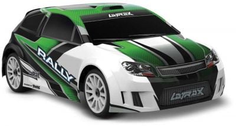
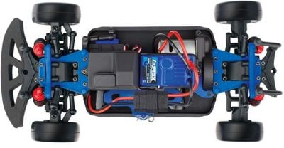

# THE TEAM


In this repository, you’ll find the documentation for the robot created by the "Battlepillars" for the 2025 World Robot Olympiad Future Engineers competition. The robot was the result of a collaborative effort by three students.

aus den Regeln: Pictures of the team and robot must be provided. The pictures of the robot must cover all sides of the robot, must be clear, in focus and show aspects of the mobility, power and sense, and obstacle management. Reference in the discussion sections 1, 2 and 3 can be made to these pictures. Team photo is necessary for judges to relate and identify the team during the local and international competitions. 

Fotos und kurze Beschreibung

<br><br><br>

# Mobility Management
aus den Regeln: Mobility management discussion should cover how the vehicle movements are managed. What motors are selected, how they are selected and implemented. A brief discussion regarding the vehicle chassis design /selection can be provided as well as the mounting of all components to the vehicle chassis/structure. The discussion may include engineering principles such as speed, torque, power etc. usage. Building or assembly instructions can be provided together with 3D CAD files to 3D print parts. 

Die Diskussion zur Bewegungssteuerung sollte beschreiben, wie die Bewegungen des Fahrzeugs gesteuert werden. Dabei sollte erläutert werden, welche Motoren ausgewählt wurden, nach welchen Kriterien sie ausgewählt wurden und wie sie im System implementiert sind.
Auch eine kurze Beschreibung des Designs oder der Auswahl des Fahrzeugchassis kann enthalten sein, ebenso wie Informationen zur Befestigung aller Komponenten am Chassis bzw. an der Fahrzeugstruktur.
Die Diskussion kann ingenieurwissenschaftliche Prinzipien wie Geschwindigkeit, Drehmoment, Leistung usw. einbeziehen.
Bauanleitungen oder Montagehinweise können zusammen mit 3D-CAD-Dateien bereitgestellt werden, um Bauteile im 3D-Druck herzustellen.

A coordinated system consisting of the chassis, steering mechanism, and powertrain is responsible for the robot's mobility, allowing it to move with both precision and efficiency. In den folgenden Kapiteln werden diese einzelnen Elemente näher erläutert.
<br><br>
## Chassis
Anfangs entstand die Idee, ein Fahrzeug mit einer Gesamtlänge von unter 20 cm zu konstruieren, um am Ende des dreirundigen Hindernisrennens einfach geradeaus in die Parklücke einfahren zu können, was Teil der regionalen Aufgabe war. Diese Strategie war im Rahmen des deutschen Regelwerks zulässig.

Da handelsübliche Modellautos in der Regel nicht den erforderlichen Maßen entsprechen, war schnell klar, dass ein Umbau eines Modellautos notwendig sein würde. Die meisten verfügbaren Modelle weisen eine Länge von etwa 30 cm auf – eine Reduktion auf unter 20 cm erschien in diesen Fällen technisch zu aufwendig. Kleinere Modelle mit einer Länge von rund 10 cm boten hingegen nicht genügend Raum für sämtliche erforderlichen Komponenten.

Schließlich wurde ein Modell mit einer Länge von 22 cm gefunden, das als geeignet erschien, auf die gewünschte Länge von 20 cm angepasst zu werden. Dieses Modell – der LaTrax Rally – wurde daher als Basis für das selbstfahrende Fahrzeug ausgewählt.

In the beginning, the idea to construct a robot with the ... below 20 cm was formed to enable our robot to park by simply driving forward after the three rounds of the parkour challenge. This strategy is permitted in the framework of the german rulebook.

As the usual model cars don't conform to the required ..., it quickly became clear that a reassembly / repurpose of a model car was necessary. The most common and accesible models have a length of about 30 cm - a reduction to under 20 cm seemed to be unfeasable regarding the technological aspects.  Smaller models with a total length of around 10 cm, however, don't have much leeway for the additional components required for the challenges.

Following that, a model with a length of 22 cm was found that we've been able to modify to the desired total length of 20 cm. This model - the LaTrax Rally - is the base used for the selfdriving vehicle.

<table>
  <tr>
    <th width=500>LaTrax Rally</th>
    <th width=500>Specifications</th>
  </tr>
  <tr>
    <td><br></td>
    <td><li>Motorart:	Elektro</li>
<li>Antrieb:	4WD</li>
<li>Maßstab:	1:18</li>
<li>Ausführung:	RTR - READY TO RUN</li>
<li>Drive / Bau:	11</li>
</td>
   </tr>
    <tr><TD colspan=2>Where to buy the car: https://traxxas.com/75054-5-118-latrax-rally</TD></tr>
</table>

<br>

## Umbau des Modellautos

### Bodenplatte

Zur Optimierung der Fahrzeugarchitektur wurde eine neue Bodenplatte in Fusion 360 konstruiert, wodurch die Gesamtlänge des Fahrzeugs auf etwa 19 cm reduziert wurde. Die Konstruktion erfolgte unter Berücksichtigung einer kompakten Bauweise zur Verbesserung der Manövrierfähigkeit. Zur Positionsbestimmung mittels Odometrie-Sensoren wurden zwei Öffnungen in der Bodenplatte integriert, um eine direkte optische Erfassung der Bodenstruktur zu ermöglichen. Die Fertigung der Platte erfolgte mittels 3D-Druck. Die Bodenplatte wurde zunächst in einfachem PLA gedruckt. Allerdings hat sich ergeben, dass schon ein leichtes Durchbiegen der Bodenplatte zu einer kritischen Veränderung des Kamerawinkels geführt hat. Deswegen wurde nach Wegen gesucht, die Bodenplatte steifer zu machen. Neben Verstärkungen der Geometrie wurde zusätzlich entschieden, ein anderes Material beim Druck zu verwenden. Im Vergleich aller Materialien, die das Team selber drucken kann, hat PPA-CF sich als das Material mit der höchsten Steifigkeit herausgestellt. Dieses Filament hat das Problem des Durchbiegens der Bodenplatte komplett eliminiert.

For the optimisation of the vehicle's architecture, a new baseplate was digitally constructed using Fusion 360, which resulted in the total length of the vehicle getting reduced to around 19 cm. The construction entailed the requirement for a compact construction method for the improvement of the maneuverability. Two holes / openings have been added for the positioning via the odometer sensors, to allow 

<table>
  <tr>
     <td width=320></td>
     <td width=500></td>
  </tr>
</table>

Auf der Bodeplatte befinden sich das Differential, das Getriebe, der Motor, das Servo, der Fahrtenregler und die Odometriesensoren. Wie diese Komponenten genau befestigt werden, kann im Construction Guide nachgelesen werden.


### Mitteldeck

Anschließend wurde noch ein Mitteldeck mit Fusion 360 designt. Die Maße orientieren sich an der Bodenplatte.

<table>
  <tr>
     <td width=320></td>
     <td width=500></td>
  </tr>
</table>

Dort verbaut wurde der Servo-Controller, die Batterie, der Raspberry und der Spannungsregler. Wie diese genau befestigt werden, kann im Construction Guide nachgelesen werden.


### Oberdeck

Um den LiDAR zu befestigen, wurde noch ein Oberdeck designt. An diesem wurde der LiDAR auf dem Kopf stehend befestigt.

<table>
  <tr>
     <td width=280></td>
     <td width=500></td>
  </tr>
</table>

Dort verbaut wurde der LiDar und das Status-Display. Wie diese genau befestigt werden, kann im Construction Guide nachgelesen werden.


## Powertrain

### Drivetrain
Bei Automobilen lassen sich grundsätzlich drei Antriebsarten unterscheiden:

- Allradantrieb: Sämtliche Räder werden mit Antriebskraft versorgt.
- Frontantrieb: Die Antriebskraft wirkt ausschließlich auf die Vorderräder.
- Heckantrieb: Nur die Hinterräder werden angetrieben.

Das vorhandene Chassis war serienmäßig mit einem Allradantrieb ausgestattet, der den Wettbewerbsanforderungen grundsätzlich genügt hätte. Die vorhandene Lenkung ließ jedoch keinen ausreichenden Radeinschlag zu, was beispielsweise ein Ausparken in einem Zug bei der Parkchallenge unmöglich machte. Zur Verbesserung des Lenkeinschlags wurde daher eine alternative Lösung erarbeitet. Diese bestand in der Konstruktion einer vollständig neuen Vorderachse. Im Zuge des Umbaus konnte der Antrieb der Vorderräder nicht beibehalten werden, da die vorhandenen Kardangelenke den erhöhten Lenkeinschlag mechanisch nicht zuließen. Aus diesem Grund wurde auf einen reinen Hinterradantrieb umgestellt.

So?
Aus diesem Grund wurde der ursprüngliche Allradantrieb deaktiviert und stattdessen auf Heckantrieb umgestellt. Diese Konfiguration bietet im Kontext niedriger Geschwindigkeit und präziser Steuerung eine ausreichende Kraftübertragung, wobei gleichzeitig die Lenkung von Antriebseinflüssen entkoppelt wird – ein Vorteil, insbesondere bei feinfühligem Navigieren durch den Hindernisparcours.

Somit wurde ein Teil der Vorderachse mit dem Programm Fusion 360 selbst erstellt und mit dem 3D-Drucker gedruckt.


<br><br>
Für den Bau der neuen Vorderachse wurde ein Lenkgestänge und Achsschenkel benötigt:
<br><br>
<table>
  <tr>
    <th width=300>Lenkgestänge und Achsschenkel</th>
    <th width=500>Specifications</th>
  </tr>
  <tr>
    <td> </td>
    <td>RC Metall Vorderachse Hinterachse Für WPL HengLong 1/16 Militär LKW RC LKW DE-
</td>
   </tr>
  <tr><TD colspan=2>Where to buy the set: https://www.ebay.de/itm/176692013502</TD></tr>
</table>
<br>
Die Räder der neuen Vorderachse sind von Lego:

<table>
  <tr>
    <th width=300>wheels</th>
    <th width=500>Specifications</th>
  </tr>
  <tr>
    <td> </td>
    <td>Size: 5,6cm x 1,5cm x 5,6cm
</td>
   </tr>
  <tr><TD colspan=2>Where to buy the wheels: https://www.brickowl.com/de/catalog/lego-wheel-56-with-medium-azure-tire-39367</TD></tr>
</table>
<br>
Die neue Vorderachse in einer Detailaufnahme:
<br><br>

<br>

### Motor
Der bereits vorhandene Brushed-Motor wurde im Rahmen einer vergleichenden Analyse verschiedenen Motorarten gegenübergestellt. Zur Bewertung der jeweiligen Vor- und Nachteile wurde eine internetgestützte Recherche durchgeführt. Dabei konnten neben dem Brushed-Motor insbesondere der Brushless-Motor sowie der Schrittmotor als relevante Alternativen identifiziert werden.

- Brushless-Motor:<br>
Diese Bauart bietet grundsätzlich eine höhere Leistungsabgabe im Vergleich zum im Modellfahrzeug verbauten Brushed-Motor. Da im Rahmen des Wettbewerbs jedoch keine hohe Endgeschwindigkeit erforderlich ist, wurde dieser Vorteil als nicht entscheidungsrelevant eingestuft. Zudem weisen Brushless-Motoren insbesondere bei niedrigen Drehzahlen eine eingeschränkte Steuerbarkeit auf, was eine präzise Navigation im Hindernisparcours erschwert.

- Schrittmotor:<br>
Schrittmotoren zeichnen sich durch eine hohe Steuerpräzision aus. Allerdings ist ihre Ansteuerung vergleichsweise komplex. Zusätzlich gehen ein hoher Stromverbrauch, größere Bauformen und eine geringe maximale Drehzahl mit dieser Motorart einher, was sie für den vorgesehenen Einsatzbereich als ungeeignet erscheinen lässt.

Auf Grundlage dieser Analyse wurde entschieden, den bereits im Modellauto integrierten Brushed-Motor weiterzuverwenden, da dieser unter den gegebenen Rahmenbedingungen die funktional und technisch sinnvollste Lösung darstellt.

<table>
  <tr>
    <th width=300>Motor</th>
    <th width=600>Specifications</th>
  </tr>
  <tr>
    <td> </td>
    <td>23-turn brushed 370-size LaTrax® motor with bullet connectors
</td>
   </tr>
    <tr><TD colspan=2>Where to buy the motor: https://traxxas.com/7575r-23-turn-brushed-370-size-motor</TD></tr>
</table>


### Motor Driver (= Fahrtenregler)
Der Fahrtenregler ist zwischen der Energiequelle und dem Antriebsmotor positioniert und übernimmt die Regelung der Motordrehzahl. Im Rahmen experimenteller Untersuchungen konnte festgestellt werden, dass der ursprünglich verbaute Fahrtenregler primär auf den Hochgeschwindigkeitsbetrieb ausgelegt ist. Im unteren Drehzahlbereich ließ sich keine ausreichende Feinsteuerung realisieren.

Im Zuge weiterführender Recherchen wurde festgestellt, dass bestimmte Modellfahrzeuge, sogenannte Crawler, speziell für den Einsatz auf unebenem und steilem Gelände konzipiert sind. Die in diesen Fahrzeugen eingesetzten Fahrtenregler zeichnen sich durch eine besonders feinfühlige Steuerbarkeit im Niedriggeschwindigkeitsbereich aus und erfüllen somit die für das Projekt relevanten Anforderungen an präzises Fahrverhalten bei geringer Geschwindigkeit.

Auf Grundlage dieser Erkenntnisse wurde die Entscheidung getroffen, den ursprünglich verbauten Regler durch ein geeigneteres Modell zu ersetzen. Die Wahl fiel auf den Quicrun WP 1080–G2, dessen technische Eigenschaften den spezifizierten Anforderungen in vollem Umfang entsprechen.

<table>
  <tr>
    <th width=300>Motor Driver Quicrun WP 1080–G2</th>
    <th width=600>Specifications</th>
  </tr>
  <tr>
    <td width=300> </td>
    <td><li>Application: 1/10th Rock Crawler</li>
<li>Motor Type: Brushed Motor (540 / 555 size motors)</li>
<li>Cont./Peak Current: 80A/400A</li>
<li>Input Voltage: 2-3S LiPo/5-9S Cell NiMH</li>
<li>BEC Output: 6V / 7.4V / 8.4V @ 4A (Switch-mode)</li>
<li>Wires & Connectors: Black-14AWG-200mm / Red-14AWG-200mm</li>
<li>Programming device: LED program box</li>
</td>
   </tr>
    <tr><TD colspan=2>Where to buy the motor driver: https://www.modellbau-berlinski.de/rc-elektronik-und-akkus/regler/auto-brushed/quicrun-wp1080-g2-crawler-brushed-regler-80a-bec-4a</TD></tr>
</table>

### Drive Motor


The drive motor control system consists of three main components:

1. **Adafruit ServoKit PWM Driver**: Generates the PWM control signals for the motor driver
2. **Motor Driver (ESC)**: Converts PWM signals to appropriate power levels for the brushed DC motor  
3. **PID Control Algorithm**: Provides closed-loop speed control using feedback from odometry sensors

#### Hardware Interface

The motor is controlled via PWM signals sent to the motor driver through the Adafruit ServoKit library:

- **Control Channel**: Servo channel 3 on the ServoKit
- **PWM Range**: 90° to 180° (forward), 90° to 0° (reverse), 90° = neutral/brake
- **Communication**: I²C between Raspberry Pi and ServoKit
- **Update Rate**: 70 Hz depending on control loop timing

#### Software Implementation

The motor control is implemented in the `DriveBase` class within `motorController.py`. Here is a sample code that implements driving to a specifix x/y coordinate. We have other functions that do different maneuvers in this class.

```python
class DriveBase:
    
    def driveTo(self, x, y, speed, brake):
        """
        Drive the robot to a specific coordinate (x, y) with controlled speed and optional braking.
        
        Args:
            x (float): Target x-coordinate in millimeters
            y (float): Target y-coordinate in millimeters  
            speed (float): Desired speed in m/s (positive for forward, negative for reverse)
            brake (int): Braking mode (1 = enable progressive braking near target, 0 = no braking)
            
        Returns:
            bool: True when target is reached (within 30mm), False while still driving
        """
        # Set the target speed for the PID controller
        self.pidController.setpoint = speed
        
        # Calculate straight-line distance from current position to target
        distance = math.sqrt(math.pow((self.slam.xpos - x),2) + math.pow((self.slam.ypos - y),2))
        
        # Calculate the required heading angle to reach the target
        # atan2 gives angle from current position to target, negated to match robot coordinate system
        zielwinkel = -(math.atan2(self.slam.ypos - y, self.slam.xpos - x) / math.pi * 180)
        
        # Calculate heading error (difference between current and required heading)
        fehlerwinkel = -zielwinkel + self.slam.angle
        
        # Normalize heading error to [-180, +180] degree range
        # This ensures we always take the shortest angular path to the target
        while fehlerwinkel > 180:
            fehlerwinkel -= 360
        while fehlerwinkel < -180:
            fehlerwinkel += 360
        
        # Initialize target angle on first call (5000 is sentinel value for "not set")
        if self.zielWinkel == 5000:
            self.zielWinkel = zielwinkel
        
        # Calculate distance along the original target line (corrected for any heading drift)
        # This gives us the "useful" distance - how much progress we've made toward the target
        distanceLine = distance * math.cos((self.zielWinkel - zielwinkel) / 180 * math.pi)
        
        # Progressive braking: reduce speed as we approach the target
        # When within 200mm and braking enabled, scale speed proportionally to remaining distance
        if (abs(distanceLine) < 200) and (brake == 1):
            self.pidController.setpoint = speed * distanceLine / 200
        
        # Calculate steering correction using PID controller
        # fehlerwinkel is the input, outputSteer is the steering angle correction
        outputSteer = self.pidSteer.compute(fehlerwinkel,1)
        
        # Calculate motor speed correction using PID controller
        # Compares actual speed (slam.speed) with target speed (setpoint)
        output = self.pidController.compute(self.slam.speed,0.5,self.slam)
        
        # Limit steering output to prevent excessive steering angles
        # ±55 degrees is the maximum safe steering for faster driving
        if (outputSteer>55):
            outputSteer = 55
        if (outputSteer<-55):
            outputSteer = -55
            
        # Apply steering: 90° is straight ahead, add correction for turning
        setServoAngle(self.kit,90 + outputSteer,self.slam)
        
        # Apply motor control: 99° is forward base speed, add PID correction
        self.kit.servo[3].angle = 99 + output
        
        # Check if we've reached the target (within 30mm tolerance)
        if distanceLine < 30:
            # Reset target angle for next movement command
            self.zielWinkel = 5000
            # Stop the motor (90° = neutral position)
            self.kit.servo[3].angle = 90
            return True  # Target reached
        else:
            return False  # Still driving to target
```


#### Advanced Control Features

**Adaptive Braking**: The system implements intelligent braking that adjusts deceleration based on remaining distance:

```python
if (distance_remaining < 30) and (brake == 1):
    if speed > 0:
        self.pidController.setpoint = 0.1  # Gentle deceleration
    else:
        self.pidController.setpoint = -0.1

if (distance_remaining < 10) and (brake == 1):
    self.pidController.setpoint = 0  # Full stop
```

**Direction-Dependent Control**: The system handles forward and reverse motion differently to account for mechanical asymmetries:

```python
if speed > 0:  # Forward
    self.kit.servo[3].angle = 110 + output
else:  # Reverse  
    self.kit.servo[3].angle = 80 + output
```

**Safety Features**: 
- Automatic motor cutoff when target reached
- PID reset when changing directions to prevent windup
- Speed limiting for better reliability


#### Optical Tracking Odometry SensorsT

The odometry system uses two **SparkFun Qwiic Optical Tracking Odometry Sensors (OTOS)** connected via I²C at addresses `0x17` and `0x19`. Here's how we implement the odometry system:

##### Position and Speed Tracking

```python
def update(self):
    """Main odometry update function called every control loop iteration"""
    
    # Read position data from both sensors
    myPosition1 = self.myOtos1.getPosition()  # Returns x, y, h (heading)
    myPosition2 = self.myOtos2.getPosition()
    
    # Calculate speed from position changes (speed in m/s * 100)
    if self.lastXpos1 != 5000:  # Skip first iteration
        self.speed1 = math.sqrt((myPosition1.x - self.lastXpos1)**2 + 
                               (myPosition1.y - self.lastYpos1)**2) * 100
    
    if self.lastXpos2 != 5000:
        self.speed2 = math.sqrt((myPosition2.x - self.lastXpos2)**2 + 
                               (myPosition2.y - self.lastYpos2)**2) * 100
    
    # Store positions for next speed calculation
    self.lastXpos1, self.lastYpos1 = myPosition1.x, myPosition1.y
    self.lastXpos2, self.lastYpos2 = myPosition2.x, myPosition2.y
    
    # Convert to robot coordinate system (mm, with coordinate transformation)
    myPosition1.x = -myPosition1.x * 1000
    myPosition1.y = -myPosition1.y * 1000
    myPosition2.x = -myPosition2.x * 1000
    myPosition2.y = -myPosition2.y * 1000
```

##### Sensor Health Monitoring and Redundancy

```python
def update(self):
    # Health monitoring: compare sensor readings for anomalies
    if self.healthy1 == 1 and self.healthy2 == 1:
        # Check for speed discrepancies between sensors
        if self.speed1 + 0.15 < self.speed2:
            self.errorsOtos1 += 1  # Sensor 1 significantly slower
        else:
            if self.errorsOtos1 > 0:
                self.errorsOtos1 -= 1  # Decrease error count
                
        if self.speed2 + 0.15 < self.speed1:
            self.errorsOtos2 += 1  # Sensor 2 significantly slower
        else:
            if self.errorsOtos2 > 0:
                self.errorsOtos2 -= 1
        
        # Check for impossible speeds (> 2 m/s indicates sensor failure)
        if self.speed1 > 2:
            self.errorsOtosSpeed1 += 1
        if self.speed2 > 2:
            self.errorsOtosSpeed2 += 1
            
        # Check position bounds (robot should stay within field)
        if (myPosition1.x < -100 or myPosition1.x > 3100 or 
            myPosition1.y < -100 or myPosition1.y > 3100):
            self.healthy1 = -2  # Position out of bounds
            
    # Mark sensors as unhealthy after repeated errors
    if self.errorsOtos1 > 20:
        self.healthy1 = 0
        print(f"Sensor 1 unhealthy, errors: {self.errorsOtos1}")
    if self.errorsOtosSpeed1 > 5:
        self.healthy1 = -1
        print(f"Sensor 1 speed errors: {self.errorsOtosSpeed1}")
```

##### Data Fusion and Final Position Calculation

```python
def update(self):
    # Use best available sensor data for robot position
    if self.healthy1 == 1 and self.healthy2 == 1:
        # Both sensors healthy: average their readings
        self.xpos = (myPosition1.y + myPosition2.y) / 2
        self.ypos = (myPosition1.x + myPosition2.x) / 2
        self.angle = meanAngle(myPosition1.h, myPosition2.h)  # Average angles
        self.speed = (self.speed1 + self.speed2) / 2
        
    elif self.healthy1 == 1:
        # Only sensor 1 healthy: use its data
        self.xpos = myPosition1.y
        self.ypos = myPosition1.x
        self.angle = myPosition1.h
        self.speed = self.speed1
        
    else:
        # Only sensor 2 healthy: use its data
        self.xpos = myPosition2.y
        self.ypos = myPosition2.x
        self.angle = myPosition2.h
        self.speed = self.speed2
```

##### Position Reset and Calibration

```python
def setPosition(self, x, y, angle=-5000):
    """Set absolute position (used for LiDAR-based corrections)"""
    
    # Update sensor 1 position
    myPosition = self.myOtos1.getPosition()
    myPosition.y = -x / 1000  # Convert mm to meters and apply coordinate transform
    myPosition.x = -y / 1000
    if angle > -5000:
        myPosition.h = angle
    self.myOtos1.setPosition(myPosition)
    
    # Update sensor 2 position
    myPosition = self.myOtos2.getPosition()
    myPosition.y = -x / 1000
    myPosition.x = -y / 1000
    if angle > -5000:
        myPosition.h = angle
    self.myOtos2.setPosition(myPosition)
    
    # Update internal position tracking
    self.xpos = x
    self.ypos = y
    self.ignoreSpeedUpdate = 1  # Skip next speed calculation
```

#### Key Features of Our Implementation

1. **Dual Sensor Redundancy**: Two sensors provide backup if one fails due to dust or surface issues
2. **Automatic Health Monitoring**: Continuous error detection and sensor status tracking
3. **Speed Calculation**: Real-time velocity calculation from position differences
4. **Coordinate System Integration**: Seamless integration with robot's navigation coordinate system
5. **LiDAR Fusion**: Position corrections using LiDAR wall measurements when sensors drift

This odometry system provides continuous position tracking with 2-5cm accuracy per meter of travel, enabling  autonomous navigation throughout the competition course.


#### LiDAR 

Our LiDAR system uses the **RpLidar S2L** which provides 360-degree scanning with up to 32000 samples per second. The implementation consists of hardware interface, data processing, and multiple application functions. The raspberry communicates with the lidar via a serial uart port at 1 Mbps. The communication is handled by a library supplied by Slamtec.

##### Hardware Interface and Initialization


##### Real-time Scanning and Data Acquisition

```python
def update(self):
    """Main update loop - called every control cycle"""
    
    # Scan every 10th loop iteration to optimize performance
    if self.loopCounter >= 9:
        # Get complete 360° scan from LiDAR
        self.lidar.getScan(self.scan)  # Updates self.scan array
        self.loopCounter = 0
    else:
        self.loopCounter += 1
    
    # self.scan[angle] now contains distance in mm for each degree
    # Example: self.scan[0] = distance at 0°, self.scan[90] = distance at 90°
```

##### Position Detection and Localization

```python
def startpostionsetzen(self):
    """Detect robot's starting position using LiDAR wall measurements"""
    
    # Calculate average distance in forward direction (-5° to +5°)
    average = 0
    scans = 0
    for i in range(-5, 6):
        if self.scan[i] > 0:
            average += self.scan[i]
            scans += 1
    average = average / scans
    
    # Determine starting position based on wall distances
    if (average > 1870) and (average < 1970):
        # Position 1: Near front wall, clockwise direction
        self.direction = self.CW
        self.eventType = self.ER
        self.setPosition(average, 3000 - self.scan[90], 0)
        
    elif (average > 1345) and (average < 1450):
        # Position 2: Different wall configuration
        self.direction = self.CCW
        self.setPosition(self.scan[180], 3000 - self.scan[-90], 180)
        
    # Additional position detection logic...
```

##### Dynamic Position Correction During Driving

```python
def repositionDrive(self):
    """Correct robot position using LiDAR while driving"""
    
    # Determine robot's orientation quadrant
    quadrant = 0
    quadrant_range = 1050
    
    if (self.xpos < quadrant_range and self.ypos < quadrant_range):
        quadrant = 1  # Top-left
    elif (self.xpos < quadrant_range and self.ypos > 3000 - quadrant_range):
        quadrant = 2  # Bottom-left
    # ... additional quadrants
    
    # Correct position based on current heading
    angle_check = self.angle
    while angle_check > 180:
        angle_check -= 360
    while angle_check < -180:
        angle_check += 360
    
    # Facing right (180°): use distance to right wall
    if abs(angle_check - 180) < 30:
        wall_distance = self.scan[90]  # Distance to right wall
        corrected_x = 3000 - wall_distance
        self.setPosition(corrected_x, self.ypos, self.angle)
        
    # Facing forward (0°): use distance to front wall
    elif abs(angle_check) < 30:
        wall_distance = self.scan[0]   # Distance to front wall
        corrected_y = wall_distance
        self.setPosition(self.xpos, corrected_y, self.angle)
```

##### Obstacle Detection and Recognition

```python
def hindernisseErkennung(self, scan, toScan, camera, checkHeightNear):
    """Detect obstacles using LiDAR and determine their positions"""
    
    found = 0
    
    # Convert polar LiDAR data to Cartesian coordinates
    xposes = []
    yposes = []
    for i in range(len(scan)):
        # Convert angle + robot position to world coordinates
        rad = (i + self.angle) / 180 * math.pi
        xposes.append(math.cos(rad) * -scan[i] + self.xpos)
        yposes.append(math.sin(rad) * scan[i] + self.ypos)
    
    # Check each predefined obstacle position
    for i in range(len(self.hindernisse)):
        if i in toScan:  # Only check specified positions
            self.hindernisse[i].farbe = Hindernisse.NICHTS
            dots = 0
            angles = []
            
            # Find LiDAR points near this obstacle position
            for b in range(len(xposes)):
                distance_to_obstacle = math.sqrt(
                    (xposes[b] - self.hindernisse[i].x)**2 + 
                    (yposes[b] - self.hindernisse[i].y)**2
                )
                
                # If LiDAR point is within 120mm of obstacle position
                if distance_to_obstacle < 120 and self.scan[b] > 200:
                    dots += 1
                    angles.append(b)
            
            if dots > 0:  # Obstacle detected
                found += dots
                
                # Calculate average angle to obstacle
                angle = sum(angles) / len(angles)
                angle = -angle  # Coordinate system correction
                
                # Use camera to determine obstacle color
                # (camera processing code integration here)
```

##### Key Features of Our LiDAR Implementation

1. **Real-time 360° Scanning**: Continuous environment monitoring at 10 kHz
2. **Automatic Position Correction**: Uses wall distances to correct odometry drift
3. **Starting Position Detection**: Automatically determines robot placement
4. **Obstacle Detection**: Identifies obstacle positions
5. **Coordinate Transformation**: Converts polar scan data to robot coordinate system
6. **Performance Optimization**: Strategic scan timing to maintain control loop performance

##### Data Structure and Access Patterns

```python
# LiDAR scan data structure
self.scan[0]     # Distance to front (0°)
self.scan[90]    # Distance to right (90°) 
self.scan[180]   # Distance to back (180°)
self.scan[270]   # Distance to left (270°/-90°)

# Example: Check if path is clear ahead
if self.scan[0] > 500:  # More than 500mm clear ahead
    # Safe to drive forward
    
# Example: Distance to nearest wall on right side
right_wall_distance = min(self.scan[80:100])  # Check 80°-100° range
```


### Servo Motor
Der Servo ist für die Lenkung der Vorderräder verantwortlich und sitzt direkt im Modellfahrzeug. Die Stellgeschwindigkeit sowie das Drehmoment dieses Servos wurden im Rahmen einer technischen Bewertung als vollumfänglich ausreichend für die Wettbewerbsanforderungen eingestuft.

Konkret handelt es sich um den Traxxas Waterproof Sub-Micro Servo (Modellnummer 2065A). Dieser erzeugt bei einer Betriebsspannung von 6,0 V ein Drehmoment von 2,3 kg·cm (≈ 32 oz-in) und erreicht eine Stellzeit von 0,20 s pro 60°.

Da diese Kenndaten eine präzise sowie wirkungsvolle Lenkung gewährleisten, wurde beschlossen, den bereits im Modell vorhandenen Servo weiterhin zu verwenden.

<table>
  <tr>
    <th width=300>Waterproof Sub-Micro Servo</th>
    <th width=600>Specifications</th>
  </tr>
  <tr>
    <td> </td>
    <td><li>Fully waterproof</li>
<li>Fits steering in LaTrax models</li>
<li>Power: 2.3kg/cm</li>
<li>Operating voltage: 6.0V</li>
<li>Speed: 0.20 sec/60°</li>
<li>Dimensions: 22.6×12.6×22.5 mm</li>
</td>
   </tr>
    <tr><TD colspan=2>Where to buy the motor: https://traxxas.com/2065a-waterproof-sub-micro-servo</TD></tr>
</table>

### Funktionsweise Antrieb

Das Getriebe besteht aus einem Motorritzel mit 14 Zähnen und einem größeren Hauptzahnrad
mit 61 Zähnen. Das Motorritzel wird vom Motor gedreht. Das Ritzel wiederum dreht das größere
Hauptzahnrad. Das Hauptzahnrad ist mit dem Differential verbunden, welches die Kraft auf die
beiden Hinterräder verteilt. Um feinfühlig steuern zu können und weil wir keine hohe Endge-
schwindigkeit brauchen, haben wir die größtmögliche Übersetzung gewählt, die sich in unser
Chassis einbauen ließ. Die Übersetzung wird vom Hauptzahnrad und dem Motorritzel bestimmt
und ist bei uns 61:14 = 1:4,35.
<br><br>
Durch die gewählte Übersetzung von 61:14 ergibt sich eine signifikante Verstärkung des Drehmoments am Antriebsstrang. Diese Konfiguration wurde gezielt gewählt, um eine zuverlässige Kraftübertragung auch bei niedrigen Geschwindigkeiten sicherzustellen. Während der Testläufe zeigte sich, dass die Wettbewerbsfläche oft kleinere Unebenheiten und Wellen aufweist. Diese können dazu führen, dass Fahrzeuge mit unzureichendem Drehmoment hängen bleiben oder an Traktion verlieren. In unseren Versuchen bewährte sich die getroffene Antriebswahl: Der Roboter konnte auch über wellige Mattenbereiche hinweg gleichmäßig beschleunigen und blieb dabei jederzeit kontrollierbar. Somit trägt die kraftbetonte Getriebeübersetzung wesentlich zur Zuverlässigkeit des Fahrzeugs im realen Einsatz bei.


## Steering

The steering system of our robot employs a servo-controlled front axle with Ackermann steering geometry.

### Servo Control System

The steering is controlled through an Adafruit 16 Channel Servo Driver connected to the Raspberry Pi via I²C communication. The servo driver board manages the PWM signal generation required for the servo positioning. For the communication with the board we use the Adafruit servokit library

#### Software Implementation

The servo control is implemented in the `motorController.py` file through the `setServoAngle()` function:

```python
def setServoAngle(kit, angle, slam=None):
    servoMitte = 80  # Center position (straight ahead)
    
    # Convert desired steering angle to servo position
    target = angle - 90 + servoMitte
    
    # Limit servo travel to prevent damage
    if target > 180:
        target = 180
    if target < 0:
        target = 0
    
    # Send command to servo on channel 0
    kit.servo[0].angle = target

```

#### Steering Range and Calibration

- **Center Position**: 80° (servo angle) = straight ahead. This value needs to be set up by hand accoring to the exact servo arm mounting
- **Maximum Left**: 0° (servo angle) = full left lock
- **Maximum Right**: 180° (servo angle) = full right lock
- **Steering Input Range**: The function accepts angles where 90° represents straight ahead, with deviations from 90° controlling the steering direction


<br><br><br>

# Power and Sense Management
aus den Regeln: Power and Sense management discussion should cover the power source for the vehicle as well as the sensors required to provide the vehicle with information to negotiate the different challenges. The discussion can include the reasons for selecting various sensors and how they are being used on the vehicle together with power consumption. The discussion could include a wiring diagram with BOM for the vehicle that includes all aspects of professional wiring diagrams. 
<br><br>
Die Diskussion zum Energie- und Sensorsystem sollte sowohl die Stromquelle des Fahrzeugs als auch die Sensoren abdecken, die benötigt werden, um dem Fahrzeug Informationen zur Bewältigung der verschiedenen Herausforderungen bereitzustellen. Die Diskussion kann die Gründe für die Auswahl verschiedener Sensoren sowie deren Einsatz am Fahrzeug und den damit verbundenen Energieverbrauch beinhalten. Es kann zudem ein Schaltplan mit Stückliste (BOM) für das Fahrzeug enthalten sein, der alle Aspekte professioneller Verdrahtungspläne berücksichtigt.

Kurzer Satz was in dem Kapitel alles benannt werden wird.

<br><br>

## Sensoren
  
### Li-Po Battery
- Bild + Spezifikationen

### LiDAR

Im Rahmen unserer Untersuchungen zum Thema autonomes Fahren wurde festgestellt, dass in der Regel LiDAR-Systeme (Light Detection and Ranging) zur Umgebungserfassung eingesetzt werden. Dabei handelt es sich um ein zentrales Sensorsystem in autonomen Fahrzeugen, das mithilfe von Laserstrahlen die Umgebung präzise erfasst und ein zweidimensionales Abbild generiert.

Durch die Messung der Laufzeit der reflektierten Laserstrahlen kann die Entfernung zu Objekten bestimmt werden. Diese Informationen ermöglichen eine zuverlässige Erkennung von Hindernissen sowie anderen Verkehrsteilnehmern und tragen wesentlich zur sicheren Navigation des Fahrzeugs bei.

Eine erhöhte Umgebungswahrnehmung wird erzielt, wenn die LiDAR-Daten mit weiteren Sensordaten, beispielsweise von Kameras oder Radarsystemen, kombiniert werden. Dies erlaubt eine fundierte Entscheidungsfindung zur sicheren Fahrzeugsteuerung. Aufgrund der überzeugenden Leistungsmerkmale wurde entschieden, ein LiDAR-System in das eigene autonome Fahrzeug zu integrieren.

In der nachfolgenden Tabelle wurden die für die Auswahl relevanten technischen Kriterien verschiedener LiDAR-Systeme zusammengestellt und entsprechend unserer Anforderungen farblich bewertet. Im Ergebnis stellte sich heraus, dass der RpLidar S2 die geeignetste Option für unsere Anwendung darstellt.


Nach der Integration des LiDAR-Systems in den Roboter wurde festgestellt, dass die Spielfeldbegrenzung nicht zuverlässig erkannt wurde. Ursache hierfür war, dass die vom Sensor ausgesendeten Laserstrahlen über die Begrenzung hinweg projiziert wurden.

In mehreren Iterationen wurde der Sensor schrittweise tiefer im Gehäuse des Roboters verbaut, jedoch konnte auch dadurch keine zufriedenstellende Erfassung der Begrenzungslinien erreicht werden. Eine anschließende Analyse des Datenblatts ergab, dass die Laserstrahlen des verwendeten LiDARs in einem leicht nach oben gerichteten Winkel emittiert werden. Dies erklärte, weshalb auch bei einer tieferliegenden Positionierung die relevanten Objekte nicht im Scanbereich erfasst wurden.

Daraufhin wurde beim Hersteller angefragt, ob eine Montage des LiDARs in umgekehrter (invertierter) Ausrichtung technisch zulässig sei. Die Rückmeldung fiel positiv aus, sodass der Sensor nun in umgekehrter Position im Roboter verbaut ist. Durch diese Anordnung wird erreicht, dass die Scanebene die Spielfeldbegrenzung zuverlässig detektiert.

### Kamera
Während zur Positionsbestimmung eines Hindernisses der LiDar verwendet wird, wird zusätzlich eine Kamera benötigt, um die Farbe des Hindernisses zu erkennen. Zunächst wurde die Raspberry Pi Global Shutter Camera bestellt, da deren technische Eigenschaften als besonders geeignet für den Einsatz in einem mobilen Robotersystem eingeschätzt wurden. Die Kamera ermöglicht die verzerrungsfreie Erfassung schneller Bewegungen, da sie – im Gegensatz zu Rolling-Shutter-Systemen – typische Bewegungsartefakte vermeidet. Zudem erlaubt die Unterstützung von Wechselobjektiven eine flexible Anpassung an unterschiedliche Anwendungsszenarien. Nach dem Eintreffen der Kamera stellte sich jedoch heraus, dass deren physische Abmessungen deutlich größer ausfielen als ursprünglich angenommen. Aufgrund der begrenzten Platzverhältnisse im Fahrzeugchassis konnte sie nicht integriert werden.

Infolgedessen wurde auf eine kompaktere Alternative zurückgegriffen: das Raspberry Pi Camera Module 3 Wide (12 MP). Obwohl ursprünglich eine Global-Shutter-Kamera angedacht war, wurde festgestellt, dass die im System auftretenden Geschwindigkeiten keine kritischen Rolling-Shutter-Artefakte verursachen. Die gewählte Kamera erfüllt die Anforderungen in Bezug auf Sichtfeld, Auflösung (12 MP), Integration und Rechenkompatibilität und stellt somit eine praktikable Lösung für die Bildverarbeitung im gegebenen Kontext dar.

### Odometrie Sensor
In den letzten zwei Jahren wurde im Rahmen der Teilnahme an der Kategorie RoboMission die Bedeutung einer kontinuierlichen Positionsbestimmung deutlich. Dort wurde die Position durch Auswertung der Radumdrehungen und ergänzend durch ein Gyroskop bestimmt. Das aktuelle Modellbau-Chassis bietet jedoch keine Möglichkeit, die Radbewegung direkt zu messen.

Bei der Suche nach Alternativen wurde festgestellt, dass die Bewegung auch optisch – ähnlich wie bei einer Computermaus – erfasst werden kann. Auf dieser Grundlage wurde der „Optical Tracking Odometry Sensor“ von SparkFun ausgewählt. Dieser integriert einen optischen Bewegungssensor, ein Gyroskop sowie einen Mikrocontroller, der die Odometrieberechnungen eigenständig durchführt.

Zur Erhöhung der Genauigkeit und Redundanz wurden zwei dieser Sensoren verbaut.

Funktionsweise
Die Bewegungserkennung erfolgt durch eine nach unten gerichtete Kamera, die mit bis zu 20.000 Bildern pro Sekunde Veränderungen der Bodenstruktur analysiert. Aus den Bilddifferenzen wird die Verschiebung des Fahrzeugs über den Untergrund ermittelt. Diese Methode ist unempfindlich gegenüber Rutsch- oder Schlupfeffekten, wie sie bei Encoder-basierten Verfahren auftreten können.


- Verbesserungsvorschlag: Einen dritten Sensor einbauen, damit echte Mehrheitsentscheidung, was der richtige Messwert ist

### Status-Display
Zusätzlich wurde ein Status-Display integriert, über das verschiedene Systemparameter visualisiert werden. Die aktuelle Geschwindigkeit sowie die Zielgeschwindigkeit werden dabei durch Balkenanzeigen in Metern pro Sekunde dargestellt.

Der Betriebszustand der beiden Odometrie-Sensoren wird durch ein Farbsystem signalisiert:

- Grünes Licht zeigt an, dass der betreffende Maussensor aktiviert ist und ordnungsgemäß arbeitet.
- Rotes Licht wird angezeigt, wenn ein Sensor eine mehr als 0,2 m/s geringere Geschwindigkeit im Vergleich zum zweiten Sensor misst; in diesem Fall wird der Sensor als fehlerhaft klassifiziert.
- Blaues Licht weist darauf hin, dass der Sensor eine Geschwindigkeit über 1 m/s registriert, was physikalisch nicht plausibel ist; der Sensor wird daraufhin automatisch deaktiviert.

Dieses Display ist eine optionale Komponente und für die Funktionalität des Roboters nicht unbedingt erforderlich.

<br>

## Energieversorgung des Fahrzeugs

Die Energieversorgung des autonomen Fahrzeugs wurde so ausgelegt, dass sie sämtliche Sensoren, Steuerungseinheiten und Aktuatoren zuverlässig mit Energie versorgen kann. Als zentrale Stromquelle kommt ein 7,4 V Lithium-Polymer-Akku (LiPo, 2S, 2200 mAh) zum Einsatz, der direkt mit dem Fahrtenregler verbunden ist und über einen 5V Spannungswandler auch den Raspberry mit Strom versorgt.

### Energieverbrauch der Komponenten

Im Folgenden sind die wesentlichen verbauten Komponenten sowie deren typischer Energieverbrauch aufgeführt:

| Komponente  | Betriebsspannung | Leistungsaufnahme (typisch)  | Bemerkung |
| ------------- | ------------- | ------------- | ------------- |
| Raspberry Pi 5  | 5 V  | 3–8 W  | Hauptsteuerung, hohe CPU-Leistung  | 
| Raspberry Pi Camera Module 3 Wide (12 MP)  | 5 V  | 1–2 W  | Direkt am CSI-Port des RPi angeschlossen  |
| 2× SparkFun Optical Tracking Odometry Sensor  | 3,3 V  | je ca. 0,1 W  | Geringer Stromverbrauch, über I²C kommunizierend  |
| RpLidar S2  | 5 V  | 2 W  | Kontinuierlicher Betrieb zur Umfelderfassung  |
| LaTrax 370 brushed DC-Motor (23-turn)  | 7,4 V  | 1-10 W (je nach Last)  | Hauptantrieb, stark lastabhängig  |
| Quicrun WP 1080–G2 Motor Driver  | 7,4 V  | geringer Eigenverbrauch  | Steuerung des Antriebsmotors  |
| Traxxas Sub-Micro Servo 2065A (Lenkung)  | 6 V  | 1–2 W kurzzeitig  | Stromspitzen bei Bewegung, Versorgung über BEC  |
| Led Anzeigefeld (Status-Display) | 3,3 V  | 0-0,5 W  | Der Stromverbrauch ist abhängig davon, wie viele Pixel leuchten  |
| Servo-Controller  | 5 V  | 0,1 W  | Geringer Stromverbrauch, über I²C kommunizierend  |

### Gesamtleistungsbedarf

Der gesamte Energiebedarf des Systems liegt abhängig vom bei geschätzten 8–20 W im Betrieb. Dabei entfallen die größten Verbraucher auf:

- Den Raspberry Pi 5
- Den DC-Motor (hoher Strom bei Beschleunigung)
- Das LiDAR-Modul, das dauerhaft aktiv ist

Bei einer Akkukapazität von 2200 mAh (7,4 V) ergibt sich eine verfügbare Energie von 16,28 Wh. Damit kann eine Betriebsdauer von ca. 45 bis 120 Minuten erreicht werden, abhängig von Fahrverhalten, Streckenprofil und Rechenlast.
Basierend auf Erfahrungswerten wurde festgestellt, dass eine sichere Betriebszeit von ca. 90 Minuten zuverlässig erreicht wird. Im Anschluss wird der Akku routinemäßig gewechselt, um einer Tiefentladung vorzubeugen, da keine Spannungsüberwachung im System integriert wurde.

### Spannungsversorgung

Die Spannungsversorgung der einzelnen Komponenten wird wie folgt realisiert:
- 7,4 V direkt: DC-Motor über den Fahrtenregker
- 5 V über Step-Down-Regler (DC-DC-Wandler): Raspberry Pi 5, LiDAR, Kamera, Servo, Servocontroller
- 3,3 V über in den Raspberry integrierten Regler : Odometry-Sensoren, Led Anzeigefeld

### Sicherheit und Verdrahtung
- Der Akkustecker ist verpolungssicher
- Ein Hauptschalter trennt die Versorgung komplett


## Schaltplan der Bauteile


<br><br><br>

# Code für alle Komponenten
- wird von Nils gefüllt

Steering Servo


<br><br><br>

# Obstacle Management

Dieses Kapitel schreibt Nils
Die Diskussion zum Hindernismanagement sollte die Strategie des Fahrzeugs zur Bewältigung des Hindernisparcours in Bezug auf alle Herausforderungen beinhalten. Dies kann Flussdiagramme, Pseudocode sowie Quellcode mit ausführlichen Kommentaren umfassen.
<br><br>
## Initial location aqusition 

At the beginning of the program, the robot detects the starting direction in which the car must drive on the track, based on its position on the mat.

For the Open Challenge, there are four different positions where we can place the robot, which allow it to recognize how it must drive. These four options result from the fact that there are two possible starting sections and two directions of travel.

In the Obstacle Challenge, two different positions are possible. Here as well, the robot uses the LiDAR to detect its position and then knows which direction it needs to drive.


 <br><br>
## Position updates during driving 

### optical tracking sensor function 
For continuous position tracking, we use two optical tracking sensors. A downward-facing camera inside the sensor captures 20,000 images per second. Based on changes in the images, the sensor detects movement across the surface. Additionally, the sensor has a built-in gyroscope. Using data from the gyroscope and the movement across the ground, the sensor automatically calculates the current coordinates.

### sensor failure detection / health status 
Two optical tracking sensors were installed to increase redundancy. If one sensor fails, for example due to dust on the lens, the robot can still accurately determine its position. A sensor is recognized by the program as “not healthy” under the following conditions:

- One of the two sensors is at least 0.15 m/s slower than the other. Dust on the lens can prevent the sensor from accurately detecting changes in the ground, causing its reported speed to decrease. The slower sensor is then deactivated as “not healthy”.

- If one sensor reports a speed greater than 2 m/s, it is also deactivated as “not healthy”.

- If the sensor reports a position outside the playing field, it is likewise deactivated as “not healthy”.


## position corrections 
Position tracking using the optical tracking sensor leads to inaccuracies of 2–5 cm per meter when the robot drives straight. After turns, the inaccuracy increases. These deviations are not acceptable in the Obstacle Challenge, as they may cause the robot to drive into a wall or hit an obstacle. Therefore, the program implements a position reset using the LiDAR:

- When the robot is stationary, it repositions itself based on the two outer walls. The LiDAR detects the distance to the walls and thus determines the robot's position.

- While driving, the LiDAR measures the distance to the wall in front and repositions the robot accordingly. The issue is that the LiDAR responds to the program's position request with a delay of 100–200 ms because it rotates, making repositioning less accurate while the robot is moving.

## Obstacle Recognition 
This function detects and stores obstacles within each section of the course using the LiDAR and the camera. The process is divided into two parts:

### Determining the position of an obstacle within a course section

Five scan points were defined (see Appendix 4: Scan Point Diagram), at which the LiDAR determines which of the six possible positions within the section in front of the robot the obstacle is located. The environment is not scanned continuously, but only at specific, predefined points that the robot passes during the first lap of the obstacle course. If no obstacle is detected at a scan point, the robot moves forward 50 cm and scans again.

A list of coordinates was created for all possible obstacle positions. The LiDAR checks whether something is detected near (within a radius of 100 mm) any of these coordinates. If an obstacle is detected, the position is stored in a list.

### Determining the color of the obstacle

The camera is then used to identify the color of the obstacle. For image recognition, information from the WRO support document (WRO Future Engineers Getting Started) was used. Based on the camera image, the robot determines the pixel coordinates of the detected obstacles. These coordinates are converted into an angle. For visualization, this angle is drawn on the map.


 
<br><br><br><br>


 


lidar obstacle recognition 

camera obstacle recognition 

lidar/camera sensor fusion sample pseudo code 

 

command loop / control loop / display loop explanation why 3 threads short description of each thread flow diagram for each thread 

 

description of commands available to command loop (driveTo.... ) 

 

navigation strategy open challenge 

simple fixed waypoints 

 

navigation strategy obstacle challenge -scan round drive to scan point flow diagram what happens depending on obstacle setup (dive to second scan point) 

description of rotation for second scanpoint 

second/third round 

parking strategy 

9 possible imüprovements - crash recovery - wegpunkte optimieren - open challenge kürzere strecke je nach wand - obstacle challenge momentan umfahren wir mögliche blöcke die vielleicht nicht da sind. wir könnten die strecke verkürzen, würden aber viel zusätzliche komplexibilität hinzufügen 

- speed improvement by using different drive speeds (faster speed on streight ways for example) 
 
- update of heading by measuring the wall angle 
     
- more contunuous position updates by lidar 
 

<br><br><br>


Engineering materials
====

This repository contains engineering materials of a self-driven vehicle's model participating in the WRO Future Engineers competition in the season 2022.

## Content

* `t-photos` contains 2 photos of the team (an official one and one funny photo with all team members)
* `v-photos` contains 6 photos of the vehicle (from every side, from top and bottom)
* `video` contains the video.md file with the link to a video where driving demonstration exists
* `schemes` contains one or several schematic diagrams in form of JPEG, PNG or PDF of the electromechanical components illustrating all the elements (electronic components and motors) used in the vehicle and how they connect to each other.
* `src` contains code of control software for all components which were programmed to participate in the competition
* `models` is for the files for models used by 3D printers, laser cutting machines and CNC machines to produce the vehicle elements. If there is nothing to add to this location, the directory can be removed.
* `other` is for other files which can be used to understand how to prepare the vehicle for the competition. It may include documentation how to connect to a SBC/SBM and upload files there, datasets, hardware specifications, communication protocols descriptions etc. If there is nothing to add to this location, the directory can be removed.

## Introduction

_This part must be filled by participants with the technical clarifications about the code: which modules the code consists of, how they are related to the electromechanical components of the vehicle, and what is the process to build/compile/upload the code to the vehicle’s controllers._

## How to prepare the repo based on the template

_Remove this section before the first commit to the repository_

1. Clone this repo by using the `git clone` functionality.
2. Remove `.git` directory
3. [Initialize a new public repository on GitHub](https://github.com/new) by following instructions from "create a new repository on the command line" section (appeared after pressing "Create repository" button).
