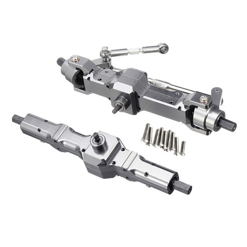

# Table of Contents

<ul dir="auto">
<li><a href="#the-team">The team</a>
<ul dir="auto">
<li><a href="#nils-stauff">Nils Stauff</a></li>
<li><a href="#olivia-greilich">Olivia Greilich</a></li>
<li><a href="#leonard-kolo">Leonard Kolo</a></li>
<li><a href="#team-photo">Team photo</a></li>
<li><a href="#funny-team-photo">Funny team photo</a></li>
</ul>
</li>
<li><a href="#the-robot">The robot</a>
<ul dir="auto">
<li><a href="#photos-of-the-robot">Photos of the robot</a></li>
</ul>
</li>
<li><a href="#mobility-management">Mobility management</a>
<ul dir="auto">
<li><a href="#chassis">Chassis</a></li>
<li><a href="#modification-of-the-model-car">Modification of the model car</a>
<ul dir="auto">
<li><a href="#chassis-plate">Chassis plate</a></li>
<li><a href="#middle-deck">Middle deck</a></li>
<li><a href="#upper-deck">Upper deck</a></li>
</ul>
</li>
<li><a href="#potential-improvements---chassis">Potential improvements - chassis</a></li>
<li><a href="#powertrain">Powertrain</a>
<ul dir="auto">
<li><a href="#drivetrain">Drivetrain</a></li>
<li><a href="#motor">Motor</a></li>
<li><a href="#electronic-speed-controller">Electronic speed controller</a></li>
<li><a href="#functioning-of-the-drive-system">Functioning of the drive system</a></li>
</ul>
</li>
<li><a href="#potential-improvements---powertrain">Potential improvements - powertrain</a></li>
<li><a href="#steering">Steering</a>
<ul dir="auto">
<li><a href="#new-front-axle">New front axle</a></li>
<li><a href="#servo-saver">Servo saver</a></li>
<li><a href="#servo-motor">Servo motor</a></li>
</ul>
</li>
<li><a href="#potential-improvements---steering">Potential improvements - steering</a></li>
</ul>
</li>
<li><a href="#power-and-sense-management">Power and sense management</a>
<ul dir="auto">
<li><a href="#sensors">Sensors</a>
<ul dir="auto">
<li><a href="#lidar">LiDAR</a></li>
<li><a href="#potential-improvements---lidar">Potential improvements - LiDAR</a></li>
<li><a href="#camera">Camera</a></li>
<li><a href="#potential-improvements---camera">Potential improvements - camera</a></li>
<li><a href="#odometry-sensor">Odometry sensor</a></li>
<li><a href="#potential-improvements---odometry-sensor">Potential improvements - odometry sensor</a></li>
<li><a href="#status-display">Status display</a></li>
<li><a href="#potential-improvements---status-display">Potential improvements - status display</a></li>
</ul>
</li>
<li><a href="#vehicle-power-supply">Vehicle power supply</a>
<ul dir="auto">
<li><a href="#lipo-battery">LiPo battery</a></li>
<li><a href="#component-power-consumption">Component power consumption</a></li>
<li><a href="#total-power-requirements">Total power requirements</a></li>
<li><a href="#power-supply">Power supply</a></li>
<li><a href="#safety-and-wiring">Safety and wiring</a></li>
<li><a href="#potential-improvements---power-supply">Potential improvements - power supply</a></li>
</ul>
</li>
<li><a href="#circuit-diagram-of-components">Circuit diagram of components</a></li>
</ul>
</li>
<li><a href="#obstacle-management">Obstacle management</a>
<ul dir="auto">
<li><a href="#coordinate-system">Coordinate system</a></li>
<ul dir="auto">
<li><a href="#coordinate-dimensions-and-origin">Coordinate dimensions and origin</a></li>
<li><a href="#coordinate-system-properties">Coordinate system properties</a></li>
<li><a href="#heading-angle-convention">Heading angle convention</a></li>
</ul>
<li><a href="#waypoint-navigation-system">Waypoint navigation system</a></li>
<ul dir="auto">
<li><a href="#command-example-drive-to-coordinate-4502500">Command example: drive to coordinate 450/2500</a></li>
<li><a href="#command-example-turn-robot-ccw-to-a-heading-of--90">Command example: turn robot CCW to a heading of -90°</a></li>
</ul>
<li><a href="#initial-location-acquisition">Initial location acquisition</a></li>
<li><a href="#position-updates-during-driving">Position updates during driving</a></li>
<ul dir="auto">
<li><a href="#optical-tracking-sensor-function">Optical tracking sensor function</a></li>
<li><a href="#sensor-failure-detection--health-status">Sensor failure detection / health status</a></li>
</ul>
<li><a href="#position-corrections">Position corrections</a></li>
<li><a href="#obstacle-recognition">Obstacle recognition</a></li>
<ul dir="auto">
<li><a href="#determining-the-position-of-an-obstacle-within-a-course-section">Determining the position of an obstacle within a course section</a></li>
<li><a href="#determining-the-color-of-the-obstacle">Determining the color of the obstacle</a></li>
<li><a href="#complete-obstacle-detection-function">Complete obstacle detection function</a></li>
<li><a href="#complete-code-for-waypoint-generation">Complete code for waypoint generation</a></li>
</ul>
<li><a href="#navigation-strategy-open-challenge">Navigation strategy open challenge</a></li>
<li><a href="#navigation-strategy-obstacle-challenge">Navigation strategy obstacle challenge</a></li>
<ul dir="auto">
<li><a href="#unparking">Unparking</a></li>
<li><a href="#first-round-scanning">First round: scanning</a></li>
<li><a href="#second-and-third-round">Second and third round</a></li>
<li><a href="#parking">Parking</a></li>
<li><a href="#obstacle-avoidance-waypoint-generation">Obstacle avoidance waypoint generation</a></li>
<li><a href="#source-code-driveroundpy">Source code: driveRound.py</a></li>
<li><a href="#possible-improvements">Possible improvements</a></li>
<ul dir="auto">
<li><a href="#angle-measurement">Angle measurement</a></li>
<li><a href="#waypoint-optimizations">Waypoint optimizations</a></li>
<li><a href="#wall-position-open-challenge">Wall position (open challenge)</a></li>
<li><a href="#speed-optimization">Speed optimization</a></li>
</ul>
</ul>
<li><a href="#software-structure">Software structure</a></li>
</ul>
</li>
<li><a href="#code-for-all-components">Code for all components</a>
<ul dir="auto">
<li><a href="#servo">Servo</a>
<ul dir="auto">
<li><a href="#software-implementation">Software implementation</a></li>
<li><a href="#steering-range-and-calibration">Steering range and calibration</a></li>
</ul>
</li>
<li><a href="#drive-motor">Drive motor</a>
<ul dir="auto">
<li><a href="#components">Components</a></li>
<li><a href="#hardware-interface">Hardware interface</a></li>
<li><a href="#software-implementation-1">Software implementation</a></li>
<li><a href="#pid-controller-implementation">PID controller implementation</a></li>
<li><a href="#advanced-control-features">Advanced control features</a></li>
</ul>
</li>
<li><a href="#optical-tracking-odometry-sensors">Optical tracking odometry sensors</a>
<ul dir="auto">
<li><a href="#position-and-speed-tracking">Position and speed tracking</a></li>
<li><a href="#sensor-health-monitoring-and-redundancy">Sensor health monitoring and redundancy</a></li>
<li><a href="#data-fusion-and-final-position-calculation">Data fusion and final position calculation</a></li>
<li><a href="#position-reset-and-calibration">Position reset and calibration</a></li>
<li><a href="#key-features-of-our-implementation">Key features of our implementation</a></li>
</ul>
</li>
<li><a href="#lidar-1">LiDAR</a>
<ul dir="auto">
<li><a href="#real-time-scanning-and-data-acquisition">Real-time scanning and data acquisition</a></li>
<li><a href="#position-detection-and-localization">Position detection and localization</a></li>
<li><a href="#dynamic-position-correction-during-driving">Dynamic position correction during driving</a></li>
<li><a href="#obstacle-detection-and-recognition">Obstacle detection and recognition</a></li>
<li><a href="#key-features-of-our-lidar-implementation">Key features of our LiDAR implementation</a></li>
<li><a href="#data-structure-and-access-patterns">Data structure and access patterns</a></li>
</ul>
</li>
<li><a href="#potential-improvements---code-for-all-components">Potential improvements - code for all components</a></li>
</ul>
</li>
<li><a href="#construction-guide---bauanleitung">Construction guide</a></li>
</ul>


# The team 
<div align="center">
    <a href="img/teamname.jpg" target="_blank">
        
    </a>
</div>
In this repository, you’ll find the documentation for the robot created by the "Battlepillars" for the 2025 World Robot Olympiad Future Engineers competition. The robot was the result of a collaborative effort by three students.

## Nils Stauff

<div align="center">
    <a href="img/nils.jpg" target="_blank">
        
    </a>
</div>

Hi! I’m Nils, and I’m 16 years old. I enjoy coding and solving technical problems. In my free time, I like scuba diving and exploring the underwater world. During winter, I often go skiing, and I’m also a big fan of cats.

For our WRO project, I’m responsible for developing the robot’s software and making sure it runs as intended. It can be challenging at times, but it’s very rewarding when everything works as planned!

## Olivia Greilich

<div align="center">
    <a href="img/olivia.jpg" target="_blank">
        
    </a>
</div>

Hello everyone! My name is Olivia Greilich and I'm 16, currently attending the Lise-Meitner Gymnasium in Anrath. Languages, communicating and connecting with people is my passion, same with painting, sculpting and crocheting!
One interesting fact about me is that I am simply enamored with jellyfish of all types, colours, shapes and sizes. I have two jellyfish lamps, tons of stickers, books and of course a phone charm.
In my free time, I usually occupy myself with writing fanfiction on Archive Of Our Own (AO3).

My part of the team effort is the documentation and images you'll see below.

## Leonard Kolo

<div align="center">
    <a href="img/leonard.jpg" target="_blank">
        
    </a>
</div>

Hi! I'm Leonard from Germany and I'm 15 years old, currently attending the Max Steenbeck Gymnasium in Cottbus. This is not my first WRO season. Last year I participated in the Robo Mission category and this year me and my team wanted to try something new so we are participating now in the category Future Engineers. My hobby’s are go karting, playing games, building LEGO and flying drone.

I contribute my technical expertise in the areas of robot construction, component research and selection, as well as in the development and manufacturing of 3D-printed parts, which are crucial for the mechanical implementation of our project.

## Team photo

<div align="center">
    <a href="img/team.jpg" target="_blank">
        
    </a>
</div>

## Funny team photo

<div align="center">
    <a href="img/team.jpg" target="_blank">
        
    </a>
</div>
<br><br><br>

# The robot
## Photos of the robot
<div align="center">
    <a href="img/vorne.jpg" target="_blank">
        
    </a>
</div>
<br>
<div align="center">
    <a href="img/links.jpg" target="_blank">
        
    </a>
</div>
<br>
<div align="center">
    <a href="img/rechts.jpg" target="_blank">
        
    </a>
</div>
<br>
<div align="center">
    <a href="img/hinten.jpg" target="_blank">
        
    </a>
</div>
<br>
<div align="center">
    <a href="img/oben.jpg" target="_blank">
        
    </a>
</div>
<br>
<div align="center">
    <a href="img/unten.jpg" target="_blank">
        
    </a>
</div>
<br><br><br>

# Mobility management

The **Mobility Management System** comprises the **chassis**, **steering**, and **drivetrain** of the robot, which are essential for precise and efficient locomotion. The following chapters will explain these individual elements in detail.
<br>
## **Chassis**
At first, the idea was to design a vehicle with a total length of less than 20 cm so that it could drive straight into the parking space at the end of the three-lap obstacle course, which was part of the regional challenge. This strategy was permitted under the German rule set.

Since commercially available model cars usually do not meet the required dimensions, we quickly realized that modifying an existing model car would be necessary. Most available models are around 30 cm long — reducing them to under 20 cm would have been too technically complex. Smaller models, around 10 cm in length, on the other hand, did not provide enough space for all the required components.

Eventually, we found a model with a length of **22 cm** that seemed suitable for adaptation to the desired **20 cm**. This model — the **LaTrax Rally** — was therefore chosen as the basis for the self-driving vehicle.

Where to buy the car: <a href="https://traxxas.com/75054-5-118-latrax-rally">https://traxxas.com/75054-5-118-latrax-rally</a>
<br>

## Modification of the model car

### **Chassis plate**

To optimize the vehicle architecture, a new **chassis plate** was designed in **Fusion 360**, reducing the total length of the vehicle to about **19 cm**. The design focused on a compact structure to improve maneuverability. For position detection using **odometry sensors**, two openings were integrated into the chassis plate to enable direct optical measurement of the ground surface. The plate was manufactured using **3D printing**.

Initially, the chassis plate was printed in standard **PLA**. However, we found that even slight bending of the plate caused a critical change in the **camera angle**. Therefore, ways to increase the **stiffness** of the chassis plate were explored. In addition to reinforcing the geometry, the team decided to use a different **material** for printing. Among all the materials we could print ourselves, **PPA-CF** proved to have the highest rigidity. This filament completely eliminated the problem of the chassis plate bending.


<table align="center" cellpadding="6" cellspacing="0">
  <tr>
     <td width=320>
       <a href="img/Bodenplatte1.jpeg" target="_blank">
         
       </a>
     </td>
     <td width=500>
       <a href="img/Bodenplatte2.jpeg" target="_blank">
         
       </a>
     </td>
  </tr>
</table>

Dimensioning of the base plate:


<div align="center">
    <a href="img/Masse/Lowerdeck.jpg" target="_blank">
        
    </a>
</div>


The chassis plate houses the **differential**, **gearbox**, **motor**, **servo**, **electronic speed controller (ESC)**, and **odometry sensors**. Details on the mounting of these components can be found in the <a href="#construction-guide---bauanleitung">Construction Guide</a>.

<div align="center">
    <a href="img/Bodenplatte3.jpg" target="_blank">
        
    </a>
</div>

The **servo** is installed in a designated mount on the chassis plate and secured with the **servo bracket**.

Dimensioning of the servo bracket:
<div align="center">
    <a href="img/Masse/Servobracket.jpg" target="_blank">
        
    </a>
</div>


To prevent the **electronic speed controller (ESC)** from coming loose, two **3D-printed sidebars** were installed between the spacer bolts on the chassis plate.

Dimensioning of the sidebars:
<div align="center">
    <a href="img/Masse/Sidebar.jpg" target="_blank">
        
    </a>
</div>

In order to protect the **front wheels** from collisions—and indirectly also the **steering linkage** and the **servo**—we designed a **bumper** and printed it using a **3D printer**.

Dimensioning of the bumper:
<div align="center">
    <a href="img/Masse/Bumper.jpg" target="_blank">
        
    </a>
</div>

### **Middle deck**

Next, a **middle deck** was designed in **Fusion 360**, with dimensions based on the chassis plate.

<table align="center">
  <tr>
     <td width=320>
       <a href="img/Mitteldeck2.jpeg" target="_blank">
         
       </a>
     </td>
     <td width=500>
       <a href="img/Mitteldeck1.jpeg" target="_blank">
         
       </a>
     </td>
  </tr>
</table>

Dimensioning of the middle deck:

<div align="center">
    <a href="img/Masse/Middledeck.jpg" target="_blank">
        
    </a>
</div>

The **servo controller**, **battery**, **Raspberry Pi**, and **voltage regulator** are mounted on this deck. A **camera** was also integrated in this section. Details on the mounting of these components can be found in the <a href="#construction-guide---bauanleitung">Construction Guide</a>. 


<div align="center">
    <a href="img/Mitteldeck3.jpg" target="_blank">
        
    </a>
</div>

To mount the **camera** on the robot, we designed a **bracket** and printed it using a **3D printer**.

Dimensioning of the camera bracket:
<div align="center">
    <a href="img/Masse/Cameraholder.jpg" target="_blank">
        
    </a>
</div>

### **Upper deck**

To mount the **LiDAR**, a **top deck** was also designed, and the LiDAR was attached to it in an **upside-down** position.

<table align="center">
  <tr>
     <td width=280>
       <a href="img/Oberdeck2.jpeg" target="_blank">
         
       </a>
     </td>
     <td width=500>
       <a href="img/Oberdeck1.jpeg" target="_blank">
         
       </a>
     </td>
  </tr>
</table>
Dimensioning of the top deck:

<div align="center">
    <a href="img/Masse/Lidar.jpg" target="_blank">
        
    </a>
</div>

The **LiDAR** and the **status display** are installed on this deck. Details on the mounting of these components can be found in the <a href="#construction-guide---bauanleitung">Construction Guide</a>.

<div align="center">
    <a href="img/Oberdeck3.jpg" target="_blank">
        
    </a>
</div>

## Potential improvements - chassis
- Construct an **outer hull** to improve the outer appearance of the vehicle and prevent potential **dust** or **debris** from reaching the inner works.
- Furthermore, we could free up some space for a **third odometry sensor**.

- We could lower the **chassis height** in order to allow the **LiDAR** to be mounted lower, thus removing the need for **support beams**, which currently block LiDAR vision.

<br>

## **Powertrain**

### **Drivetrain**

In automobiles, three basic types of **drive systems** can be distinguished:

- **All-wheel drive (AWD)**: All wheels receive driving power.
- **Front-wheel drive (FWD)**: Driving power is applied only to the front wheels.
- **Rear-wheel drive (RWD)**: Only the rear wheels are driven.

The existing chassis was originally equipped with an **all-wheel drive system**, which would have generally met the competition requirements. However, the existing **steering mechanism** did not allow a sufficient **steering angle**, making maneuvers such as exiting a parking space in a single move during the parking challenge impossible. To improve the steering angle, an alternative solution was developed: the design of an entirely **new front axle** (<a href="#steering">cf. Chapter “Steering”</a>).

During the conversion, retaining the **front-wheel drive** was not possible, as the existing **universal joints** mechanically limited the increased steering angle. Therefore, the original all-wheel drive was deactivated and replaced with a **rear-wheel drive system**. This configuration provides sufficient **power transmission** for **low-speed**, precise control, while also decoupling the steering from drive influences — a particular advantage when navigating the obstacle course with precision.


### **Motor**
The existing **brushed motor** was compared to various other **motor types** as part of a comparative analysis. To evaluate their respective advantages and disadvantages, an online literature review was conducted. In addition to the brushed motor, the **brushless motor** and the **stepper motor** were identified as relevant alternatives.

**Brushless motor:**
This type generally offers higher power output compared to the brushed motor installed in the model vehicle. However, since high top speed is not required for the competition, this advantage was deemed non-essential. Furthermore, brushless motors exhibit limited controllability at low rotational speeds, which complicates precise navigation through the obstacle course.

**Stepper motor:**
Stepper motors are known for their high control precision, but their operation is comparatively complex. In addition, they are associated with high power consumption, larger physical size, and low maximum speed, making them unsuitable for the intended application.

Based on this analysis, it was decided to continue using the **brushed motor** already integrated into the model car, as it represents the most functional and technically appropriate solution under the given conditions.

<table align="center">
    <tr>
        <th bgcolor="#CCFFCC" width="300">Motor</th>
        <th bgcolor="#9ae4fd" width="600">Specifications</th>
  </tr>
  <tr>
        <td>
      <a href="img/motor.jpg" target="_blank">
        
      </a>
    </td>
        <td bgcolor="#c8f0fd">23-turn brushed 370-size LaTrax® motor with bullet connectors
</td>
   </tr>
        <tr><td bgcolor="#e9c8fd" colspan="2">Where to buy the motor: <a href="https://traxxas.com/7575r-23-turn-brushed-370-size-motor">https://traxxas.com/7575r-23-turn-brushed-370-size-motor</a></td></tr>
</table>


### **Electronic speed controller**

The **electronic speed controller (ESC)** is positioned between the **power source** and the **drive motor** and controls the **motor speed**. Experimental investigations revealed that the originally installed ESC was primarily designed for **high-speed** operation. At **low speeds**, it did not allow for sufficient fine control.

Further research showed that certain model vehicles, known as **crawlers**, are specifically designed for use on rough and steep terrain. The ESCs used in these vehicles offer particularly sensitive control at low speeds, thereby meeting the project’s requirements for precise low-speed driving behavior.

Based on these findings, the decision was made to replace the original controller with a more suitable model. The selected ESC, the **Quicrun WP 1080–G2**, fully meets the specified technical requirements.

<table align="center" cellpadding="6" cellspacing="0">
    <tr>
        <th bgcolor="#CCFFCC" width="300">Motor Driver Quicrun WP 1080–G2</th>
        <th bgcolor="#9ae4fd" width="600">Specifications</th>
  </tr>
  <tr>
        <td width="300">
      <a href="img/fahrtenregler.jpg" target="_blank">
        
      </a>
    </td>
        <td bgcolor="#c8f0fd"><li>Application: 1/10th Rock Crawler</li>
<li>Motor Type: Brushed Motor (540 / 555 size motors)</li>
<li>Cont./Peak Current: 80A/400A</li>
<li>Input Voltage: 2-3S LiPo/5-9S Cell NiMH</li>
<li>BEC Output: 6V / 7.4V / 8.4V @ 4A (Switch-mode)</li>
<li>Wires & Connectors: Black-14AWG-200mm / Red-14AWG-200mm</li>
<li>Programming device: LED program box</li>
</td>
   </tr>
        <tr><td bgcolor="#e9c8fd" colspan="2">Where to buy the motor driver: <a href="https://www.modellbau-berlinski.de/rc-elektronik-und-akkus/regler/auto-brushed/quicrun-wp1080-g2-crawler-brushed-regler-80a-bec-4a">https://www.modellbau-berlinski.de/rc-elektronik-und-akkus/regler/auto-brushed/quicrun-wp1080-g2-crawler-brushed-regler-80a-bec-4a</a></td></tr>
</table>
<tr> 

### Functioning of the drive system

The gearbox consists of a motor pinion with 14 teeth and a larger main gear with 61 teeth. The motor drives the pinion, which in turn rotates the larger main gear. The main gear is connected to the differential, which distributes power to the two rear wheels.

To allow for precise control and because high top speed is not required, we chose the largest possible gear ratio that could be installed in our chassis. The gear ratio is determined by the main gear and the motor pinion, and in our case, it is 61:14 = 1:4.35
<br><br>
The chosen gear ratio of 61:14 results in a significant increase in torque within the drivetrain. This configuration was deliberately selected to ensure reliable power transmission even at low speeds.

During test runs, we observed that the competition field often features small irregularities and bumps. These can cause vehicles with insufficient torque to get stuck or lose traction. In our tests, the selected drivetrain configuration proved highly effective: the robot was able to accelerate smoothly across uneven mat surfaces while remaining fully controllable at all times.

Thus, the torque-oriented gear ratio makes a significant contribution to the vehicle’s reliability in real-world operation.


## Potential improvements - powertrain:
- Use the same wheels for the back wheels as the front axis, as the front wheels have better traction and are easier to clean and maintain.

- Encoders on rear wheels or on the motor for precise wheel slip detection, better traction control, more accurate speed control and for detecting the wheels spinning on uneven surfaces, e.g. bumps.

- Maintain high steering angles while providing front wheel drive. That would prevent the front weels from sliding at high steering angles.


## Steering

As already mentioned, the existing steering mechanism of the purchased chassis did not allow for a sufficient steering angle, making maneuvers such as exiting a parking space in a single move during the parking challenge impossible. To improve the steering angle, an alternative solution was developed, which consisted of designing an entirely new front axle (<a href="#drivetrain">cf. Chapter Drivetrain</a>).

In this context, we also tested different steering concepts, including parallelogram and bell-crank mechanisms, and carefully evaluated their pros and cons. In the end, we decided to implement an Ackermann steering system. This choice was made because Ackermann geometry optimizes wheel angles during turns, reducing tire slip and improving maneuverability—especially important for precise movements in our small, lightweight robot. Compared to simpler systems, Ackermann steering provides more accurate cornering and better control, which was crucial for achieving our performance goals.


### New front axle

Part of the front axle was designed in Fusion 360 and 3D-printed.

<div align="center">
    <a href="img/vorderachse_design.png" target="_blank">
        
    </a>
</div>

Dimensioning of the front axle:
<div align="center">
    <a href="img/Masse/Frontaxle.jpg" target="_blank">
        
    </a>
</div>
<br>
For the construction of the new front axle, a steering linkage and steering knuckles were required:
<br><br>
<table align="center" cellpadding="6" cellspacing="0">
    <tr>
        <th bgcolor="#CCFFCC" width="300">steering linkage and steering knuckles</th>
        <th bgcolor="#9ae4fd" width="500">Specifications</th>
  </tr>
  <tr>
        <td>
      <a href="img/Lenkstange.jpg" target="_blank">
        
      </a>
    </td>
        <td bgcolor="#c8f0fd">RC Metal Front and Rear Axle
</td>
   </tr>
    <tr><td bgcolor="#e9c8fd" colspan="2">Where to buy the set: <a href="https://www.ebay.de/itm/176692013502">https://www.ebay.de/itm/176692013502</a></td></tr>
</table>
<tr> 
<tr> 

<br>
The wheels of the new front axle are from Lego:
<br><br>
<table align="center" cellpadding="6" cellspacing="0">
    <tr>
        <th bgcolor="#CCFFCC" width="300">Wheels</th>
        <th bgcolor="#9ae4fd" width="500">Specifications</th>
  </tr>
  <tr>
        <td>
      <a href="img/legorad.jpg" target="_blank">
        
      </a>
    </td>
        <td bgcolor="#c8f0fd">Size: 5,6cm x 1,5cm x 5,6cm
</td>
   </tr>
    <tr><td bgcolor="#e9c8fd" colspan="2">Where to buy the wheels: <a href="https://www.brickowl.com/de/catalog/lego-wheel-56-with-medium-azure-tire-39367">https://www.brickowl.com/de/catalog/lego-wheel-56-with-medium-azure-tire-39367</a></td></tr>
</table>
<br>
The new front axle in a close-up view:
<br><br>
<div align="center">
    <a href="img/vorderachse_detail.jpg" target="_blank">
        
    </a>
</div>


### Servo saver
The Servo Saver is installed on the Servo and connects to the steering linkage. The Servo Saver, when the front wheels collide against an obstacle, uses a spring to prevent an overload on the Servo.

<table align="center" cellpadding="6" cellspacing="0">
    <tr>
        <th bgcolor="#CCFFCC" width="300">Dilwe RC Servo Saver</th>
        <th bgcolor="#9ae4fd" width="600">Specifications</th>
  </tr>
  <tr>
        <td>
      <a href="img/servosaver.jpg" target="_blank">
        
      </a>
    </td>
        <td bgcolor="#c8f0fd"><li>Size: 10 × 7 × 2 cm</li>
    <li>Weight: 12 g</li>
    <li>Material: Aluminium</li>
</td>
   </tr>
        <tr><td bgcolor="#e9c8fd" colspan="2">Where to buy the Servo Saver: <a href="https://www.amazon.de/-/en/Lightweight-Universal-Precision-Protection-Replacement/dp/B0CSYMSHL3?th=1">https://www.amazon.de/-/en/Lightweight-Universal-Precision-Protection-Replacement/dp/B0CSYMSHL3?th=1</a></td></tr>
</table>

### Servo motor
The servo is responsible for steering the front wheels. The servo’s actuation speed and torque were evaluated as fully sufficient to meet the competition requirements.

Specifically, it is the Traxxas Waterproof Sub-Micro Servo (model number 2065A). At an operating voltage of 6.0 V, it delivers a torque of 2.3 kg·cm (≈ 32 oz-in) and achieves a response time of 0.20 s per 60°.

Since these specifications ensure precise and effective steering, it was decided to continue using the servo already installed in the model.

<table align="center" cellpadding="6" cellspacing="0">
  <tr>
        <th bgcolor="#CCFFCC" width="300">Waterproof Sub-Micro Servo</th>
        <th bgcolor="#9ae4fd" width="600">Specifications</th>
  </tr>
  <tr>
    <td>
      <a href="img/motordriver.jpg" target="_blank">
        
      </a>
    </td>
    <td bgcolor="#c8f0fd"><li>Fully waterproof</li>
<li>Fits steering in LaTrax models</li>
<li>Power: 2.3kg/cm</li>
<li>Operating voltage: 6.0V</li>
<li>Speed: 0.20 sec/60°</li>
<li>Dimensions: 22.6×12.6×22.5 mm</li>
</td>
   </tr>
    <tr><td bgcolor="#e9c8fd" colspan="2">Where to buy the motor: <a href="https://traxxas.com/2065a-waterproof-sub-micro-servo">https://traxxas.com/2065a-waterproof-sub-micro-servo</a></td></tr>
</table>
<tr> 

## Potential improvements - steering:
- The servo saver occasionally fails and triggers a false alarm during sharp or high-speed turns. A potential improvement would be to tighten the servo saver to prevent this issue.

- Additionally, the wheels could be improved in terms of grip to reduce slipping.
<br><br><br>

# Power and sense management
The **Power and Sense Management System** includes the **sensors** for environmental perception as well as the robot’s **power supply**, both of which are essential for reliable and autonomous navigation. The following chapters provide a detailed explanation of the individual sensors, the power supply, and the electrical circuitry.
<br>

## Sensors

### LiDAR

During our research on autonomous driving, we found that **LiDAR systems** (Light Detection and Ranging) are commonly used for environmental perception. **LiDAR** is a core sensor system in autonomous vehicles that uses **laser beams** to precisely capture the surroundings and generate a **two-dimensional map**.

By measuring the **time of flight** of the reflected laser beams, the **distance** to surrounding objects can be determined. This information enables reliable **detection of obstacles** and other entities in the environment, significantly contributing to safe vehicle navigation.

Environmental awareness can be further enhanced by combining LiDAR data with additional sensor inputs, such as **cameras** or **radar systems**. This **sensor fusion** allows for more informed and reliable decision-making in vehicle control.

Due to its compelling performance characteristics, we decided to integrate a **LiDAR system** into our autonomous vehicle. The table below summarizes the **key technical criteria** of various LiDAR systems relevant to the selection process, with a color-coded evaluation based on our requirements: green indicates that the criterion meets our requirements, yellow indicates a moderate level, and red indicates insufficient performance. As a result, the **RpLidar S2** proved to be the most suitable option for our application.

<table align="center" border="1" style="border-collapse: collapse; border: 2px solid black;">
  <tr>
        <th bgcolor="#E8E8E8" width="200" style="border: 1px solid black; border-bottom: 3px solid black; padding: 8px;">Criterion</th>
        <th bgcolor="#E8E8E8" width="150" style="border: 1px solid black; border-bottom: 3px solid black; padding: 8px;">RpLidar-S2</th>
        <th bgcolor="#E8E8E8" width="150" style="border: 1px solid black; border-bottom: 3px solid black; padding: 8px;">RpLidar A2</th>
        <th bgcolor="#E8E8E8" width="150" style="border: 1px solid black; border-bottom: 3px solid black; padding: 8px;">RpLidar A1</th>
        <th bgcolor="#E8E8E8" width="150" style="border: 1px solid black; border-bottom: 3px solid black; padding: 8px;">YDLidar TG30</th>
  </tr>
  <tr>
      <td bgcolor="#F0F0F0" style="border: 1px solid black; padding: 8px;"><b>Range</b></td>
      <td bgcolor="#90EE90" style="border: 1px solid black; padding: 8px;">🟩 0,05-18 m</td>
      <td bgcolor="#FFB6C1" style="border: 1px solid black; padding: 8px;">🟥 0,2-16 m</td>
      <td bgcolor="#FFB6C1" style="border: 1px solid black; padding: 8px;">🟥 0,15-12 m</td>
      <td bgcolor="#90EE90" style="border: 1px solid black; padding: 8px;">🟩 0,05-30 m</td>
  </tr>
  <tr>
      <td bgcolor="#F0F0F0" style="border: 1px solid black; padding: 8px;"><b>Distance Measurement Accuracy</b></td>
      <td bgcolor="#90EE90" style="border: 1px solid black; padding: 8px;">🟩 +/- 50 mm</td>
      <td bgcolor="#FFB6C1" style="border: 1px solid black; padding: 8px;">🟥 < 1%</td>
      <td bgcolor="#FFB6C1" style="border: 1px solid black; padding: 8px;">🟥 < 1%</td>
      <td bgcolor="#FFD700" style="border: 1px solid black; padding: 8px;">🟨 +/- 60mm</td>
  </tr>
  <tr>
      <td bgcolor="#F0F0F0" style="border: 1px solid black; padding: 8px;"><b>Distance Measurement Resolution</b></td>
      <td bgcolor="#90EE90" style="border: 1px solid black; padding: 8px;">🟩 13 mm</td>
      <td bgcolor="#FFB6C1" style="border: 1px solid black; padding: 8px;">🟥 1 %</td>
      <td bgcolor="#FFB6C1" style="border: 1px solid black; padding: 8px;">🟥 1 %</td>
      <td bgcolor="#FFB6C1" style="border: 1px solid black; padding: 8px;">🟥 -</td>
  </tr>
  <tr>
      <td bgcolor="#F0F0F0" style="border: 1px solid black; padding: 8px;"><b>Enclosed Housing</b></td>
      <td bgcolor="#90EE90" style="border: 1px solid black; padding: 8px;">🟩 yes</td>
      <td bgcolor="#90EE90" style="border: 1px solid black; padding: 8px;">🟩 yes</td>
      <td bgcolor="#FFB6C1" style="border: 1px solid black; padding: 8px;">🟥 no</td>
      <td bgcolor="#90EE90" style="border: 1px solid black; padding: 8px;">🟩 yes</td>
  </tr>
  <tr>
      <td bgcolor="#F0F0F0" style="border: 1px solid black; padding: 8px;"><b>Angular Resolution</b></td>
      <td bgcolor="#90EE90" style="border: 1px solid black; padding: 8px;">🟩 0,1125°</td>
      <td bgcolor="#FFB6C1" style="border: 1px solid black; padding: 8px;">🟥 0,225°</td>
      <td bgcolor="#FFB6C1" style="border: 1px solid black; padding: 8px;">🟥 1°</td>
      <td bgcolor="#FFD700" style="border: 1px solid black; padding: 8px;">🟨 0,13°</td>
  </tr>
    <tr>
      <td bgcolor="#F0F0F0" style="border: 1px solid black; padding: 8px;"><b>Update Rate</b></td>
      <td bgcolor="#90EE90" style="border: 1px solid black; padding: 8px;">🟩 2-10 Hz</td>
      <td bgcolor="#FFB6C1" style="border: 1px solid black; padding: 8px;">🟥 5-15 Hz</td>
      <td bgcolor="#FFB6C1" style="border: 1px solid black; padding: 8px;">🟥 5,5 Hz</td>
      <td bgcolor="#FFB6C1" style="border: 1px solid black; padding: 8px;">🟥 5-12 hz</td>
  </tr>
  <tr>
      <td bgcolor="#F0F0F0" style="border: 1px solid black; padding: 8px;"><b>Price</b></td>
      <td bgcolor="#FFD700" style="border: 1px solid black; padding: 8px;">🟨 ~ 220€</td>
      <td bgcolor="#FFD700" style="border: 1px solid black; padding: 8px;">🟨 ~ 260€</td>
      <td bgcolor="#90EE90" style="border: 1px solid black; padding: 8px;">🟩 ~ 90€</td>
      <td bgcolor="#FFB6C1" style="border: 1px solid black; padding: 8px;">🟥 ~ 450€</td>
  </tr>
  <tr>
      <td bgcolor="#F0F0F0" style="border: 1px solid black; border-top: 3px solid black; padding: 8px;"><b>Evaluation</b></td>
      <td bgcolor="#90EE90" style="border: 1px solid black; border-top: 3px solid black; padding: 8px;">🟩 Very good</td>
      <td bgcolor="#FFB6C1" style="border: 1px solid black; border-top: 3px solid black; padding: 8px;">🟥 Moderate</td>
      <td bgcolor="#FFB6C1" style="border: 1px solid black; border-top: 3px solid black; padding: 8px;">🟥 Moderate</td>
      <td bgcolor="#FFD700" style="border: 1px solid black; border-top: 3px solid black; padding: 8px;">🟨 Good</td>
  </tr>
</table>


After integrating the **LiDAR system** into the robot, we found that the **field boundaries** were not being reliably detected. The cause was that the **laser beams** emitted by the sensor were projected over the boundary lines.

Through several iterations, the sensor was gradually mounted **lower** within the robot’s housing; however, this adjustment still did not result in satisfactory detection of the boundary lines. A subsequent **analysis of the datasheet** revealed that the LiDAR’s laser beams are emitted at a slightly upward angle, which explained why the relevant objects remained outside the **scan range** even when the sensor was positioned lower.

The **manufacturer** was then contacted to determine whether mounting the LiDAR in an **inverted orientation** would be technically permissible. The response was positive, so the sensor is now installed **upside down** in the robot. This configuration ensures that the **scanning plane** reliably detects the field boundaries.

Implementation details of the LiDAR **data flow** and **APIs** are documented under Code for all components → [LiDAR](#lidar-1).

### Potential improvements - LiDAR:
-- Find a LiDAR that scans **parallel to the ground** or **downward**, rather than upward, so that it can be installed in the correct orientation.

-- Look for a LiDAR with a higher **update rate**, greater **distance measurement accuracy**, and improved **angular resolution**.


### Camera
While the LiDAR is used to determine the **position of an obstacle**, an additional **camera** is required to identify the obstacle’s **color**. Initially, the **Raspberry Pi Global Shutter Camera** was ordered, as its technical specifications appeared particularly suitable for use in a mobile robotic system. The camera enables distortion-free capture of fast movements since—unlike **rolling-shutter systems**—it avoids typical motion artifacts. Moreover, its support for **interchangeable lenses** allows flexible adaptation to different application scenarios.

However, upon arrival, it became apparent that the physical **dimensions** of the camera were significantly larger than originally anticipated. Due to the **limited space** within the vehicle chassis, integration was not possible.

As a result, a more **compact alternative** was selected: the **Raspberry Pi Camera Module 3 Wide (12 MP)**. Although a global shutter camera had initially been planned, we found that the operating speeds in the system do not cause critical rolling-shutter artifacts. The chosen camera meets the requirements in terms of **field of view**, **resolution (12 MP)**, **integration**, and **computational compatibility**, making it a practical solution for **image processing** in this context.

### Potential improvements - camera:
-- Find and install a better **camera** with a wider **field of view**.

### Odometry sensor
Over the past two years of participating in the **RoboMission** category, the importance of **continuous position tracking** became evident. In that context, the vehicle’s position was determined by evaluating **wheel rotations**, complemented by a **gyroscope**. However, the current model car chassis does not provide a way to directly measure wheel movement.

While searching for alternatives, it was discovered that **motion** can also be detected **optically**—similar to the operation of a **computer mouse**. 

The functionality of the system is as follows: **Motion detection** is achieved through a **downward-facing camera** that analyzes changes in the **ground texture** at up to **20,000 frames per second**. The vehicle’s **displacement** over the surface is determined from the differences between consecutive images. This method is resistant to **slip effects** that can occur in **encoder-based systems**.

Based on this principle, the **SparkFun Optical Tracking Odometry Sensor** was selected. This device integrates an **optical motion sensor**, a **gyroscope**, and a **microcontroller** that independently performs **odometry calculations**.

To increase **accuracy** and **redundancy**, **two** of these sensors were installed.

**Software architecture**, **health monitoring**, and **fusion logic** are detailed under Code for all components → [Optical tracking odometry sensors](#optical-tracking-odometry-sensors).


### Potential improvements - odometry sensor:

-- Install a **third sensor** to enable a true **majority decision** when determining the correct measurement. With three sensors, the system could automatically identify the one **deviating sensor** as faulty in the event of conflicting measurements and rely on the two agreeing sensors. This would significantly improve the **robustness** of the system, since currently, if one of the two sensors fails, only a **single sensor** remains available, and its **accuracy** can no longer be verified through comparison.

### Status display
A **status display** was additionally integrated to visualize various **system parameters**. The **current speed** and **target speed** are represented using **bar indicators** in meters per second.

The operational **status** of the two **odometry sensors** is communicated through a **color-coded system**:

-- **Green light**: indicates that the corresponding optical sensor is active and functioning correctly.
-- **Red light**: is displayed when one sensor measures a speed more than **0.2 m/s** lower than the other sensor; in this case, the sensor is classified as **faulty**.
-- **Blue light**: indicates that the sensor has detected a speed exceeding **2 m/s**, which is physically implausible; the sensor is then automatically **deactivated**.

This display is an **optional component** and is not strictly necessary for the robot’s **core functionality**.

### Potential improvements - status display:
-- Display more **information** during operation, for example, the **colors of the obstacles**.
<br>

## Vehicle power supply

The **power supply** of the autonomous vehicle was designed to reliably provide **energy** to all **sensors**, **control units**, and **actuators**. The central **power source** is a **7.4 V lithium-polymer battery (LiPo, 2S, 2200 mAh)**, which is directly connected to the **electronic speed controller (ESC)** and also powers the **Raspberry Pi** via a **5 V voltage converter**.

### LiPo battery
<table align="center" cellpadding="6" cellspacing="0">
  <tr>
        <th bgcolor="#CCFFCC" width="300">Zeee 2S Lipo Akku</th>
        <th bgcolor="#9ae4fd" width="600">Specifications</th>
  </tr>
  <tr>
    <td>
      <a href="img/lipo.jpg" target="_blank">
        
      </a>
    </td>
    <td bgcolor="#c8f0fd"><li>Battery voltage: 7.4 V</li>
    <li>Configuration: 2S1P</li>
    <li>Capacity: 2200mAh</li>
    <li>Discharge rate: 50C</li>
    <li>Connector type: XT60 connector</li>
    <li>Dimensions: 73 x 34 x 18,5 mm (L × W × H)</li>
    <li>Approximate weight: 98 g</li>
</td>
   </tr>
    <tr><td bgcolor="#e9c8fd" colspan="2">Where to buy the Battery: <a href="https://www.amazon.de/Zeee-Hubschrauber-Quadcopter-Rennmodelle-Packungen/dp/B0C2CGD9NK">https://www.amazon.de/Zeee-Hubschrauber-Quadcopter-Rennmodelle-Packungen/dp/B0C2CGD9NK</a></td></tr>
</table>

### Component power consumption

The following table lists the essential installed **components** and their typical **power consumption**:

<table align="center" border="1" style="border-collapse: collapse; border: 2px solid black;">
    <tr>
        <th bgcolor="#E8E8E8" width="300" style="border: 1px solid black; border-bottom: 3px solid black; padding: 8px;">Component</th>
        <th bgcolor="#E8E8E8" width="200" style="border: 1px solid black; border-bottom: 3px solid black; padding: 8px;">Operating voltage</th>
        <th bgcolor="#E8E8E8" width="200" style="border: 1px solid black; border-bottom: 3px solid black; padding: 8px;">Power consumption (typical)</th>
        <th bgcolor="#E8E8E8" width="400" style="border: 1px solid black; border-bottom: 3px solid black; padding: 8px;">Notes</th>
  </tr>
  <tr>
    <td style="border: 1px solid black; padding: 8px;">Raspberry Pi 5</td>
    <td style="border: 1px solid black; padding: 8px;">5 V</td>
    <td style="border: 1px solid black; padding: 8px;">3–8 W</td>
    <td style="border: 1px solid black; padding: 8px;">Main controller, high CPU performance</td>
  </tr>
  <tr>
    <td style="border: 1px solid black; padding: 8px;">Raspberry Pi Camera Module 3 Wide (12 MP)</td>
    <td style="border: 1px solid black; padding: 8px;">5 V</td>
    <td style="border: 1px solid black; padding: 8px;">1–2 W</td>
    <td style="border: 1px solid black; padding: 8px;">Connected directly to RPi CSI port</td>
  </tr>
  <tr>
    <td style="border: 1px solid black; padding: 8px;">2× SparkFun Optical Tracking Odometry Sensor</td>
    <td style="border: 1px solid black; padding: 8px;">3.3 V</td>
    <td style="border: 1px solid black; padding: 8px;">approx. 0.1 W each</td>
    <td style="border: 1px solid black; padding: 8px;">Low power consumption, I²C communication</td>
  </tr>
  <tr>
    <td style="border: 1px solid black; padding: 8px;">RpLidar S2</td>
    <td style="border: 1px solid black; padding: 8px;">5 V</td>
    <td style="border: 1px solid black; padding: 8px;">2 W</td>
    <td style="border: 1px solid black; padding: 8px;">Continuous operation for environment scanning</td>
  </tr>
  <tr>
    <td style="border: 1px solid black; padding: 8px;">LaTrax 370 brushed DC-Motor (23-turn)</td>
    <td style="border: 1px solid black; padding: 8px;">7.4 V</td>
    <td style="border: 1px solid black; padding: 8px;">1-10 W (load dependent)</td>
    <td style="border: 1px solid black; padding: 8px;">Main drive, highly load dependent</td>
  </tr>
  <tr>
    <td style="border: 1px solid black; padding: 8px;">Quicrun WP 1080–G2 Motor Driver</td>
    <td style="border: 1px solid black; padding: 8px;">7.4 V</td>
    <td style="border: 1px solid black; padding: 8px;">low self-consumption</td>
    <td style="border: 1px solid black; padding: 8px;">Drive motor control</td>
  </tr>
  <tr>
    <td style="border: 1px solid black; padding: 8px;">Traxxas Sub-Micro Servo 2065A (Steering)</td>
    <td style="border: 1px solid black; padding: 8px;">6 V</td>
    <td style="border: 1px solid black; padding: 8px;">1–2 W briefly</td>
    <td style="border: 1px solid black; padding: 8px;">Current spikes during movement, powered via BEC</td>
  </tr>
  <tr>
    <td style="border: 1px solid black; padding: 8px;">LED Display Panel (Status Display)</td>
    <td style="border: 1px solid black; padding: 8px;">3.3 V</td>
    <td style="border: 1px solid black; padding: 8px;">0-0.5 W</td>
    <td style="border: 1px solid black; padding: 8px;">Power consumption depends on number of illuminated pixels</td>
  </tr>
  <tr>
    <td style="border: 1px solid black; padding: 8px;">Servo controller</td>
    <td style="border: 1px solid black; padding: 8px;">5 V</td>
    <td style="border: 1px solid black; padding: 8px;">0,1 W</td>
    <td style="border: 1px solid black; padding: 8px;">Low power consumption, I²C communication</td>
  </tr>
</table>


### Total power requirements

The total **energy consumption** of the system ranges from approximately **8–20 W** during operation. The largest **power consumers** are:

-- The **Raspberry Pi 5**
-- The **DC motor** (high current during acceleration)
-- The **LiDAR module**, which operates continuously

With a **battery capacity** of **2200 mAh (7.4 V)** the available **energy** is **16.28 Wh**. This allows for **operating times** of approximately **45 to 120 minutes**, depending on **driving behavior**, **track profile**, and **computational load**.
Based on **empirical data**, it was determined that a **safe operating time** of approximately **90 minutes** is reliably achieved. After this time, the **battery** is routinely replaced to prevent **deep discharge**, as no **voltage monitoring** is integrated into the system.

### Power supply

The power supply for individual components is implemented as follows:
- 7,4 V direkt: DC motor via the speed controller
- 5 V via step-down regulator (DC-DC converter): Raspberry Pi 5, LiDAR, camera, servo, servo controller
- 3,3 V via Raspberry Pi integrated regulator: Odometry sensors, LED display panel

### Safety and wiring
- The battery connector is reverse-polarity protected
- A main switch completely isolates the power supply


## Potential improvements - power supply:
- Monitor battery voltage to replace the battery in time.
- Design a baseboard (PCB) that connects all components and reduces wiring complexity.


## Circuit diagram of components

<div align="center">
    <a href="img/schaltplan.jpg" target="_blank">
        
    </a>
</div>

<br><br><br>


# Obstacle management


## Coordinate system
To understand our overall strategy, it is important to understand the basics our system is build on.
Our robot uses a Cartesian coordinate system to navigate the WRO Future Engineers field:

### Coordinate dimensions and origin
- **Field Size**: 3000mm × 3000mm square
- **Origin (0, 0)**: Located at the **top-left corner** of the field 
- **X-axis**: Increases from left to right (0mm to 3000mm)
- **Y-axis**: Increases from top to bottom (0mm to 3000mm)
- **Units**: All coordinates are specified in millimeters (mm)

### Coordinate system properties
1. **Absolute Positioning**: The coordinate system is field-absolute, not robot-relative
2. **Origin Alignment**: The origin remains fixed at the top-left corner regardless of robot orientation

### Heading angle convention
- **0°**: Robot facing in the negative X direction (to the left)
- **90°**: Robot facing in the positive Y direction (downward)
- **+-180°**: Robot facing in the positive X direction (to the right)
- **-90°**: Robot facing in the negative Y direction (upward)

## Waypoint navigation system

Waypoints are target coordinates that the robot navigates to sequentially. Each waypoint specifies (x, y) coordinates in millimeters. We have defined a structure that stores waypoints together with a command. These are added to a queue and are executed in order. Several commands are available. 

For generative waypoint patterns and rotation mapping used in the obstacle challenge, see [Navigation strategy obstacle challenge](#navigation-strategy-obstacle-challenge).

### Command example: drive to coordinate 450/2500 
```python
orders.append(Order(x=450, y=2500, speed=0.75, brake=0, type=Order.DESTINATION, num=100, rotation=0))
```

### Command example: turn robot CCW to a heading of -90°
```python
orders.append(Order(zielwinkel=-90, speed=0.2, brake=1, dir=Order.CCW, type=Order.WINKEL)))
```
<br>

## Initial location acquisition 
The initial position is determined by measuring the distance to the borders using the LiDAR.

The starting direction is inferred from the robot’s position on the mat.

For the Open Challenge, the robot can be placed in four possible positions, which allow it to identify the required driving path. These positions result from the combination of two starting sections and two travel directions.

In the Obstacle Challenge, two starting positions are possible. Here, the robot also uses the LiDAR to determine its position and the corresponding direction of travel.

<div align="center">
    <a href="img/flowdiagrammstart.jpeg" target="_blank">
        
    </a>
</div>


 <br><br>

## Position updates during the race 

### Optical tracking sensor function 
For continuous position tracking, we use two optical tracking sensors. A downward-facing camera inside the sensor captures 20,000 images per second. Based on changes in the images, the sensor detects movement across the surface. Additionally, the sensor has a built-in gyroscope. Using data from the gyroscope and the movement across the ground, the sensor automatically calculates the current coordinates.

### Sensor failure detection / health status 
Two optical tracking sensors were installed to increase redundancy. If one sensor fails, for example due to dust on the lens, the robot can still accurately determine its position. A sensor is recognized by the program as “not healthy” under the following conditions:

- One of the two sensors is at least 0.15 m/s slower than the other. Dust on the lens can prevent the sensor from accurately detecting changes in the ground, causing its reported speed to decrease. The slower sensor is then deactivated as “not healthy”.

- If one sensor reports a speed greater than 2 m/s, it is also deactivated as “not healthy”.

- If the sensor reports a position outside the playing field, it is likewise deactivated as “not healthy”.
<div align="center">
    <a href="img/flowdiagramm2.jpeg" target="_blank">
        
    </a>
</div>

When both sensors are healthy, we take the average of the readings of both sensors. Otherwise, we just take the data from the healthy sensor.

## Position corrections 
Position tracking using the optical tracking sensor leads to inaccuracies of 2–5 cm per meter when the robot drives straight. After turns, the inaccuracy increases even more. 

<div align="center">
    <a href="img/lidarDelay.png" target="_blank">
        
    </a>
    <p><em>Figure: LiDAR measurement delay of 100–200 ms while cornering. The red dots mark the walls detected by the LiDAR.</em></p>
</div>

These deviations are not acceptable in the Obstacle Challenge, as they may cause the robot to drive into a wall or hit an obstacle. Therefore, the program implements a position reset using the LiDAR:

- When the robot is stationary, it repositions itself based on the two outer walls. The LiDAR detects the distance to the walls and thus determines the robot's position. This can not be done while driving, because the lidar measurement is delayed by about 100 to 200ms, so we would already have moved on. This type of repositioning has to be manually set up in the programm, after stopping the robot. This is done when we need a hight accuracy, for example before scanning the obstacles.


- While driving, the LiDAR measures the distance to the wall in front and repositions the robot accordingly. For this, we do not use the complete 360° scan from the lidar, but we trigger the reposition automatically exactly when the front distance is measured by the lidar. On this way we reduce the delay of the lidar measurement. This kind of repositioning is automatically triggered when certain conditions are met:
  - The lidar has just transmitted the distance to the front
  - The robot has crossed the line to one of the corner squares and has a good visibility to the wall in front.


### Reposition while driving (pseudocode)
```
if (lidar has just scanned front):
    choose wall direction accordingly and average nearby LiDAR samples
    ensure wall visibility by quadrant gating
    if measurement valid and quadrant changed since last:
        correct x or y toward measured wall distance (with margin)
        store lastQuadrant/currentReposition to avoid repetition
```


## Obstacle recognition 
This function detects and stores obstacles within each section of the course using the LiDAR and the camera. The process is divided into two parts:

### Determining the position of an obstacle within a course section

The environment is not scanned continuously, but only at specific, predefined points that the robot passes during the first lap of the obstacle course :The first two ones are directly after leaving the parking area,  after that at 4 additional points.

<div align="center">
    <a href="img/scanpunkte.png" target="_blank">
        
    </a>
    <p><em>Figure: Strategic scanning points for obstacle detection on the course</em></p>
</div>

At these points the LiDAR determines at which of the six possible positions within the section in front of the robot the obstacles are located. 

A list of coordinates was created for all possible obstacle positions. The LiDAR checks whether something is detected near (within a radius of 100 mm) any of these coordinates. If an obstacle is detected, the position is stored in a list.


### Determining the color of the obstacle

The camera is then used to identify the color of the obstacle. The object recognition is strongly based on the [WRO support document](https://world-robot-olympiad-association.github.io/future-engineers-gs/p04-cv/#objects-recognition) (WRO Future Engineers Getting Started). Based on the camera image, the robot determines the pixel coordinates of the detected obstacles. These coordinates are converted into an angle. The angle is based on the horizontal distance from the center of the screen. The center of the screen means the object is straight ahead. For visualization, this angle is drawn on the map:

<div align="center">
    <a href="img/programmausgabe.jpg" target="_blank">
        
    </a>
    <p><em>Figure: Visualization of angle measurement for obstacle determination using camera and LiDAR</em></p>
</div>

### Complete obstacle detection function

The following function implements the complete obstacle detection and color recognition algorithm combining LiDAR and camera data:

```python
def hindernisseErkennung(self, scan, toScan, camera, checkHeightNear):
    """ :The first two ones are directly a   Detect obstacles using LiD, Aafter that d determine their colors using the camera.
    
    This function combines LiDAR distance measurements with camera color detection
    to identify and classify obstacles at predefined positions on the competition field.
    
    Args:
        scan: Array of LiDAR distance measurements (360 degrees)
        toScan: List of obstacle indices to check (limits scanning to relevant positions)
        camera: Camera object for capturing images and detecting colored obstacles
        checkHeightNear: Boolean flag for near-distance obstacle detection mode
        
    Returns:
        found: Total number of LiDAR points detected near obstacles
    """
    found = 0
    
    # Set detection threshold based on distance
    # Near obstacles require fewer LiDAR points for reliable detection
    if checkHeightNear:
        dotsNeeded = 1  # Lower threshold for near obstacles
    else:
        dotsNeeded = 0  # Standard threshold for distant obstacles
    
    # Capture camera image for color detection
    camera.captureImage(checkHeightNear)
    
    # Step 1: Convert LiDAR polar coordinates to Cartesian world coordinates
    xposes = []
    yposes = []
    for i in range(len(scan)):
        # Convert degree angle to radians and account for robot's current heading
        rad = (i + self.angle) / 180 * math.pi
        # Calculate world coordinates from LiDAR angle scan
        xposes.append(math.cos(rad) * -scan[i] + self.xpos) 
        yposes.append(math.sin(rad) * scan[i] + self.ypos)  

    # Step 2: Check each predefined obstacle position against LiDAR data
    # hindernisse = the predefined possible obstacle positions
    for i in range(len(self.hindernisse)):
        # toScan = which obstacles should currently be checked (performance optimization)
        if i in toScan:
            # Reset obstacle status to "nothing detected"
            self.hindernisse[i].farbe = Hindernisse.NICHTS
            dots = 0        # Counter for LiDAR points near this obstacle position
            angles = []     # List to store angles of detected points
            
            # Step 3: Check if obstacle is near any LiDAR points
            for b in range(len(xposes)):
                # Calculate if LiDAR point is within 120mm radius of expected obstacle position
                # and has valid distance reading (> 200mm filters out noise)
                if (math.pow((xposes[b] - self.hindernisse[i].x), 2) + 
                    math.pow((yposes[b] - self.hindernisse[i].y), 2) < math.pow(120, 2)) and (self.scan[b] > 200):
                    dots += 1           # Count detected point
                    angles.append(b)    # Store angle index for camera matching
            
            # Step 4: If sufficient LiDAR points detected, process obstacle
            if dots > dotsNeeded:
                found += dots  # Add to total detection count
                
                # Calculate average angle to obstacle for camera alignment
                angle = 0
                for c in angles:
                    # Normalize angle to [-180, 180] range
                    while c > 180:
                        c -= 360
                    angle += c
                # Average angle points to the center of detected obstacle
                angle = angle / len(angles)
                angle = -angle  # Coordinate system correction
                
                # Step 5: Match LiDAR detection with camera color detection
                # Find camera-detected block closest to calculated LiDAR angle
                closestAngle = 0
                for d in range(len(camera.blocksAngle)):
                    # Find the camera block with angle closest to LiDAR angle
                    if abs(camera.blocksAngle[d] - angle) < abs(camera.blocksAngle[closestAngle] - angle):
                        closestAngle = d
                
                # Step 6: Assign color to detected obstacle based on camera detection
                if len(camera.blocksAngle) > 0:
                    # Color detected by camera - assign it to obstacle
                    if camera.blocksColor[closestAngle] == camera.RED:
                        self.hindernisse[i].farbe = Hindernisse.RED
                    if camera.blocksColor[closestAngle] == camera.GREEN:
                        self.hindernisse[i].farbe = Hindernisse.GREEN
                else:
                    # Fallback: if no camera detection, assume RED
                    # This ensures we still avoid obstacles even if color detection fails
                    self.hindernisse[i].farbe = Hindernisse.RED
    
    return found
```

### Angle width and color assignment (implementation note)
- An obstacle’s acceptable angle window is distance‑dependent: angular_width = 2·atan(diameter/(2·distance)).
- A lidar detection is accepted only if the middle of a camera detection block falls within the obstacles acceptable angle with. Otherwise the obstacle is ignored (by setting the color to nothing). This is done because when the lidar passes sharp edges, sometimes a random pixel can be generated at a farther distance, generating a false obstacle.
- SCAN robustness: each SCAN is retried once if it found nothing, forcing a fresh LiDAR update to reduce false negatives.

 ## Navigation strategy open challenge 

For the open challenge, we navigate using simple fixed waypoints. They are chosen in a way that they work independent of the inner wall configuration.

### Complete Code for Waypoint Generation


```python
        if slam.direction == slam.CW:  #  open challenge CW                                               
            
            
            orders.append(Order(x=450, y=2500,speed=speedi,brake=0,type=Order.DESTINATION,num=100))
            
            for i in range(0,3):
                if i >= 1:
                    orders.append(Order(x=450, y=2700,speed=speedi,brake=0,type=Order.DESTINATION,num=101))
                orders.append(Order(x=300, y=450,speed=speedi,brake=0,type=Order.DESTINATION,num=102))
                orders.append(Order(x=2550, y=300,speed=speedi,brake=0,type=Order.DESTINATION,num=103))
                orders.append(Order(x=2700, y=2550,speed=speedi,brake=0,type=Order.DESTINATION,num=104))
            
            orders.append(Order(x=1500, y=2700,speed=speedi,brake=1,type=Order.DESTINATION,num=105))
        else:  #  open challenge CCW                                                                                               
            orders.append(Order(x=2550, y=2500,speed=speedi,brake=0,type=Order.DESTINATION,num=105))
            
            for i in range(0,3):
                if i >= 1:
                    orders.append(Order(x=2550, y=2700,speed=speedi,brake=0,type=Order.DESTINATION,num=106))
                orders.append(Order(x=2700, y=450,speed=speedi,brake=0,type=Order.DESTINATION,num=107))
                orders.append(Order(x=450, y=300,speed=speedi,brake=0,type=Order.DESTINATION,num=108))
                orders.append(Order(x=300, y=2550,speed=speedi,brake=0,type=Order.DESTINATION,num=109))
            
            orders.append(Order(x=1500, y=2700,speed=speedi,brake=1,type=Order.DESTINATION,num=110))
```


## Navigation strategy obstacle challenge

The obstacle challenge is seperated in different phases:


### Unparking
First we leave the parking spot. Before completing the unparking, we have to do our first scan to check for an obstacle in the middle position.

#### Unparking (Pseudocode)
```
if CW:
    turn right (~-90°)
    SCAN middle slot (index 2)
    if RED in middle: drive via safe waypoints A
    elif GREEN in middle: drive via safe waypoints B
    else:
        drive to second scan region; SCAN; branch by color
else:  # CCW
    turn left (~+90°)
    SCAN middle slot (index 0)
    if GREEN in middle: drive via safe waypoints C
    else: drive via safe waypoints D
```

### First Round: Scanning
We drive one complete round and scan for obstacles on the way. For scanning the obstacles, we drive to fixed positions where we can scan all 6 positions on one part of the track. To scan all obstacles at one, we made sure the car is positioned exactly in the middle between the two front obstacle positions.

<div align="center">
    <a href="img/allobstacles.png" target="_blank">
        
    </a>
    <p><em>Figure: The robot can detect all 6 possible traffic signs’ seats from its current location</em></p>
</div>

After that, we choose the correct waypoints to drive to the next scan point. 


### Second and Third Round

On the second and third round, we do not scan for obstacles anymore. The positions are remembered from the first round, and waypoints are generated to navigate around all obstacles.

### Parking

To get all points possible we chosed to implement the paralel parking challenge. We tried many different strategys. What worked best was driving backwards perpendicular to the wall and then swing in with maximum steering angle. The position must be very accurate, so we do several repositions and drive front and back several times if needed until the measured position is accurate enough.
The neccesary position accuracy for the starting point of this manuver is about +-5 cm in the x-direction and +- 3 cm in the y-direction. Usually our process will assure a position erroe below 1cm in all directions.


### Obstacle Avoidance Waypoint Generation

Based on the scanned obstacles, we generate waypoints to drive around them on the right side.
To make the programm less complex, we do not differentiate if the obstacle is on the inner or the outer side. We always drive in a way so we avoid both. This resolves to 4 different patterns to drive around one set of obstacles: 

<div align="center">
    <a href="img/route1.jpg" target="_blank">
        
    </a>
    <p><em>Figure: If the robot scans red–green, it follows this route.</em></p>
</div>
<br>
<div align="center">
    <a href="img/route2.jpg" target="_blank">
        
    </a>
    <p><em>Figure: If the robot scans green-red, it follows this route.</em></p>
</div>
<BR>
<div align="center">
    <a href="img/route3.jpg" target="_blank">
        
    </a>
    <p><em>Figure: If the robot scans red once or twice, it follows this route, regardless of the obstacle positions.</em></p>
</div>
<BR>
<div align="center">
    <a href="img/route4.jpg" target="_blank">
        
    </a>
    <p><em>Figure: If the robot scans green once or twice, it follows this route, regardless of the obstacle positions.</em></p>
</div>

Additiional logic is needed to transition from one pattern to another pattern on the next segment.

#### Rotation mapping


In our first program (for the German finals), we programmed the complete 360° course with individual code. Since the waypoints for the international finals are different, we had to rewrite much of the waypoint generation. This time, we programmed only one 90° segment of the course. The waypoints for the other segments are generated by rotating/mirroring the original waypoints. This is done via the option `Order(rotation=…)` in the order command :
- Clockwise: `0, 90, 180, 270`
- Counter‑clockwise: `1000, 1090, 1180, 1500` 

Target angles and are transformed in `Order.__init__` function.Additional logic is needed for handling the parking slot.

#### Source code: driveRound.py

The `driveRound()` function generates the waypoints for the second and third round. 

```python
    
def driveRound(orders,Order, waitCompleteOrders, checkForColor, rotation, scanStart, last = False):
    """
    Generate adaptive waypoints for navigating one section of the obstacle challenge course.
    This function analyzes detected obstacles and generates appropriate waypoints to navigate around them
    while staying on the correct side of the field based on obstacle colors (red/green).
   
    Args:
        orders: Command queue for robot navigation (list of Order objects)
        Order: Order class for creating navigation commands
        waitCompleteOrders: Function to wait for command queue completion
        checkForColor: Function to check if specific color obstacle exists in range
                      checkForColor(color, startIdx, endIdx) -> bool
        rotation: Direction identifier (0-999=CW, 1000+=CCW)
                 Specific values: 0=CW-0°, 90=CW-90°, 180=CW-180°, 270=CW-270°
                                 1000=CCW-0°, 1090=CCW-90°, 
        scanStart: Starting index for obstacle scanning 
                  Identifies which of 3 sections we're currently navigating
        last: Boolean flag indicating if this is the last section before parking
    
    """
    
    # Step 1: Determine direction and configure obstacle colors
    if (rotation >= 1000):
        # Counter-clockwise direction (rotation IDs 1000-1999)
        direction = Order.CCW
        # Adjust scan indices for CCW (wrap around with -12 offset for negative indices)
        scan1=(scanStart+8-12, scanStart+12-12)  # Destination area obstacles (far pair)
        scan2=(scanStart+6-12, scanStart+10-12)  # Destination area obstacles (near pair)
        scan3=(scanStart+4, scanStart+6)         # Source area obstacles (near pair)
        scan4=(scanStart, scanStart+4)           # Source area obstacles (close pair)
        outer=Hindernisse.RED    # Outer obstacles (toward walls) are RED in CCW
        inner=Hindernisse.GREEN  # Inner obstacles (toward center) are GREEN in CCW
    else:
        # Clockwise direction (rotation IDs 0-999)
        direction = Order.CW
        scan1=(scanStart+6, scanStart+10)   # Destination area obstacles (near pair)
        scan2=(scanStart+8, scanStart+12)   # Destination area obstacles (far pair)
        scan3=(scanStart, scanStart+4)      # Source area obstacles (close pair)
        scan4=(scanStart+4, scanStart+6)    # Source area obstacles (near pair)
        outer=Hindernisse.GREEN  # Outer obstacles (toward walls) are GREEN in CW
        inner=Hindernisse.RED    # Inner obstacles (toward center) are RED in CW
    
    speedi = 0.5  # Target speed in m/s (constant throughout section)

    # Step 2: Analyze obstacle configuration in source and destination areas
    # Determine if inner obstacles are present in source area (where robot currently is)
    # Logic: Inner obstacles present if:
    #   - scan4 (close pair) has inner color, OR
    #   - scan4 has no outer color AND scan3 (near pair) has inner color
    # This handles cases where only one obstacle is present in the area
    sinside= checkForColor(inner, scan4[0], scan4[1])  or ((not checkForColor(outer, scan4[0], scan4[1])) and checkForColor(inner, scan3[0], scan3[1]))
    
    # Determine if inner obstacles are present in destination area (where robot is heading)
    # Same logic applied to destination scan ranges (scan1 and scan2)
    dinside= checkForColor(inner, scan1[0], scan1[1])  or ((not checkForColor(outer, scan1[0], scan1[1])) and checkForColor(inner, scan2[0], scan2[1]))
    
    # Step 3: Generate waypoints for first part of section (vertical movement, upper area)
    # Decision based on source area obstacle configuration in scan3 (near pair)
    # This determines the x-coordinate: 200mm (tight), 400mm (medium), or 800mm (wide)
    if checkForColor(inner, scan3[0], scan3[1]) or (not checkForColor(outer, scan3[0], scan3[1]) and checkForColor(inner, scan4[0], scan4[1])):
        # Inner obstacles detected in source area - must take wide path to avoid them
        # Use x=800mm to stay safely away from center obstacles
        orders.append(Order(x=800, y=2000,speed=speedi,brake=0,type=Order.DESTINATION,num=14, rotation=rotation))
        orders.append(Order(x=800, y=1750,speed=speedi,brake=0,type=Order.DESTINATION,num=15, rotation=rotation))
    else:
        # No inner obstacles in immediate area - can take tighter path closer to inner wall
        if rotation != 90 and rotation != 1500:
            # Standard tight path at x=200mm (most sections)
            orders.append(Order(x=200, y=2000,speed=speedi,brake=0,type=Order.DESTINATION,num=16, rotation=rotation))
            orders.append(Order(x=200, y=1750,speed=speedi,brake=0,type=Order.DESTINATION,num=17, rotation=rotation))
        else:
            # Special case for 90-degree rotations - slightly wider at x=400mm
            # These rotations need more clearance due to approach angle
            orders.append(Order(x=400, y=2000,speed=speedi,brake=0,type=Order.DESTINATION,num=22, rotation=rotation))
            orders.append(Order(x=400, y=1750,speed=speedi,brake=0,type=Order.DESTINATION,num=23, rotation=rotation))

    # Step 4: Generate waypoints for middle part of section (transition area)
    # This waypoint (y≈1000-1200mm) is critical as it's in the zone where both
    # source and destination obstacles can affect the path
    # Must consider both obstacle configurations to choose safe x-coordinate
    if checkForColor(inner, scan4[0], scan4[1]) or (not checkForColor(outer, scan4[0], scan4[1]) and checkForColor(inner, scan3[0], scan3[1])):
        # Source area has inner obstacles - already on wide path (x=800)
        if dinside:
            # Destination also has inner obstacles - stay wide and slightly higher
            # y=1050mm gives more clearance when transitioning between obstacle zones
            orders.append(Order(x=800, y=1050,speed=speedi,brake=0,type=Order.DESTINATION,num=18, rotation=rotation))
        else:
            # Destination is clear - can move to lower y-coordinate
            # y=1000mm for tighter transition
            orders.append(Order(x=800, y=1000,speed=speedi,brake=0,type=Order.DESTINATION,num=19, rotation=rotation))
    
    else:
        # Source area clear of inner obstacles - on tight path (x=200 or x=400)
        if rotation != 90 and rotation != 1500:
            # Standard tight path continues at x=200mm
            # y=1100mm provides clearance when approaching destination area
            orders.append(Order(x=200, y=1100,speed=speedi,brake=0,type=Order.DESTINATION,num=20, rotation=rotation))
        else:
            # Special 90-degree rotations continue at x=400mm
            orders.append(Order(x=400, y=1000,speed=speedi,brake=0,type=Order.DESTINATION,num=24, rotation=rotation))

    # Step 5: Generate corner waypoint for section transition (if not last section)
    # The corner waypoint positions the robot for the next section
    # Skip if this is the last section - robot will proceed to parking instead
    if not last:
        # Re-evaluate obstacle configuration for more precise corner placement
        # This is necessary as we need final source/destination assessment
        sinside= checkForColor(inner, scan4[0], scan4[1])  or ((not checkForColor(outer, scan4[0], scan4[1])) and checkForColor(inner, scan3[0], scan3[1]))
        dinside= checkForColor(inner, scan1[0], scan1[1])  or ((not checkForColor(outer, scan1[0], scan1[1])) and checkForColor(inner, scan2[0], scan2[1]))
        
        # Debug output to verify obstacle detection logic
        print("Rotation: ",rotation, "  sinside: " ,sinside, "   dinside: ",dinside)
        
        # Choose corner waypoint based on combined source/destination obstacle configuration
        # Different corners needed for different rotation angles (standard vs 180-degree)
        if rotation != 180 and rotation != 1180:
            # Standard corner positions (most rotations: 0°, 90°, 270°)
            if ( sinside and not  dinside):
                # Source has inner obstacles, destination is outer-only
                # Use moderate corner at (600, 550) - wider x to clear source obstacles
                orders.append(Order(x=600, y=550,speed=speedi,brake=0,type=Order.DESTINATION,num=26, rotation=rotation))
            if ( not sinside and dinside):
                # Source is outer-only, destination has inner obstacles
                # Use higher corner at (400, 800) - extra y clearance for destination
                orders.append(Order(x=400, y=800,speed=speedi,brake=0,type=Order.DESTINATION,num=27, rotation=rotation))
            if ( not sinside and  not dinside):
                # Both areas have outer obstacles only - tightest safe corner
                # Use tight corner at (400, 500) for most efficient path
                orders.append(Order(x=400, y=500,speed=speedi,brake=0,type=Order.DESTINATION,num=28, rotation=rotation))
        else:
            # Special corner positions for 180-degree rotations
            # These rotations approach from opposite direction, need adjusted clearances
            if ( sinside and not  dinside):
                # Source inner, destination outer - wider corner needed
                orders.append(Order(x=700, y=700,speed=speedi,brake=0,type=Order.DESTINATION,num=261, rotation=rotation))
            if ( not sinside and dinside):
                # Source outer, destination inner - similar to standard
                orders.append(Order(x=400, y=800,speed=speedi,brake=0,type=Order.DESTINATION,num=272, rotation=rotation))
            if ( not sinside and  not dinside):
                # Both outer - slightly modified tight corner for 180° approach
                orders.append(Order(x=450, y=550,speed=speedi,brake=0,type=Order.DESTINATION,num=283, rotation=rotation))
```


### Possible improvements


#### Angle measurement
Currently we do not measure the heading during the course, but rely on the gyroscope. However, the gyroscope drifts noticable during the course.
The heading could be updated by measuring the angle of the walls with the lidar.

#### Waypoint optimizations
The waypoint generation could be expanded to take inner and outer waypoints and some other details into account. This would allow shorter (and therefore fatster) courses and more obstacle clearence.

#### Wall position (open challenge)
The wall position on the open challenge could be detected and different waypoints generated. On this way a shorter (faster) course could be driven,

#### Speed optimization
General driving speed can be increased until the course gets unreliable.
Driving speed on uncritical parts could be increased even more.
<br><br><br>

# Code for all components


## Servo 

The steering is controlled through an Adafruit 16 Channel Servo Driver connected to the Raspberry Pi via I²C communication. The servo driver board manages the PWM signal generation required for the servo positioning. For the communication with the board we use the Adafruit servokit library.

Hardware selection, geometry, and mechanical integration are covered in [Steering](#steering).

### Software implementation

The servo control is implemented in the `motorController.py` file through the `setServoAngle()` function:

```python
def setServoAngle(kit, angle, slam=None):
    servoMitte = 80  # Center position (straight ahead)
    
    # Convert desired steering angle to servo position
    target = angle - 90 + servoMitte
    
    # Limit servo travel to prevent damage
    if target > 180:
        target = 180
    if target < 0:
        target = 0
    
    # Send command to servo on channel 0
    kit.servo[0].angle = target

```

### Steering range and calibration

- **Center Position**: 80° (servo angle) = straight ahead. This value needs to be set up by hand according to the exact servo arm mounting
- **Maximum Left**: 0° (servo angle) = full left lock
- **Maximum Right**: 180° (servo angle) = full right lock
- **Steering Input Range**: The function accepts angles where 90° represents straight ahead, with deviations from 90° controlling the steering direction


## Drive motor

### Components

The drive motor control system consists of three main components:

1. **Adafruit ServoKit PWM Driver**: Generates the PWM control signals for the motor driver
2. **Motor Driver (ESC)**: Converts PWM signals to appropriate power levels for the brushed DC motor  
3. **PID Control Algorithm**: Provides closed-loop speed control using feedback from odometry sensors

### Hardware interface

The motor is controlled via PWM signals sent to the motor driver through the Adafruit ServoKit library:

- **Control Channel**: Servo channel 3 on the ServoKit
- **PWM Range**: 90° to 180° (forward), 90° to 0° (reverse), 90° = neutral/brake
- **Communication**: I²C between Raspberry Pi and ServoKit
- **Update Rate**: 70 Hz depending on control loop timing

### Software implementation

The motor control is implemented in the `DriveBase` class within `motorController.py`. Here is a sample code that implements driving to a specific x/y coordinate. We have other functions that do different maneuvers in this class.

```python
class DriveBase:
    
    def driveTo(self, x, y, speed, brake):
        """
        Drive the robot to a specific coordinate (x, y) with controlled speed and optional braking.
        
        Args:
            x (float): Target x-coordinate in millimeters
            y (float): Target y-coordinate in millimeters  
            speed (float): Desired speed in m/s (positive for forward, negative for reverse)
            brake (int): Braking mode (1 = enable progressive braking near target, 0 = no braking)
            
        Returns:
            bool: True when target is reached (within 30mm), False while still driving
        """
        # Set the target speed for the PID controller
        self.pidController.setpoint = speed
        
        # Calculate straight-line distance from current position to target
        distance = math.sqrt(math.pow((self.slam.xpos - x),2) + math.pow((self.slam.ypos - y),2))
        
        # Calculate the required heading angle to reach the target
        # atan2 gives angle from current position to target, negated to match robot coordinate system
        zielwinkel = -(math.atan2(self.slam.ypos - y, self.slam.xpos - x) / math.pi * 180)
        
        # Calculate heading error (difference between current and required heading)
        fehlerwinkel = -zielwinkel + self.slam.angle
        
        # Normalize heading error to [-180, +180] degree range
        # This ensures we always take the shortest angular path to the target
        while fehlerwinkel > 180:
            fehlerwinkel -= 360
        while fehlerwinkel < -180:
            fehlerwinkel += 360
        
        # Initialize target angle on first call (5000 is sentinel value for "not set")
        if self.zielWinkel == 5000:
            self.zielWinkel = zielwinkel
        
        # Calculate distance along the original target line (corrected for any heading drift)
        # This gives us the "useful" distance - how much progress we've made toward the target
        distanceLine = distance * math.cos((self.zielWinkel - zielwinkel) / 180 * math.pi)
        
        # Progressive braking: reduce speed as we approach the target
        # When within 200mm and braking enabled, scale speed proportionally to remaining distance
        if (abs(distanceLine) < 200) and (brake == 1):
            self.pidController.setpoint = speed * distanceLine / 200
        
        # Calculate steering correction using PID controller
        # fehlerwinkel is the input, outputSteer is the steering angle correction
        outputSteer = self.pidSteer.compute(fehlerwinkel,1)
        
        # Calculate motor speed correction using PID controller
        # Compares actual speed (slam.speed) with target speed (setpoint)
        output = self.pidController.compute(self.slam.speed,0.5,self.slam)
        
        # Limit steering output to prevent excessive steering angles
        # ±55 degrees is the maximum safe steering for faster driving
        if (outputSteer>55):
            outputSteer = 55
        if (outputSteer<-55):
            outputSteer = -55
            
        # Apply steering: 90° is straight ahead, add correction for turning
        setServoAngle(self.kit,90 + outputSteer,self.slam)
        
        # Apply motor control: 99° is forward base speed, add PID correction
        self.kit.servo[3].angle = 99 + output
        
        # Check if we've reached the target (within 30mm tolerance)
        if distanceLine < 30:
            # Reset target angle for next movement command
            self.zielWinkel = 5000
            # Stop the motor (90° = neutral position)
            self.kit.servo[3].angle = 90
            return True  # Target reached
        else:
            return False  # Still driving to target
```

### PID controller implementation

Our robot uses two separate PID controllers for motion control: one for speed regulation and another for steering control. The PID (Proportional-Integral-Derivative) controllers provide smooth and stable control by continuously adjusting outputs based on error feedback.

#### <ins>PID controller class structure</ins>

```python
class PIDController:
    def __init__(self, Kp, Ki, Kd, setpoint, min, max, drive=0):
        self.Kp = Kp              # Proportional gain
        self.Ki = Ki              # Integral gain  
        self.Kd = Kd              # Derivative gain
        self.setpoint = setpoint  # Target value
        self.previous_error = 0   # Previous error for derivative calculation
        self.integral = 0         # Accumulated error for integral term
        self.min = min           # Minimum output limit
        self.max = max           # Maximum output limit
        self.drive = drive       # Flag for drive motor (used for diagnostics)
    
    def reset(self):
        """Reset integral and derivative terms - used when changing direction"""
        self.previous_error = 0
        self.integral = 0
```

#### <ins>PID computation algorithm</ins>

```python
def compute(self, process_variable, dt, slam=None):
    """
    Calculate PID output based on current measurement and target setpoint
    
    Args:
        process_variable: Current measured value (speed, angle, etc.)
        dt: Time delta since last computation 
        slam: Optional SLAM object for diagnostics
        
    Returns:
        Control output value (within min/max bounds)
    """
    # Calculate error between target and actual value
    error = self.setpoint - process_variable
    
    # Proportional term: immediate response to current error
    P_out = self.Kp * error
    
    # Integral term: accumulated error over time (eliminates steady-state error)
    self.integral += error * dt
    
    # Integral windup protection: prevent integral from exceeding output limits
    if self.Ki * self.integral > self.max:
        self.integral = self.max / self.Ki
    if self.Ki * self.integral < self.min:
        self.integral = self.min / self.Ki
    I_out = self.Ki * self.integral
    
    # Derivative term: rate of error change (reduces oscillation)
    derivative = (error - self.previous_error) / dt
    D_out = self.Kd * derivative
    
    # Combine all three terms
    output = P_out + I_out + D_out
    
    # Update previous error for next derivative calculation
    self.previous_error = error
    
    # Apply output limits for safety
    if output > self.max:
        output = self.max
    if output < self.min:
        output = self.min
        
    return output
```

#### <ins>Dual PID controller configuration</ins>

Our robot uses two PID controllers with different tuning parameters optimized for their specific control tasks:

**Speed Control PID**:
```python
# Speed controller: maintains target velocity
self.pidController = PIDController(Kp=20, Ki=5, Kd=1.00, 
                                 setpoint=1, min=-50, max=40, drive=1)
```
- **Kp=20**: High proportional gain for responsive speed changes
- **Ki=5**: Moderate integral gain to eliminate steady-state speed errors  
- **Kd=1.0**: Small derivative gain to reduce speed oscillations
- **Range**: -50 to +40 (asymmetric for different forward/reverse characteristics)

**Steering Control PID**:
```python
# Steering controller: maintains target heading/direction
self.pidSteer = PIDController(Kp=2, Ki=0, Kd=0, 
                            setpoint=0, min=-90, max=90)
```
- **Kp=2**: Moderate proportional gain for smooth steering response
- **Ki=0**: No integral term (avoids steering drift accumulation)
- **Kd=0**: No derivative term (steering doesn't need oscillation damping)
- **Range**: ±90° maximum steering angle

#### <ins>PID controllers in action</ins>

**Speed Control Example**:
```python
# Set target speed and calculate correction
self.pidController.setpoint = speed  # Target speed in m/s
output = self.pidController.compute(self.slam.speed, 0.5, self.slam)

# Apply motor control with PID correction
self.kit.servo[3].angle = 99 + output  # Base speed + PID adjustment
```

**Steering Control Example**:
```python
# Calculate heading error and steering correction
fehlerwinkel = target_angle - current_angle  # Heading error in degrees
outputSteer = self.pidSteer.compute(fehlerwinkel, 1)

# Apply steering with limits
if outputSteer > 55: outputSteer = 55
if outputSteer < -55: outputSteer = -55
setServoAngle(self.kit, 90 + outputSteer, self.slam)
```


### Advanced control features

**Adaptive Braking**: The system implements intelligent braking that adjusts deceleration based on remaining distance:

```python
if (distance_remaining < 30) and (brake == 1):
    if speed > 0:
        self.pidController.setpoint = 0.1  # Gentle deceleration
    else:
        self.pidController.setpoint = -0.1

if (distance_remaining < 10) and (brake == 1):
    self.pidController.setpoint = 0  # Full stop
```

**Direction-Dependent Control**: The system handles forward and reverse motion differently to account for mechanical asymmetries:

```python
if speed > 0:  # Forward
    self.kit.servo[3].angle = 110 + output
else:  # Reverse  
    self.kit.servo[3].angle = 80 + output
```

**Safety Features**: 
- Automatic motor cutoff when target reached
- PID reset when changing directions to prevent windup
- Speed limiting for better reliability


## Optical tracking odometry sensors

The odometry system uses two **SparkFun Qwiic Optical Tracking Odometry Sensors (OTOS)** connected via I²C at addresses `0x17` and `0x19`. Here's how we implement the odometry system:

### Position and speed tracking

```python
def update(self):
    """Main odometry update function called every control loop iteration"""
    
    # Read position data from both sensors
    myPosition1 = self.myOtos1.getPosition()  # Returns x, y, h (heading)
    myPosition2 = self.myOtos2.getPosition()
    
    # Calculate speed from position changes (speed in m/s * 100)
    if self.lastXpos1 != 5000:  # Skip first iteration
        self.speed1 = math.sqrt((myPosition1.x - self.lastXpos1)**2 + 
                               (myPosition1.y - self.lastYpos1)**2) * 100
    
    if self.lastXpos2 != 5000:
        self.speed2 = math.sqrt((myPosition2.x - self.lastXpos2)**2 + 
                               (myPosition2.y - self.lastYpos2)**2) * 100
    
    # Store positions for next speed calculation
    self.lastXpos1, self.lastYpos1 = myPosition1.x, myPosition1.y
    self.lastXpos2, self.lastYpos2 = myPosition2.x, myPosition2.y
    
    # Convert to robot coordinate system (mm, with coordinate transformation)
    myPosition1.x = -myPosition1.x * 1000
    myPosition1.y = -myPosition1.y * 1000
    myPosition2.x = -myPosition2.x * 1000
    myPosition2.y = -myPosition2.y * 1000
```

### Sensor health monitoring and redundancy

```python
def update(self):
    # Health monitoring: compare sensor readings for anomalies
    if self.healthy1 == 1 and self.healthy2 == 1:
        # Check for speed discrepancies between sensors
        if self.speed1 + 0.15 < self.speed2:
            self.errorsOtos1 += 1  # Sensor 1 significantly slower
        else:
            if self.errorsOtos1 > 0:
                self.errorsOtos1 -= 1  # Decrease error count
                
        if self.speed2 + 0.15 < self.speed1:
            self.errorsOtos2 += 1  # Sensor 2 significantly slower
        else:
            if self.errorsOtos2 > 0:
                self.errorsOtos2 -= 1
        
        # Check for impossible speeds (> 2 m/s indicates sensor failure)
        if self.speed1 > 2:
            self.errorsOtosSpeed1 += 1
        if self.speed2 > 2:
            self.errorsOtosSpeed2 += 1
            
        # Check position bounds (robot should stay within field)
        if (myPosition1.x < -100 or myPosition1.x > 3100 or 
            myPosition1.y < -100 or myPosition1.y > 3100):
            self.healthy1 = -2  # Position out of bounds
            
    # Mark sensors as unhealthy after repeated errors
    if self.errorsOtos1 > 20:
        self.healthy1 = 0
        print(f"Sensor 1 unhealthy, errors: {self.errorsOtos1}")
    if self.errorsOtosSpeed1 > 5:
        self.healthy1 = -1
        print(f"Sensor 1 speed errors: {self.errorsOtosSpeed1}")
```

### Data fusion and final position calculation

```python
def update(self):
    # Use best available sensor data for robot position
    if self.healthy1 == 1 and self.healthy2 == 1:
        # Both sensors healthy: average their readings
        self.xpos = (myPosition1.y + myPosition2.y) / 2
        self.ypos = (myPosition1.x + myPosition2.x) / 2
        self.angle = meanAngle(myPosition1.h, myPosition2.h)  # Average angles
        self.speed = (self.speed1 + self.speed2) / 2
        
    elif self.healthy1 == 1:
        # Only sensor 1 healthy: use its data
        self.xpos = myPosition1.y
        self.ypos = myPosition1.x
        self.angle = myPosition1.h
        self.speed = self.speed1
        
    else:
        # Only sensor 2 healthy: use its data
        self.xpos = myPosition2.y
        self.ypos = myPosition2.x
        self.angle = myPosition2.h
        self.speed = self.speed2
```

### Position reset and calibration

```python
def setPosition(self, x, y, angle=-5000):
    """Set absolute position (used for LiDAR-based corrections)"""
    
    # Update sensor 1 position
    myPosition = self.myOtos1.getPosition()
    myPosition.y = -x / 1000  # Convert mm to meters and apply coordinate transform
    myPosition.x = -y / 1000
    if angle > -5000:
        myPosition.h = angle
    self.myOtos1.setPosition(myPosition)
    
    # Update sensor 2 position
    myPosition = self.myOtos2.getPosition()
    myPosition.y = -x / 1000
    myPosition.x = -y / 1000
    if angle > -5000:
        myPosition.h = angle
    self.myOtos2.setPosition(myPosition)
    
    # Update internal position tracking
    self.xpos = x
    self.ypos = y
    self.ignoreSpeedUpdate = 1  # Skip next speed calculation
```

### Key features of our implementation

1. **Dual Sensor Redundancy**: Two sensors provide backup; rationale and hardware context in Sensors → [Odometry sensor](#odometry-sensor)
2. **Automatic Health Monitoring**: Continuous error detection and sensor status tracking
3. **Speed Calculation**: Real-time velocity calculation from position differences
4. **Coordinate System Integration**: Seamless integration with robot's navigation coordinate system
5. **LiDAR Fusion**: Position corrections using LiDAR wall measurements when sensors drift

This odometry system provides continuous position tracking with 2-5cm accuracy per meter of travel, enabling autonomous navigation throughout the competition course.


## LiDAR 

Our LiDAR system uses the **RpLidar S2** which provides 360-degree scanning with up to 32000 samples per second. The Raspberry Pi communicates with the LiDAR via a serial UART port at 1 Mbps. The communication is handled by a library supplied by Slamtec.

### Real-time scanning and data acquisition

```python
def update(self):
    """Main update loop - called every control cycle"""
    
    # Scan every 10th loop iteration to optimize performance
    if self.loopCounter >= 9:
        # Get complete 360° scan from LiDAR
        self.lidar.getScan(self.scan)  # Updates self.scan array
        self.loopCounter = 0
    else:
        self.loopCounter += 1
    
    # self.scan[angle] now contains distance in mm for each degree
    # Example: self.scan[0] = distance at 0°, self.scan[90] = distance at 90°
```

### Position detection and localization

```python
def startpostionsetzen(self):
    """Detect robot's starting position using LiDAR wall measurements"""
    
    # Calculate average distance in forward direction (-5° to +5°)
    average = 0
    scans = 0
    for i in range(-5, 6):
        if self.scan[i] > 0:
            average += self.scan[i]
            scans += 1
    average = average / scans
    
    # Determine starting position based on wall distances
    if (average > 1870) and (average < 1970):
        # Position 1: Near front wall, clockwise direction
        self.direction = self.CW
        self.eventType = self.ER
        self.setPosition(average, 3000 - self.scan[90], 0)
        
    elif (average > 1345) and (average < 1450):
        # Position 2: Different wall configuration
        self.direction = self.CCW
        self.setPosition(self.scan[180], 3000 - self.scan[-90], 180)
        
    # Additional position detection logic...
```

### Dynamic position correction during driving

Runtime strategy and gating for LiDAR-based correction while driving are explained under Obstacle management → [Position Corrections](#position-corrections).

Relevant APIs:
- `slam.repositionDrive()` – auto‑triggered corrections during motion based on quadrant visibility
- `slam.repositionOneDirFront(angleCheck)` – snap X/Y to walls using front/side scans when stationary
- `slam.setPostion(x, y, angle)` – applies fused position update

### Obstacle detection and recognition

```python
def hindernisseErkennung(self, scan, toScan, camera, checkHeightNear):
    """Detect obstacles using LiDAR and determine their positions"""
    
    found = 0
    
    # Convert polar LiDAR data to Cartesian coordinates
    xposes = []
    yposes = []
    for i in range(len(scan)):
        # Convert angle + robot position to world coordinates
        rad = (i + self.angle) / 180 * math.pi
        xposes.append(math.cos(rad) * -scan[i] + self.xpos)
        yposes.append(math.sin(rad) * scan[i] + self.ypos)
    
    # Check each predefined obstacle position
    for i in range(len(self.hindernisse)):
        if i in toScan:  # Only check specified positions
            self.hindernisse[i].farbe = Hindernisse.NICHTS
            dots = 0
            angles = []
            
            # Find LiDAR points near this obstacle position
            for b in range(len(xposes)):
                distance_to_obstacle = math.sqrt(
                    (xposes[b] - self.hindernisse[i].x)**2 + 
                    (yposes[b] - self.hindernisse[i].y)**2
                )
                
                # If LiDAR point is within 120mm of obstacle position
                if distance_to_obstacle < 120 and self.scan[b] > 200:
                    dots += 1
                    angles.append(b)
            
            if dots > 0:  # Obstacle detected
                found += dots
                
                # Calculate average angle to obstacle
                angle = sum(angles) / len(angles)
                angle = -angle  # Coordinate system correction
                
                # Use camera to determine obstacle color
                # (camera processing code integration here)
```

### Key features of our LiDAR implementation

1. **Real-time 360° Scanning**: Continuous environment monitoring at 10 kHz
2. **Automatic Position Correction**: Uses wall distances to correct odometry drift
3. **Starting Position Detection**: Automatically determines robot placement
4. **Obstacle Detection**: Identifies obstacle positions
5. **Coordinate Transformation**: Converts polar scan data to robot coordinate system
6. **Performance Optimization**: Strategic scan timing to maintain control loop performance

### Data structure and access patterns

```python
# LiDAR scan data structure
self.scan[0]     # Distance to front (0°)
self.scan[90]    # Distance to right (90°) 
self.scan[180]   # Distance to back (180°)
self.scan[270]   # Distance to left (270°/-90°)

# Example: Check if path is clear ahead
if self.scan[0] > 500:  # More than 500mm clear ahead
    # Safe to drive forward
    
# Example: Distance to nearest wall on right side
right_wall_distance = min(self.scan[80:100])  # Check 80°-100° range
```

## Potential improvements - code for all components:

- **Crash detection and recovery**: Implement automatic detection of collisions (using accelerometer data or sudden motor load changes) and recovery procedures such as backing up, to prevent getting stuck on walls.

- **Error recovery mechanisms**: Add more automatic recovery routines for sensor failures, communication timeouts, and unexpected situations to improve system robustness.

- **Performance optimization**: Optimize critical loops and data structures using profiling tools to reduce computational load and improve real-time performance.

- **Configuration management**: Implement a centralized configuration system to easily adjust parameters without code changes for different competition scenarios.

- **Logging and diagnostics**: Enhance logging system with structured data output and real-time performance metrics for better analysis and troubleshooting.

- **Backup navigation modes**: Implement fallback navigation strategies when primary sensors fail, such as wall-following or simple waypoint navigation.


# Construction Guide

This chapter provides a step-by-step guide through the assembly of our autonomous robot. The instructions are structured so that the robot is built from bottom to top, starting with the lower deck and ending with the upper LiDAR deck.

## Assembly Overview

The robot consists of three main levels:
1. **Lower Deck**: Motor, gearbox, servo, ESC, odometry sensors
2. **Middle Deck**: Raspberry Pi, battery, servo controller, camera, voltage regulator
3. **Upper Deck**: LiDAR, status display

<div align="center">
    <span style="display:inline-block; text-align:center;">
        <a href="img/Bodenplatte3.jpg" target="_blank">
            
        </a><br>
        <em>Lower Deck</em>
    </span>
    <span style="display:inline-block; text-align:center;">
        <a href="img/Mitteldeck3.jpg" target="_blank">
            
        </a><br>
        <em>Middle Deck</em>
    </span>
    <span style="display:inline-block; text-align:center;">
        <a href="img/Oberdeck3.jpg" target="_blank">
            
        </a><br>
        <em>Upper Deck</em>
    </span>
</div>


## Step 1: Preparing the 3D-Printed Parts

**Required 3D-printed components:**
- Lower deck (PPA-CF material for maximum rigidity)
- Middle deck
- Upper deck with LiDAR mount
- Servo bracket for servo mounting
- 2x Side bars for ESC mounting
- Front axle components


<div align="center">
    <a href="img/Masse/Lowerdeck.jpg" target="_blank">
        
    </a>
    <a href="img/Masse/Middledeck.jpg" target="_blank">
        
    </a>
    <a href="img/Masse/Lidar.jpg" target="_blank">
        
    </a>
    <a href="img/Masse/Lidar.jpg" target="_blank">
        
    </a>    
    <a href="img/Masse/Lidar.jpg" target="_blank">
        
    </a>        
    <a href="img/Masse/Lidar.jpg" target="_blank">
        
    </a>        

</div>


**Material Recommendations:**
- **Lower Deck**: PPA-CF (prevents bending and camera angle changes)
- **Front Bumper**: TPU as shock absorber
- **Other Parts**: PLA or PETG are sufficient, but can also be printed with PPA-CF


## Step 2: Lower Deck Assembly

### 2.1 Prepare LaTrax Rally back axle
We need only the motor, gearbox, and back axle with wheels from the LaTrax Rally car. It is possible to get a used one to save some money.


Remove all the marked screws from the upper side of the chassis. Then you can remove the blue plate that sits above the rear differential, the rear chassis holder, and the top bridge that holds the receiver and ESC.


Now remove the marked screws from the bottom of the chassis. Do not throw away the screws; you will need them later. After that, you can remove the rear axle assembly together with the gearbox and the motor as one part.


The rear axle assembly goes on top of the lower deck. It will fit exactly into the recesses in the plate. Use the screws you saved from the last step to secure it to the lower deck from the bottom. The screw locations are marked in the drawing above. Be careful not to overtighten the screws.

For better control, you can change the main gear and the pinion gear (motor pinion: 14 teeth, main gear: 61 teeth). These gears are available as replacement parts for the LaTrax Rally.


### 2.3 Install Steering Servo
**Component:** Traxxas Waterproof Sub-Micro Servo (2065A)

Insert the servo into the designated lower-deck mounting bracket and secure it with the servo bracket.
Make sure the servo is in the center position (by connecting it to a remote or a servo tester), then add the servo saver so that it is in an upright position.


### 2.4 Front axle
**Component:** Front axle printed part


Screw the front axle holder to the lower deck with two M3 screws and nuts. The screw locations are marked in the picture.


**Component:** RC Metal Front and Rear Axle


Take the parts needed from the "RC Metal Front and Rear Axle" (see link in the parts description).
In the picture above, you can see how these parts should be mounted and connected to the servo.


### 2.5 Mount ESC (Electronic Speed Controller)
**Component:** Quicrun WP 1080–G2 (specially designed for low-speed control)


Add four M3×50 mm standoff bolts to the lower deck at the marked positions.


The ESC sits loosely on the lower deck. Slide two side bars over the standoff bolts to keep it in place.


### 2.7 Install Odometry Sensors
**Components:** 2x SparkFun Qwiic Optical Tracking Odometry Sensors (OTOS)

Insert eight M3×5 mm standoffs around the openings in the lower deck. Place the two OTOS modules on the standoffs. Make sure the optical sensor faces downward through the holes. Ensure the Y‑arrow on the sensors faces the front of the car.

## Step 4: Middle Deck Assembly


Place the middle deck on top of the car. Connect it to the lower deck with the standoffs. Use four M3×100 mm standoffs to secure it. The locations are marked in the picture above.


### 4.1 Mount Raspberry Pi 5
**Component:** Raspberry Pi 5


Add four M2.5×5 mm standoffs at the locations marked above. Place the Raspberry Pi 5 on these standoffs and secure it with M2.5 screws. The Raspberry Pi’s network port should face the outside of the car.


### 4.2 Integrate Camera

**Component:** Raspberry Pi Camera Module 3 Wide (12 MP)


Insert the camera into the designated middle‑deck mount as shown in the picture. Secure it with four M2.5 screws. Route the CSI cable to the Raspberry Pi.

### 4.3 Mount Servo Controller and Voltage Regulator
**Component:** Adafruit 16 Channel Servo Driver, 5 V Pololu step‑down converter


These components slide into the provided slots.


### 4.4 Battery and Power Supply
**Component:** 7.4 V LiPo battery (2S, 2200 mAh)

The battery has no permanent connection to the chassis. It is placed in the slot at the back. The middle deck has holes, so you can use a Velcro strap to temporarily secure the battery and swap it quickly.


## Step 5: Upper Deck with LiDAR

### 5.1 Mount LiDAR
**Component:** RpLidar S2L


**Assembly:**
Mount the LiDAR upside down beneath the upper deck. Secure it with four M3 screws. The LiDAR cable must point to the back of the car.


### 5.2 Install Status Display
**Component:** LED matrix


Mount the display on the upper deck and secure it with four M3 screws.


## Step 6: Wiring


Refer to the circuit diagram to connect all components.
I²C devices can be connected using off-the-shelf Qwiic cables. For the other connections, 0.75 mm² cable is sufficient because the currents are low. It can be helpful to use silicone- or PTFE‑insulated cables because they bend more easily and are easier to install, though this is optional. Use cable ties to secure the wiring so it does not block the Raspberry Pi’s fan or intrude into the optical path of the LiDAR or the camera. To connect the battery, the easiest option is to use XT60 connectors commonly used in RC models, as most batteries come pre‑equipped with them.

## Step 7: Software Installation

### 7.1 Prepare Raspberry Pi OS
Use "Raspberry Pi OS Full" and install it on an SD card. 


### 7.2 Install Python Libraries
```bash
# Adafruit ServoKit for servo/motor control
pip install adafruit-circuitpython-servokit

# LiDAR library from Slamtec
pip install rplidar

# OpenCV for camera image processing
pip install opencv-python

# SparkFun OTOS for odometry
pip install sparkfun-qwiic-otos
```

### 7.3 Install Battlepillars software
```bash
git clone https://github.com/Battlepillars/Wro.git
```
